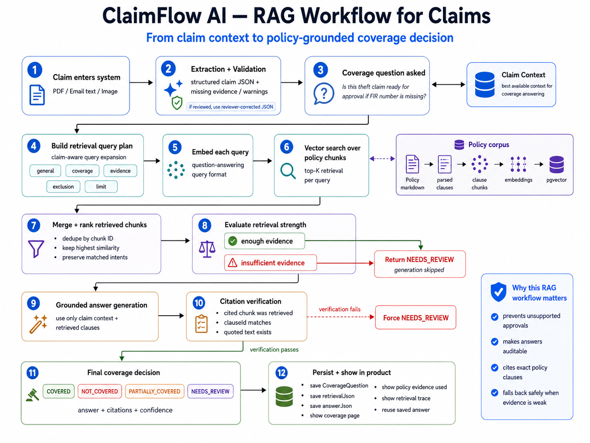

# ClaimFlow AI

### A governed agentic workflow for motor-insurance claim operations

ClaimFlow AI turns an unstructured claim PDF or email into a traceable workflow: it extracts claim data, validates it, retrieves policy evidence, proposes the next safe action, routes uncertainty to a human reviewer, learns from reviewed outcomes, and records every model call for evaluation and audit.

It was built to answer a harder question than “can an LLM read a claim?”:

> Can an AI-assisted claims workflow remain useful when the input is incomplete, the model is uncertain, policy evidence is missing, a past memory conflicts with the current claim, or a provider call fails?

The answer in ClaimFlow is a deliberately constrained form of agentic AI. The model does not approve or reject claims. It operates inside a durable state machine with deterministic validation, retrieved policy evidence, typed tools, guardrails, human review, safe workflow memory, regression evals, and an observable AI gateway.

## The use case

Motor-insurance claims arrive as PDFs and emails containing policy details, claimant information, vehicle data, incident descriptions, estimates, invoices, and supporting evidence. Before a claim can move forward, an operations team must repeatedly:

- turn those documents into structured data;
- identify missing, conflicting, or low-confidence information;
- check the current policy wording;
- request additional information when needed;
- decide which cases require human attention;
- preserve why each workflow decision was made.

A standalone extraction prompt solves only the first part. A standalone chatbot adds another interface, but it does not create reliable workflow state. ClaimFlow AI was built as the system around the model: the model handles ambiguity, while deterministic software controls state, permissions, evidence, and accountability.

## What happens to one claim

The easiest way to understand ClaimFlow AI is to follow one claim from submission to a trusted human outcome.

~~~text
PDF or email
  → AI extracts structured claim JSON
  → deterministic rules validate required fields, evidence, conflicts, and warnings
  → extraction run becomes COMPLETED, NEEDS_REVIEW, or FAILED

If NEEDS_REVIEW:
  → reviewer inspects the validation reasons
  → relevant workflow memory is retrieved
  → reviewer runs one guarded agent step
  → deterministic routing handles obvious cases first
  → otherwise the model proposes exactly one registered tool
  → guardrails allow or block the proposal

If fields or evidence are missing:
  → draft an information request
  → review task moves to NEEDS_MORE_INFO
  → reviewer records the requested value or evidence
  → review task reopens as PENDING
  → the updated state is evaluated again

When policy evidence is needed:
  → retrieve policy clauses through RAG
  → check retrieval strength
  → generate a grounded coverage assessment only when evidence is sufficient
  → verify every citation
  → persist the CoverageQuestion for the agent and reviewer

Final step:
  → human reviewer approves, edits and approves, rejects, or requests more information
  → trusted review outcome updates workflow memory
  → the complete run remains visible in one trace
~~~

This is not an autonomous claim-decision loop. ClaimFlow advances one safe workflow step at a time, persists the result, and returns control to the reviewer.

### Two different state machines

The extraction run and the human review task have different statuses. Keeping them separate makes the workflow easier to reason about.

| State owner | Important statuses | Meaning |
|---|---|---|
| **Extraction run** | <code>COMPLETED</code>, <code>NEEDS_REVIEW</code>, <code>FAILED</code> | Result of extraction plus deterministic validation. |
| **Review task** | <code>PENDING</code>, <code>NEEDS_MORE_INFO</code>, <code>IN_REVIEW</code>, <code>APPROVED</code>, <code>EDITED_AND_APPROVED</code>, <code>REJECTED</code> | Human workflow state after review is required. |

A run can remain <code>NEEDS_REVIEW</code> while its review task moves from <code>NEEDS_MORE_INFO</code> to <code>PENDING</code>, then to a final human decision.

## Guarded agent core


This diagram shows the inner Week 4 action loop. The full product path around it—validation, memory retrieval, conditional RAG, human correction, memory learning, and traceability—is connected step by step below.

The core loop is:

~~~text
Perceive current claim state
→ retrieve relevant memory
→ choose one safe next action
→ evaluate guardrails
→ execute one registered backend tool
→ persist the result
→ return control to the workflow or reviewer
~~~

The architecture deliberately separates three kinds of authority:

| Authority | Responsibility |
|---|---|
| **Model intelligence** | Extract messy documents, generate policy-grounded explanations, and propose a typed workflow action when deterministic routing is insufficient. |
| **Deterministic application logic** | Validate schemas and business rules, calculate workflow state, retrieve and threshold policy evidence, verify citations, score memory, enforce guardrails, execute tools, and persist transitions. |
| **Human reviewer** | Supply missing information, correct extracted data, judge memory relevance, and make the final approval or rejection decision. |

> Model proposes. Guardrails decide whether the tool may run. Backend executes. Human decides the claim.

## The connected workflow, step by step

### 1. Intake turns a PDF or email into claim state

ClaimFlow accepts an uploaded PDF or pasted claim email, creates a durable <code>Document</code> and <code>ExtractionRun</code>, and asks Gemini for schema-shaped claim JSON. The source document, raw model output, structured extraction, confidence metadata, model version, prompt version, and timeline events are persisted.

The extraction is a proposal, not accepted truth. Duplicate content is detected by source type and content hash, while soft delete and restore preserve history and avoid unnecessary re-extraction.

See [Week 1 — document intake and reviewer](docs/week-01/document-intake-reviewer.md).

### 2. Deterministic validation creates the first safety boundary

The extracted JSON is checked against explicit application rules:

- which fields must exist;
- which evidence is required for the detected claim type;
- whether fields conflict;
- whether warnings or low-confidence values require attention;
- whether the output matches the expected schema.


Validation produces explicit missing fields, required evidence, conflicts, and warnings, then sets the extraction-run status:

| Status | Meaning | Next step |
|---|---|---|
| <code>COMPLETED</code> | Required claim information passed the current rules. | The reviewer may inspect the claim, ask a coverage question, or continue the workflow. |
| <code>NEEDS_REVIEW</code> | Information, evidence, confidence, or consistency requires human attention. | Inspect reasons, retrieve memory, and run the next guarded action. |
| <code>FAILED</code> | Extraction or processing could not produce usable workflow state. | Inspect the error and retry or investigate. |

<code>NEEDS_REVIEW</code> is an explainable workflow boundary, not a model failure.

### 3. Memory is checked before it influences the agent

For a review-bound claim, ClaimFlow retrieves memories using structured signals such as stable claimant, policy, or vendor IDs; the same missing field; the same required evidence; or a recurring error pattern. Similar names alone are not enough.


A memory may tell the reviewer that a previous claim had the same missing <code>vehicle.registrationNumber</code> and that the safe response was to request it. It may improve routing or request specificity, but it must not copy an old value into the new claim.

When the agent step builds its context, it loads:

- current extracted and validation JSON;
- unresolved missing fields and evidence;
- review-task state;
- latest policy-retrieval status and coverage decision;
- duplicate and retry signals;
- previous agent actions;
- relevant workflow memories and their <code>mustNotDo</code> rules.

Retrieval and use are recorded separately through <code>MemoryHit</code>, so “memory was relevant” does not automatically mean “the agent used it.”

> Memory is workflow context, not claim evidence.

See [Week 5 — memory flow, evidence, and lifecycle](docs/week-05/memory-flow-evidence.md).

### 4. One guarded agent step chooses the next safe action

The run page recommends an agent step when the claim needs workflow progress. ClaimFlow first applies deterministic routing:

1. If human review is already final, return <code>no_action</code>.
2. If high-risk memory requires escalation, route to a human.
3. If a required field or evidence item is missing, propose <code>draft_information_request</code>.
4. Otherwise, LangChain may propose exactly one registered tool.

Registered tools include policy retrieval, information-request drafting, review-task creation, human escalation, non-final decision-support notes, clarification, and no action.

Every proposal is persisted before execution. Guardrails then allow or block it. They block unsupported actions such as approving or rejecting a claim, sending an email, deleting a claim, bypassing review, mutating a finalized review, or drafting unsupported decision notes.

The model never executes arbitrary code or calls an unregistered tool. The backend remains authoritative.

See [Week 4 — guarded agentic workflow](docs/week-04/agentic-workflow.md).

### 5. Missing information follows a durable request-and-reopen loop

When validation shows a missing field or evidence item, the deterministic agent route proposes an information-request draft. Memory can make the request more specific, but it cannot provide the missing value.


After guardrail approval:

~~~text
draft_information_request
→ persist FollowupDraft
→ deterministic mark_needs_more_info post-action
→ ReviewTask becomes NEEDS_MORE_INFO
~~~

The draft lists the exact requested fields and evidence. It is a review artifact; ClaimFlow does not claim to send the email automatically.

On the review-task page, the reviewer can see the request, whether retrieved memory was used by the agent, and the information still required. The workflow cannot advance merely by clicking a state button: the requested field value or evidence must be recorded.

~~~text
Reviewer provides requested information
→ ADDITIONAL_INFORMATION_RECEIVED / ADDITIONAL_EVIDENCE_RECEIVED
→ resolved item is removed from the agent context
→ ReviewTask reopens as PENDING
~~~


The original extraction is not silently overwritten. The reviewer later applies the corrected value through the edit-and-approve path.

### 6. Policy RAG is a conditional evidence path, not a mandatory linear step

RAG has two valid entry points:

1. **Coverage page:** a reviewer can ask a claim-specific coverage question for a <code>COMPLETED</code> or <code>NEEDS_REVIEW</code> run.
2. **Agent tool:** when missing information no longer takes precedence and policy evidence is needed, the agent can propose <code>retrieve_policy_clauses</code>.

This means the agent does not retrieve policy clauses while an obvious required field or evidence item is still unresolved. The information-request path runs first. Once the claim state is ready, RAG can ground coverage reasoning.



Both entry points use the same retrieval core:

~~~text
coverage question + current claim context
→ claim-aware query plan
→ query embeddings
→ pgvector search over PolicyChunk
→ merge and rank retrieved clauses
→ retrieval threshold check
~~~

From there, the two product paths differ:

| Entry point | Result |
|---|---|
| **Agent tool** | The read-only <code>retrieve_policy_clauses</code> tool returns retrieval status and policy matches in the agent tool output. It does not make or persist a final claim decision. |
| **Coverage page** | If evidence is sufficient, ClaimFlow generates a grounded coverage assessment, verifies citations, and persists a <code>CoverageQuestion</code>. If evidence is insufficient, generation is skipped and the result is forced to <code>NEEDS_REVIEW</code>. |

The Coverage-page path is:

~~~text
INSUFFICIENT_EVIDENCE
→ skip answer generation
→ persist NEEDS_REVIEW coverage result

ENOUGH_EVIDENCE
→ generate answer from retrieved clauses
→ validate citations against retrieved text
→ persist CoverageQuestion
~~~

The query plan can retrieve general, coverage, evidence, exclusion, and limit clauses. Reviewed and approved corrected JSON takes precedence over stale original extraction when coverage context is built.

A saved <code>CoverageQuestion</code> contains retrieval status, retrieved matches, grounded answer, citations, confidence, and the non-binding coverage assessment. Its latest retrieval status and decision become part of future agent context and are visible to the human reviewer.


If retrieval is weak or a citation is unsupported, ClaimFlow returns <code>NEEDS_REVIEW</code> instead of inventing policy support. RAG supplies policy evidence; it does not approve or reject the claim.

See [Week 3 — policy RAG architecture](docs/week-03/policy-rag-architecture.md).

### 7. Human review owns correction and the final decision

After requested information arrives, the review task is reopened. The reviewer starts review with:

- extracted or corrected claim JSON;
- validation findings;
- requested information and evidence;
- relevant memory guidance;
- agent rationale and tool output;
- retrieved policy clauses and coverage assessment, when available.

The reviewer can approve as-is, edit and approve, reject, or request more information. In the missing-field example, the reviewer adds the received value to corrected claim JSON and submits <code>EDIT_AND_APPROVE</code>. The final task state becomes <code>EDITED_AND_APPROVED</code>.

The agent can route, retrieve, draft, or escalate. Only a human reviewer can make the final claim decision.

### 8. The trusted review outcome updates memory

A retrieved memory is not strengthened merely because it appeared in the UI or agent context. Confidence changes only after a trusted human outcome.


A review outcome can:

- create a new memory from a useful human correction;
- strengthen a memory confirmed by the reviewer;
- weaken a memory contradicted by the outcome;
- retire repeatedly contradicted memory;
- supersede an older same-scope memory;
- generalize repeated episodic lessons into a conservative semantic pattern.

The reviewer can mark whether memory guidance was relevant. ClaimFlow then compares extracted JSON with corrected JSON and records auditable <code>MemoryUpdate</code> rows.

### 9. The run trace explains the entire claim

The trace page joins the complete story for one extraction run:

~~~text
document intake
→ extraction and validation events
→ AI gateway calls
→ memory retrieval and agent use
→ proposed action and guardrail decision
→ tool execution and information request
→ received information and review reopening
→ policy retrieval and coverage answer
→ human review outcome
→ memory update
~~~


The final trace evidence connects the human edit-and-approve outcome to memory strengthening:


The trace is the per-claim explanation. The eval dashboard is the system-wide reliability view across controlled Week 1–6 cases.

See [Week 6 — gateway observability and complete trace evidence](docs/week-06/observability-flow-evidence.md).

## Where the agentic AI is

ClaimFlow implements a guarded, single-step agent loop rather than an open-ended autonomous ReAct loop.

| Agent stage | ClaimFlow implementation |
|---|---|
| **Perceive** | Load extraction, validation, unresolved information, review state, latest RAG state, previous actions, and relevant memory. |
| **Reason** | Run deterministic routing first; call the model only when workflow interpretation is useful. |
| **Plan** | Produce exactly one typed action with rationale and tool arguments. |
| **Act** | Execute only a registered backend tool after guardrail approval. |
| **Observe** | Persist proposal, guardrail result, tool output, state transition, memory use, and gateway trace. |
| **Pause** | Return control to the product workflow or reviewer instead of autonomously pursuing a final decision. |

## Evaluations: test workflow behavior, not just model output

Each layer has synthetic failure cases and a repeatable runner:

| Layer | What the eval proves | Key safety signal |
|---|---|---|
| Extraction + validation | Structured output and final workflow status match expectations. | Incomplete claims do not silently complete. |
| Human review | Risky packets create the correct task, priority, events, and decision state. | Review routing remains correct. |
| Policy RAG | Required clauses are retrieved and citations support the answer. | False approval rate stays at zero. |
| Agent + guardrails | The expected tool is selected and unsafe proposals are blocked. | Unsafe action rate stays at zero. |
| Workflow memory | Relevant memory is retrieved and updated without replacing evidence. | Source-of-truth violations stay at zero. |
| Gateway observability | Timeouts, invalid JSON, cost blocks, and metadata failures are classified and persisted. | Missing trace rate stays at zero. |

The synthetic eval dashboard answers “does the system behave reliably across controlled cases?” The run trace answers “what happened in this particular claim?”

See [evaluation design and results](docs/evaluations.md) and the [synthetic datasets](sample-data/README.md).

## Detailed documentation

| Capability | Authoritative walkthrough |
|---|---|
| Intake, extraction, validation, and initial review boundary | [Week 1 — Document Intake Reviewer](docs/week-01/document-intake-reviewer.md) |
| Policy ingestion, vector retrieval, thresholds, citations, and coverage UI | [Week 3 — Policy RAG Architecture](docs/week-03/policy-rag-architecture.md) |
| Single-step agent, registered tools, guardrails, information request, and review loop | [Week 4 — Guarded Agentic Workflow](docs/week-04/agentic-workflow.md) |
| Memory retrieval, safe agent context, feedback, lifecycle, and semantic patterns | [Week 5 — Memory Flow Evidence](docs/week-05/memory-flow-evidence.md) |
| AI gateway, final schema, one-run trace, and Week 1–6 proof | [Week 6 — Observability Flow Evidence](docs/week-06/observability-flow-evidence.md) |

## What the product proves

- **AI output can become durable product state** without being blindly trusted.
- **RAG can support a consequential workflow** with retrieved clauses and verifiable citations.
- **An agent can take useful action without owning the final decision**, using typed tools and explicit authority boundaries.
- **Human feedback can become safe operational memory** rather than an unbounded prompt history.
- **Model calls can be governed as production dependencies**, with version, trace, latency, cost, status, and failure metadata.
- **Evaluations can measure workflow safety**, not merely prompt quality.
- **One trace can connect the complete system**, from the uploaded document through extraction, retrieval, memory, agent action, guardrail decision, follow-up, review, and model calls.

## Demo paths

After deployment and seeding, open `/demo`. The deterministic demo records do not call the model and provide three reviewer-friendly paths:

1. **Policy-grounded completed claim** — inspect structured intake and cited policy evidence.
2. **Memory-guided human review** — see a missing field retrieve prior guidance, then verify that the agent requests information instead of copying an old value.
3. **Retryable model timeout** — inspect normalized gateway failure metadata and the connected workflow trace.

For the memory path, open the run, inspect the missing `vehicle.registrationNumber`, retrieve memory, confirm the drafted information request, then open the trace to follow the claim across every layer. The eval dashboard at `/evals` provides the system-wide reliability view.

## Technology

| Area | Stack |
|---|---|
| Web application | Next.js 16, React 19, TypeScript, Zustand |
| Monorepo/runtime | Turborepo, Bun |
| Data | Postgres, Prisma 7, pgvector |
| AI | Gemini, LangChain structured tool-calling, Zod schemas |
| Reliability | Typed tools, deterministic rules, guardrails, eval runners, AI gateway tracing |

## Repository map

```text
apps/web        Workflow UI, APIs, review queue, traces, and eval dashboards
packages/ai     Claim extraction and model-backed AI integration
packages/rag    Policy loading, chunking, embeddings, retrieval, and citations
packages/agent  State builder, router, planner, typed tools, runner, and guardrails
packages/memory Memory writing, retrieval, scoring, audit hits, and update lifecycle
packages/gateway Governed model calls, AiCallLog persistence, cost and failure metadata
packages/evals  Week 1–6 evaluation runners and report generation
packages/db     Prisma schema, migrations, and deterministic demo seed
sample-data     Synthetic claim packets, failure cases, gold expectations, and reports
docs            Architecture decisions, implementation evidence, demos, and ship logs
```

## Run locally

Prerequisites: Bun, Docker, and a Gemini API key for real model-backed extraction.

```bash
cp .env.example packages/db/.env
docker compose up -d
bun install
bun run db:generate
bun run db:migrate
bun run demo:seed
bun run dev
```

Open `http://localhost:3001/demo`. Add `GEMINI_API_KEY` to `apps/web/.env.local` when you want to run real extraction; the seeded proof paths work without model calls.

Run the production quality gate with:

```bash
bun run production:check
```

It generates Prisma types, type-checks the workspaces, runs lint, executes the deterministic Week 6 gateway eval, and builds the application. Individual Week 1–6 commands and committed reports are listed in [docs/evaluations.md](docs/evaluations.md).

For a public deployment, follow [docs/deployment.md](docs/deployment.md).

## Safety and production boundaries

- All checked-in and seeded claims are synthetic.
- Model and database secrets remain server-side.
- Memory is advisory workflow context, never source-of-truth evidence.
- The agent cannot make or bypass the final human review decision.
- Public seed/reset HTTP endpoints are intentionally absent.
- Demo records use deterministic IDs and can be refreshed with `bun run demo:seed` or removed with `bun run demo:reset`.

This is a production-style portfolio system, not a licensed claims adjudication platform. Real customer deployment would additionally require authentication and role-based access, tenant isolation, encrypted object storage, PII retention controls, rate limiting, background jobs and retry queues, alerting, and insurer-approved legal/compliance review.

---

**ClaimFlow AI demonstrates agentic AI as a governed workflow system: grounded by current policy evidence, informed by safe memory, constrained by tools and guardrails, accountable to human review, and measurable through traces and evals.**
