# ClaimFlow AI

**A governed agentic workflow that turns an unstructured motor-insurance claim into a policy-grounded, human-reviewed, and fully traceable case.**

ClaimFlow AI accepts a claim PDF or email, extracts structured claim data, validates what is missing, retrieves current policy evidence, recalls relevant workflow guidance, recommends one safe next action, and keeps a human reviewer in control of the final decision.

The project was built to answer a practical question:

> How can AI help claim reviewers process incomplete and complex claims faster—while keeping every recommendation grounded, governed, human-reviewed, and auditable?

Architecturally, the workflow shows how each ClaimFlow AI layer contributes to one governed decision. Extraction converts an unstructured claim into structured JSON, deterministic validation identifies missing fields and evidence, policy RAG retrieves relevant policy clauses, and memory supplies applicable guidance from previously reviewed outcomes. The guarded agent combines this context to recommend and execute one permitted workflow action. Human review verifies the claim information and makes the final decision, while observability, evaluation, and memory feedback keep the complete process traceable, measurable, and continuously improving.


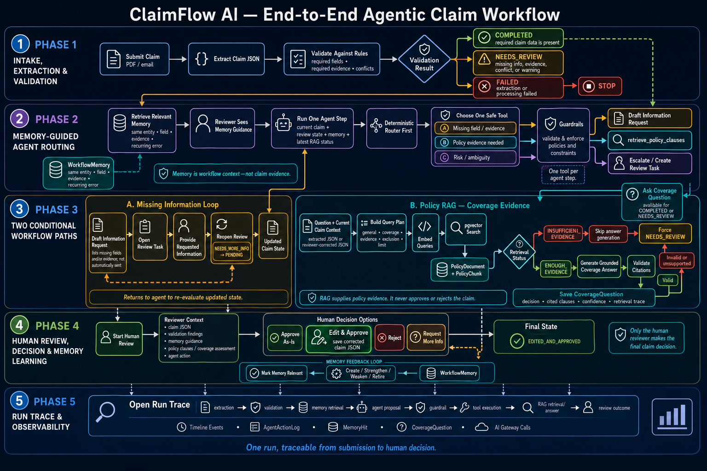

---

## Demo

Agentic Workflow : https://x.com/RitikaxG/status/2061398296137199908?s=20

Memory Layer : https://x.com/RitikaxG/status/2065037735145205775?s=20

---

## What ClaimFlow AI does

ClaimFlow AI is an end-to-end motor-claim operations workflow with:

- PDF and pasted-email intake
- schema-shaped claim JSON extraction
- deterministic validation of required fields, evidence, conflicts, and warnings
- claim-aware policy RAG with verified citations
- a guarded agent that can propose only registered tools
- human review for corrections and final decisions
- safe workflow memory built from trusted review outcomes
- an AI gateway for model, prompt, latency, token, cost, and failure metadata
- a per-run trace that connects the complete claim journey
- Week 1–6 evaluation suites and dashboards

This is not a claim chatbot and it is not an autonomous approval system. The model interprets and proposes. Deterministic software validates and constrains. Policy evidence grounds the answer. Memory offers guidance, never claim facts. The human reviewer owns approval or rejection.

---

## Core highlights

- **Structured extraction** from claim PDFs and email text
- **Deterministic validation** before AI output becomes workflow state
- **Policy-grounded RAG** with multi-query retrieval and citation verification
- **One bounded agent action** per step
- **Registered tools and guardrails** around every proposal
- **Human-in-the-loop review** for missing information and final decisions
- **Safe workflow memory** that cannot overwrite current claim evidence
- **Auditable memory lifecycle**: create, strengthen, weaken, retire, and supersede
- **Central AI gateway** for governed model calls
- **End-to-end run trace** across extraction, RAG, memory, agent, review, and gateway events
- **Regression evaluations** for every capability added from Week 1 through Week 6

---

## One claim, end to end

The 16 screens below follow a single claim through the complete product loop.

### 1. Submit a claim

A reviewer uploads a claim PDF or pastes the original claim email. ClaimFlow stores the source document and creates a durable extraction run.

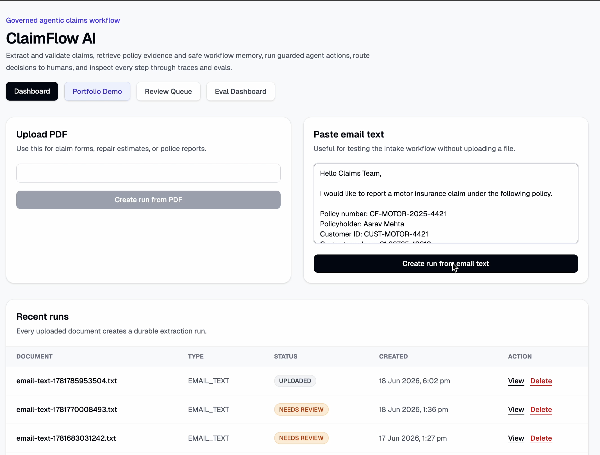

### 2. Extract structured claim JSON

The extraction call passes through the AI gateway. Gemini converts the unstructured claim into schema-shaped JSON, while ClaimFlow stores the raw response, parsed result, model, prompt version, schema version, and trace metadata.

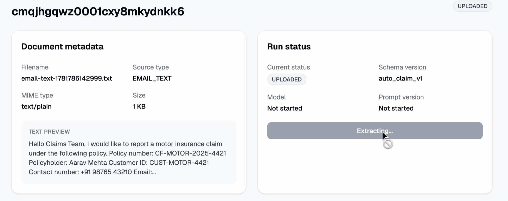

### 3. Validate before trusting the extraction

Deterministic rules inspect required fields, required evidence, conflicts, warnings, and confidence issues. In this claim, the workflow identifies missing information instead of treating a syntactically valid model response as a complete claim.

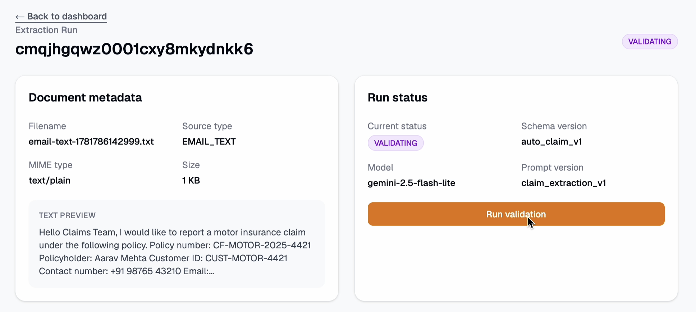

### 4. Ask a claim-specific coverage question

The reviewer asks whether the current claim is covered and what evidence is required. The question is combined with the latest claim context rather than sent to a general-purpose chatbot.

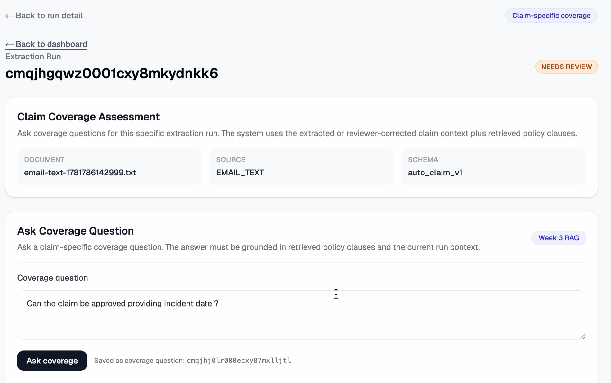

### 5. Retrieve the policy clause

Claim-aware multi-query retrieval searches coverage, evidence, exclusion, and limit clauses in Postgres with pgvector. For this claim, RAG retrieves policy evidence showing that a police report is required. The answer is grounded in the retrieved wording and its citations are verified before it is saved.

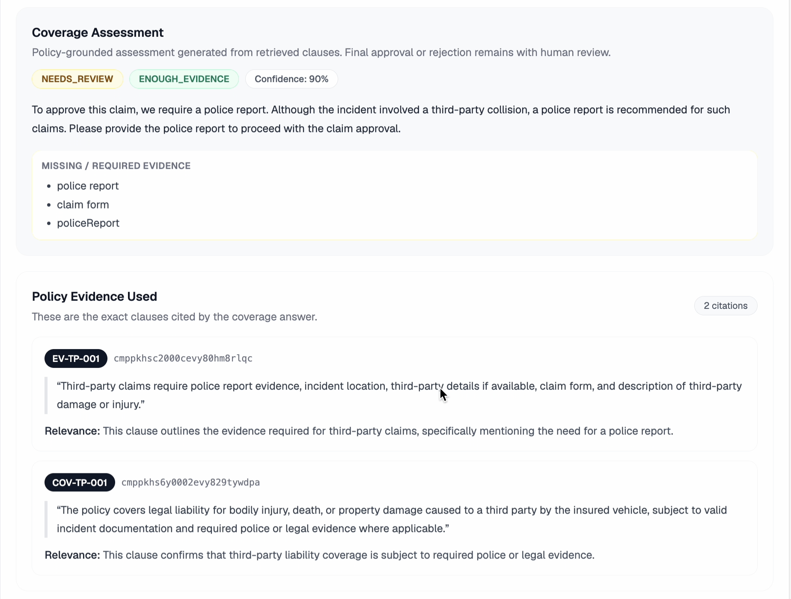

### 6. Retrieve relevant workflow memory

ClaimFlow searches prior reviewed outcomes for reusable workflow guidance. It finds a relevant lesson: a previous claim with a missing `vehicle.registrationNumber` was resolved by drafting an information request.

The memory does **not** supply the old vehicle registration number. It can suggest a safe process, but the current claim must provide its own facts.

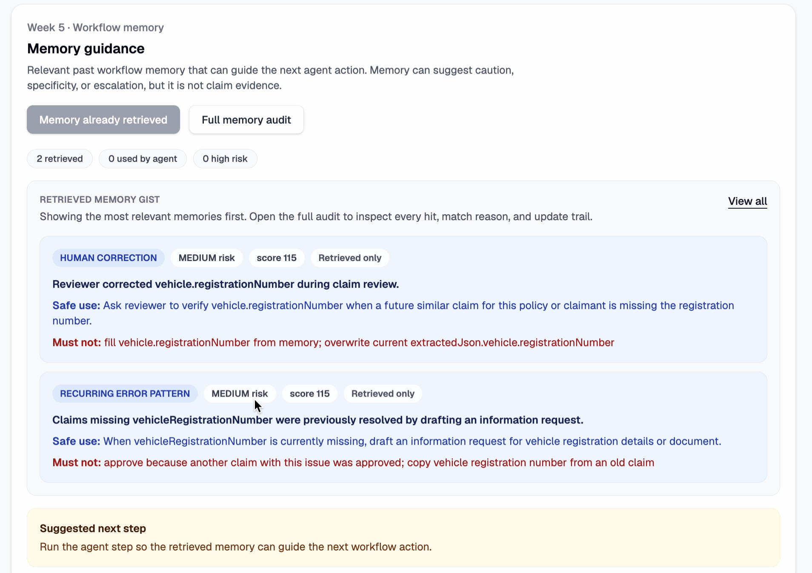

### 7. Recommend one safe next step

The current claim state, validation result, retrieved policy evidence, review state, recent actions, and safe memory guidance are assembled into the agent context. The agent recommends one bounded next action: request the missing information.

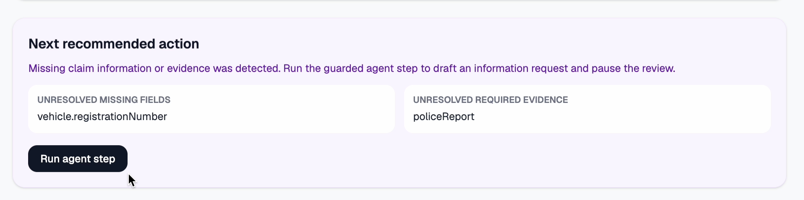

### 8. Execute only an allowed tool

The proposed action passes through guardrails before execution. ClaimFlow permits only registered backend tools; the model cannot directly approve, reject, mutate arbitrary data, or bypass review.

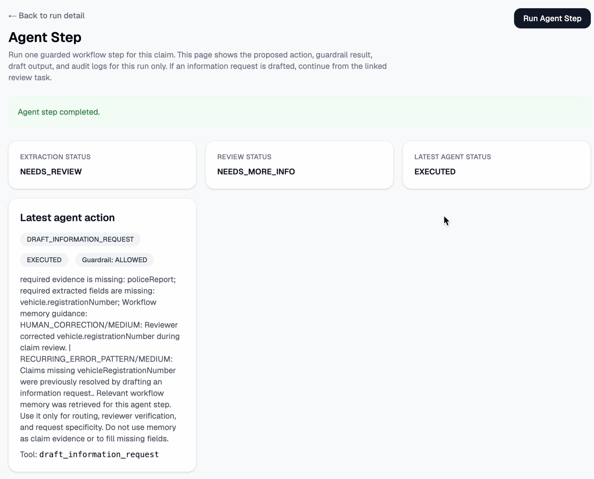

### 9. Draft the information request

The allowed `draft_information_request` tool creates a durable follow-up draft for the missing registration number and required evidence. The draft is reviewable and is not silently sent as an email.

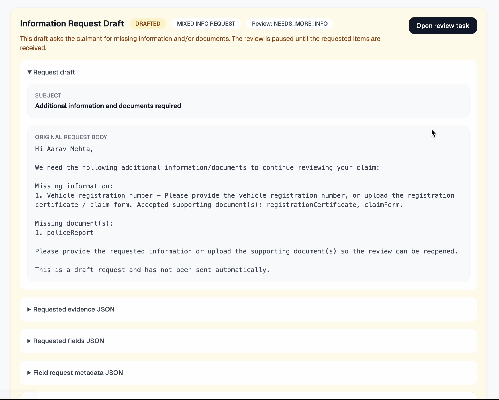

### 10. Provide the requested information

The current claim's missing information is entered into the review workflow. ClaimFlow validates the required items for this request rather than allowing the case to advance with unresolved fields.

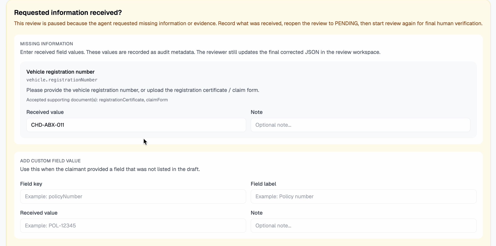

### 11. Submit the follow-up

The reviewer records the submitted information against the durable request, preserving who supplied it and which fields or evidence it addresses.

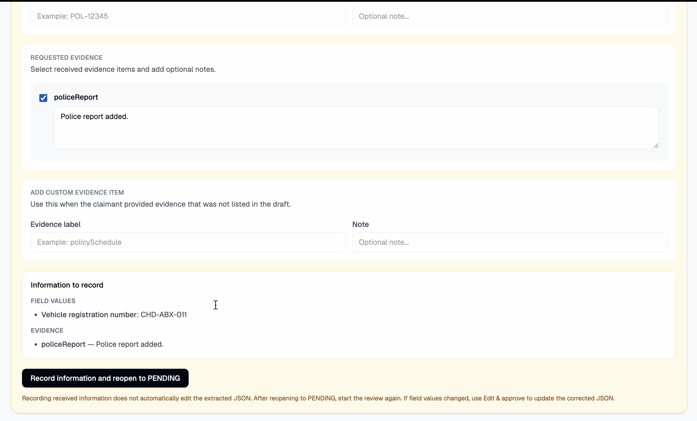

### 12. Reopen the claim with received information

Once the requested information is received, the review task moves out of its waiting state and returns to the active review queue with the new evidence attached.

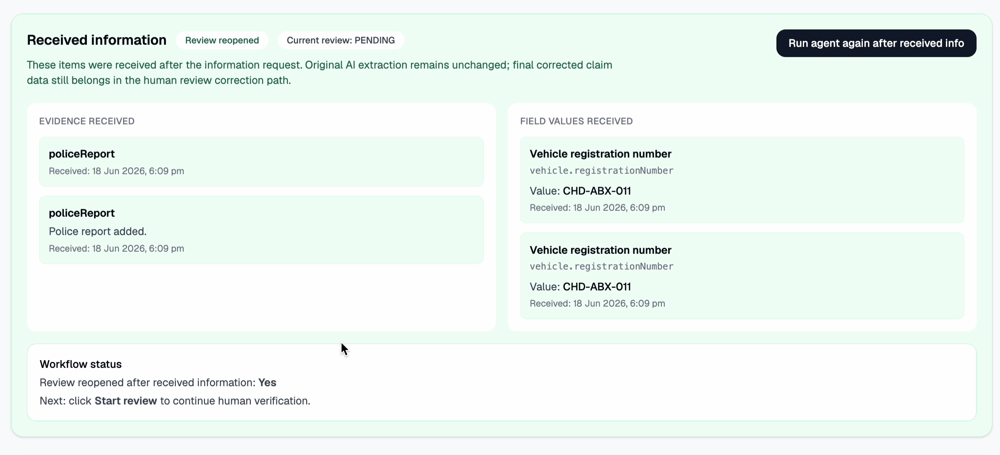

### 13. Record whether memory was useful

The reviewer marks the retrieved memory as relevant or irrelevant. Retrieval alone never strengthens a memory; only trusted human outcomes can update its confidence and lifecycle.

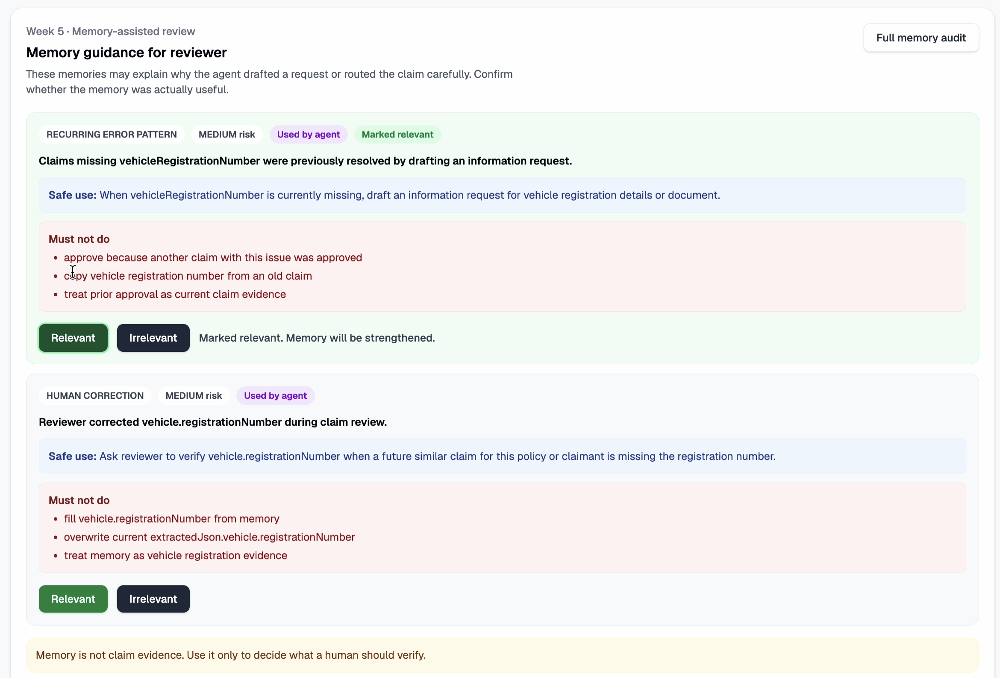

### 14. Correct and approve as a human reviewer

The reviewer sees the source claim, extracted JSON, validation findings, requested information, policy evidence, memory guidance, and agent rationale. They fill the current registration number, make any necessary corrections, and own the final approval decision.

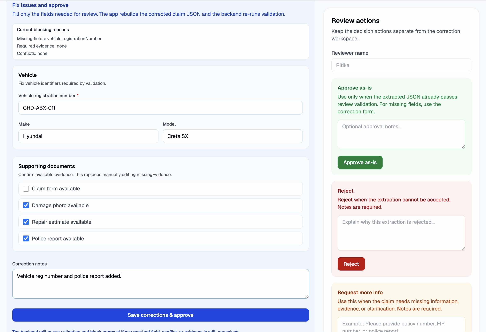

### 15. Persist the reviewed outcome

ClaimFlow stores the corrected claim JSON and the `EDITED_AND_APPROVED` outcome without erasing the original extraction. That difference becomes auditable evidence for future evaluation and safe memory updates.

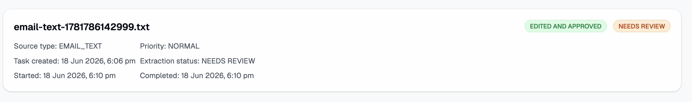

### 16. Inspect the complete workflow trace

The trace dashboard reconstructs what happened in order: document intake, extraction, validation, gateway calls, RAG retrieval, citations, memory retrieval and use, agent proposal, guardrail decision, tool execution, follow-up state changes, human review, and memory feedback.

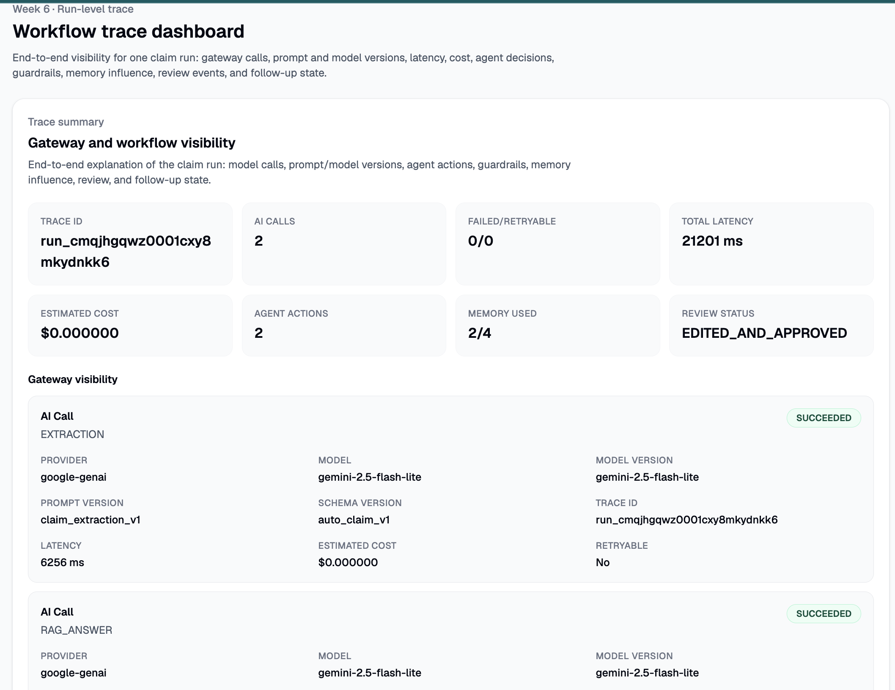

---

## How the system fits together

```txt
Claim PDF / email
        │
        ▼
AI extraction ───────────────► structured claim JSON
        │                              │
        │                              ▼
        │                    deterministic validation
        │                              │
        │              ┌───────────────┼────────────────┐
        │              ▼               ▼                ▼
        │         Policy RAG      workflow memory   review state
        │       current policy     past process      current case
        │          evidence          guidance           state
        │              └───────────────┼────────────────┘
        │                              ▼
        │                    guarded agent step
        │                    one registered tool
        │                              │
        │                              ▼
        │                 information request / review
        │                              │
        │                              ▼
        │                    human-owned decision
        │                              │
        │                              ▼
        │                  memory feedback + lifecycle
        │
        └────────► AI gateway + run trace + evaluations
```

### Extraction creates state

The model turns a messy document into a typed claim object. ClaimFlow persists both the model output and the normalized result so the transformation can be inspected later.

### Validation creates the workflow boundary

Deterministic rules decide whether the extracted claim can continue or needs review. Missing fields and evidence are explicit state, not hidden inside model prose.

### RAG supplies current policy evidence

The policy corpus is parsed into clause-level chunks and stored with embeddings. Claim-aware queries retrieve the most relevant clauses; thresholds and citation checks prevent unsupported coverage answers. Weak evidence produces `NEEDS_REVIEW`, not a confident guess.

### Memory supplies historical workflow guidance

Memory is derived from trusted corrections and review outcomes. It may say “a similar missing field was resolved through an information request,” but it may not copy a past claimant's value, override policy evidence, or make the current decision.

### The agent connects evidence to action

A deterministic router handles obvious cases first. When planning is needed, LangChain tool-calling proposes exactly one registered action. Guardrails decide whether it is permitted, and backend code—not the model—executes it.

### Human review owns the outcome

The reviewer can approve, edit and approve, reject, or request more information. Original extraction, corrected data, rationale, and status transitions remain available for audit.

### Observability and evals measure the whole system

Every model-backed call passes through the AI gateway. Per-run traces explain one claim; controlled evaluation datasets measure whether extraction, review routing, RAG, agent actions, memory behavior, and gateway failures remain reliable across many cases.

---

## Architecture controls

| Layer | Responsibility |
|---|---|
| Model intelligence | Extract ambiguous documents, draft grounded explanations, and propose one typed action. |
| Deterministic control | Validate schemas and business rules, rank evidence, enforce state transitions, and execute backend tools. |
| Policy RAG | Supply current, cited policy evidence and abstain when retrieval is weak. |
| Workflow memory | Reuse safe process lessons from trusted outcomes without supplying current claim facts. |
| Guardrails | Block unsupported tools, invalid arguments, final-state mutations, and unsafe actions. |
| Human review | Correct claim data, assess evidence, rate memory relevance, and make the final decision. |
| AI gateway | Record model, prompt, schema, trace, latency, tokens, cost, status, and normalized failures. |
| Evaluations | Test capability quality and safety contracts from Week 1 through Week 6. |

---

## Key features

### Intake, extraction, and validation

- PDF and pasted-email claim intake
- Zod-based structured claim schema
- raw and parsed model output persistence
- deterministic required-field and evidence checks
- conflict, warning, and confidence findings
- `COMPLETED`, `NEEDS_REVIEW`, and `FAILED` run states
- duplicate-content detection, soft delete, and restore

### Policy RAG

- clause-aware policy parsing and chunking
- pgvector similarity search
- claim-aware multi-query planning
- coverage, evidence, exclusion, and limit retrieval intents
- retrieval strength thresholds
- grounded answer generation and citation verification
- persisted questions, answers, evidence, and retrieval traces

### Guarded agent

- current-state context builder
- deterministic routing before model planning
- LangChain structured tool-calling
- one action per agent step
- typed tool registry and argument validation
- pre-execution guardrails
- idempotent tool execution and action audit logs

### Human review and follow-up

- durable review tasks
- information-request drafts
- waiting and received-information states
- required-item enforcement before progression
- edited claim JSON with original extraction preserved
- reviewer-owned approval and rejection

### Workflow memory

- episodic and generalized workflow lessons
- deterministic filters plus semantic retrieval
- relevance scoring and reason codes
- explicit `safeUse` and `mustNotDo` guidance
- separate retrieval, agent-use, and reviewer-feedback audit
- create, strengthen, weaken, retire, and supersede lifecycle

### Gateway, observability, and governance

- trace IDs across model-backed work
- provider, model, prompt, and schema metadata
- latency, token, and estimated-cost tracking
- normalized timeout, rate-limit, provider, parse, and validation failures
- retryability and fallback metadata
- per-run workflow trace
- Week 1–6 evaluation dashboard

---

## Repository structure

```txt
claimflow_ai/
├── apps/
│   └── web/               # Next.js product UI and server actions
├── packages/
│   ├── ai/                # Extraction and model-backed generation
│   ├── agent/             # Context, routing, planner, tools, guardrails, runner
│   ├── db/                # Prisma schema, migrations, and demo seed
│   ├── evals/             # Week 1–6 evaluation runners and reports
│   ├── gateway/           # Governed model calls and AiCallLog persistence
│   ├── memory/            # Memory writing, retrieval, scoring, audit, lifecycle
│   ├── rag/               # Policy ingestion, embeddings, retrieval, citations
│   └── shared/            # Shared schemas and types
├── sample-data/           # Synthetic packets, gold expectations, eval results
├── docs/                  # Architecture, evidence, demos, and implementation notes
├── Dockerfile
├── docker-compose.yml
└── render.yaml
```

---

## Technology

| Area | Stack |
|---|---|
| Web | Next.js 16, React 19, TypeScript, Tailwind CSS |
| Monorepo | Turborepo, Bun workspaces |
| Data | Postgres, Prisma 7, pgvector |
| AI | Gemini, LangChain tool-calling, Zod schemas |
| Reliability | Deterministic rules, typed tools, guardrails, eval runners, AI gateway |
| Deployment | Docker and Render Blueprint |

---

## Local development

### 1. Create the environment file

```bash
cp .env.example packages/db/.env
```

Add the required database and Gemini credentials described in `.env.example`.

### 2. Start Postgres

```bash
docker compose up -d
```

### 3. Install dependencies

```bash
bun install
```

### 4. Generate Prisma and run migrations

```bash
bun run db:generate
bun run db:migrate
```

### 5. Seed the deterministic demo

```bash
bun run demo:seed
```

### 6. Start the application

```bash
bun run dev
```

Open `http://localhost:3000`.

---

## Proof of implementation

### Production quality gate

```bash
bun run release:check
```

The release check generates Prisma types, type-checks the workspaces, runs lint, executes the deterministic Week 6 gateway evaluation, and builds the application.

### Evaluation coverage

| Week | Capability | What is measured |
|---|---|---|
| Week 1 | Extraction and validation | Schema conformity, field extraction, evidence checks, and run status |
| Week 2 | Human review | Routing, priority, events, corrected data, and decision state |
| Week 3 | Policy RAG | Retrieval quality, citation support, abstention, and false approval |
| Week 4 | Agent and guardrails | Tool selection, blocking, idempotency, and final-state safety |
| Week 5 | Workflow memory | Retrieval, safe use, feedback, conflicts, and lifecycle |
| Week 6 | Gateway observability | Trace completeness, failures, retries, cost, and metadata governance |

See [evaluation design and results](./docs/evaluations.md) and the [synthetic datasets](./sample-data/README.md).

---

## Detailed documentation

| Capability | Walkthrough |
|---|---|
| Intake, extraction, validation, and initial review boundary | [Week 1 — Document Intake Reviewer](./docs/week-01/document-intake-reviewer.md) |
| Policy ingestion, retrieval, thresholds, citations, and Coverage UI | [Week 3 — Policy RAG Architecture](./docs/week-03/policy-rag-architecture.md) |
| Agent context, tools, guardrails, information request, and review loop | [Week 4 — Guarded Agentic Workflow](./docs/week-04/agentic-workflow.md) |
| Memory retrieval, agent use, feedback, lifecycle, and patterns | [Week 5 — Memory Flow Evidence](./docs/week-05/memory-flow-evidence.md) |
| Gateway, final schema, complete run trace, and Week 1–6 proof | [Week 6 — Observability Flow Evidence](./docs/week-06/observability-flow-evidence.md) |

---

## Safety boundaries

- All checked-in and seeded claims are synthetic.
- Extraction is validated before it becomes trusted workflow state.
- Weak retrieval or unsupported citations force human review.
- Memory is advisory and cannot overwrite current claim data.
- The agent cannot approve, reject, delete, send an email, or bypass review.
- Final claim decisions remain human-owned.
- Production deployment still requires organization-specific authentication, authorization, secrets management, retention rules, and compliance review.

---

## Status

- Document intake and structured extraction: **implemented**
- Deterministic validation and review routing: **implemented**
- Human review and information-request loop: **implemented**
- Policy RAG and citations: **implemented**
- Guarded agent and registered tools: **implemented**
- Workflow memory and lifecycle: **implemented**
- AI gateway and complete run trace: **implemented**
- Week 1–6 evaluations: **implemented**
- Docker and Render deployment configuration: **implemented**

**ClaimFlow AI demonstrates agentic AI as a governed product workflow: grounded by current policy evidence, informed by safe memory, constrained by typed tools and guardrails, accountable to human review, and measurable through traces and evaluations.**
