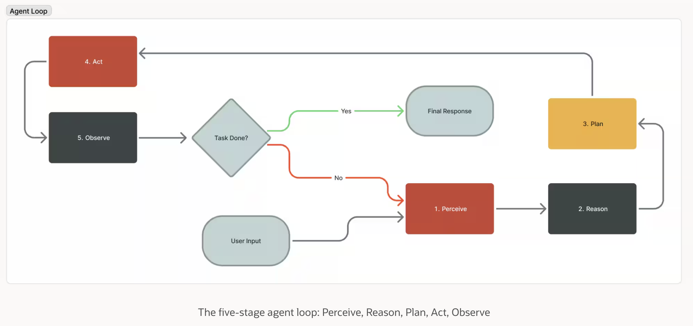
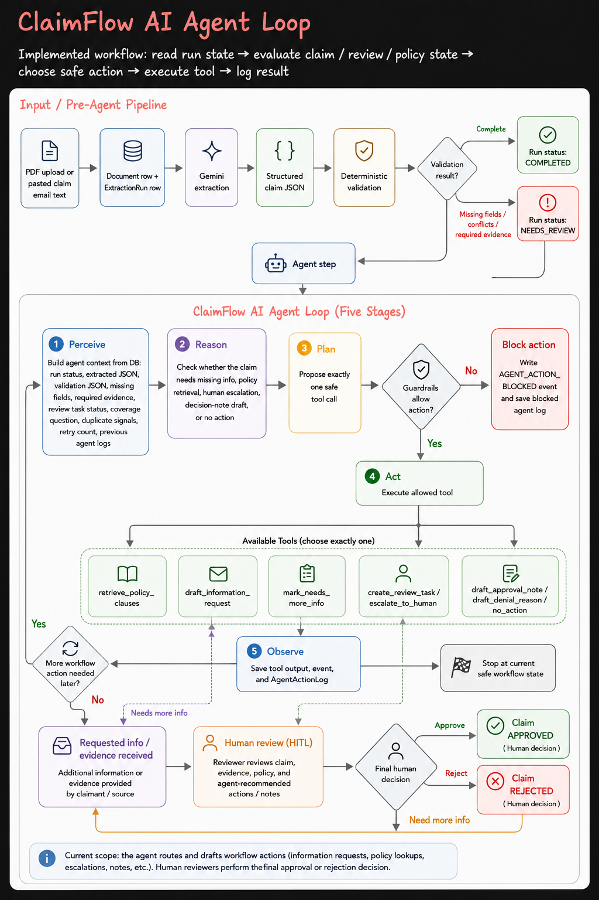

# ClaimFlow AI Agent Loop

Original Oracle blog reference: [What is the AI Agent Loop? The core architecture behind autonomous AI systems](https://blogs.oracle.com/developers/what-is-the-ai-agent-loop-the-core-architecture-behind-autonomous-ai-systems?customTrackingParam=:ad:vd:yt:awr:a_nas::RC_DEVT260124P00001:Harkirat)

This document compares the general agent loop from the Oracle reference with the implemented ClaimFlow AI agent loop.

---

## 1. General AI agent loop

The general AI agent loop is an iterative execution cycle.

At each iteration, the agent:

1. receives or assembles context,
2. reasons over that context,
3. selects or plans the next action,
4. executes the action through a tool, API, database query, or code path,
5. observes the result,
6. then either loops again or stops when the task is complete.

In Oracle’s framing, the five stages are:

```txt
Perceive → Reason → Plan → Act → Observe
```

### General loop reference image



---

## 2. How the general loop maps to ClaimFlow AI

ClaimFlow AI does not use the agent loop as a free-form chatbot. It uses the loop as a guarded workflow-routing layer on top of the implemented claim intake, extraction, validation, RAG, and review system.

The implemented ClaimFlow AI loop maps to:

```txt
Read run state
→ Evaluate claim / review / policy state
→ Choose safe workflow action
→ Execute allowed tool
→ Log result and update workflow state
```

The key difference is that ClaimFlow AI is a claims workflow system, not an autonomous final decision-maker.

The agent can route, retrieve, draft, escalate, or stop. The human reviewer still performs the final claim approval or rejection.

---

## 3. Current implemented scope in ClaimFlow AI

The current repo supports:

- PDF claim upload
- pasted claim email text
- `Document` row creation
- `ExtractionRun` row creation
- Gemini extraction
- structured claim JSON
- deterministic validation
- missing field detection
- conflict and warning detection
- required evidence detection
- timeline events
- review task creation
- policy clause retrieval through RAG
- agent action proposal
- guardrail evaluation
- allowed tool execution
- blocked action logging
- follow-up draft creation
- human review workflow
- final human review decisions: approved or rejected

The current repo does **not** claim support for automatic email sending, automatic final approval, automatic final rejection, photo analysis, invoice processing, or OCR as separate implemented systems.

---

## 4. ClaimFlow AI agent loop diagram



---

## 5. ClaimFlow AI loop stages

### 1. Perceive

The ClaimFlow agent starts by reading the current run state from the database.

It builds context from:

- run status,
- extracted claim JSON,
- validation JSON,
- missing fields,
- required evidence,
- review task status,
- coverage question state,
- duplicate signals,
- retry count,
- previous agent action logs.

In the general loop, this is the **Perceive** stage.

In ClaimFlow AI, this means:

```txt
Build agent context from DB
```

---

### 2. Reason

The agent evaluates the current claim state.

It checks questions such as:

- Are required extracted fields missing?
- Is required evidence missing?
- Is there a validation conflict?
- Is policy retrieval needed?
- Is there enough policy evidence?
- Is this a duplicate or risky claim?
- Has the review already reached a final state?
- Should the workflow escalate to a human reviewer?

In the general loop, this is the **Reason** stage.

In ClaimFlow AI, this means:

```txt
Evaluate claim / review / policy state
```

---

### 3. Plan

The agent proposes exactly one next workflow action.

Possible implemented actions include:

- retrieve policy clauses,
- draft an information request,
- mark the run as needing more information,
- create or reuse a review task,
- escalate to human review,
- draft approval note,
- draft denial reason,
- ask clarification,
- no action.

In the general loop, this is the **Plan** stage.

In ClaimFlow AI, this means:

```txt
Choose one safe workflow action
```

---

### 4. Act

Before execution, the proposed action goes through ClaimFlow guardrails.

The guardrails block unsafe or unsupported final actions. The agent must not:

- approve a claim,
- reject a claim,
- send an email,
- delete a claim,
- bypass review,
- create a final claim decision.

If the action is blocked, ClaimFlow saves the blocked action event and blocked agent log.

If the action is allowed, ClaimFlow executes the tool.

Implemented tool examples:

- `retrieve_policy_clauses`
- `draft_information_request`
- `mark_needs_more_info`
- `create_review_task`
- `escalate_to_human`
- `draft_approval_note`
- `draft_denial_reason`
- `no_action`

In the general loop, this is the **Act** stage.

In ClaimFlow AI, this means:

```txt
Execute the allowed tool only after guardrail approval
```

---

### 5. Observe

After the tool call, ClaimFlow records the result.

It saves:

- the proposed action,
- the guardrail decision,
- the tool input,
- the tool output,
- blocked reason if blocked,
- timeline event,
- `AgentActionLog`.

In the general loop, this is the **Observe** stage.

In ClaimFlow AI, this means:

```txt
Log result and update workflow state
```

---

## 6. Human-in-the-loop final decision

This is the most important product boundary.

The ClaimFlow agent does **not** approve or reject claims.

Instead, the agent helps prepare the review workflow:

1. The agent retrieves policy clauses if needed.
2. The agent drafts an information request if information or evidence is missing.
3. The requested information or evidence is received.
4. The agent can create or reuse a human review task.
5. The human reviewer reviews the claim, evidence, policy, and agent notes.
6. The human reviewer makes the final decision:
   - `Claim APPROVED`
   - `Claim REJECTED`
   - or `Need more info`, which loops back into the information request path.

So the final decision flow is:

```txt
Agent tool result
→ requested info / evidence received
→ human review
→ final human decision
→ claim approved or claim rejected
```

This keeps the system safe and enterprise-realistic.

---

## 7. General loop vs ClaimFlow AI loop

| General agent loop | ClaimFlow AI implementation |
|---|---|
| Perceive | Read run state from DB: extraction, validation, review, policy, previous agent logs |
| Reason | Decide whether the claim needs missing info, policy retrieval, human review, decision-note draft, or no action |
| Plan | Propose exactly one workflow action |
| Act | Execute only allowed tools after guardrail approval |
| Observe | Save timeline event, tool result, guardrail result, and `AgentActionLog` |
| Stop condition | Stop at current safe workflow state, or move into HITL review |
| Final decision | Human reviewer approves or rejects the claim |

---

## 8. How ClaimFlow AI reduces LLM calls

Agentic systems can become expensive if every workflow step is sent to the LLM. ClaimFlow AI reduces unnecessary LLM calls by keeping the agent loop narrow, deterministic where possible, and guarded.

### 8.1 Deterministic actions before LLM tool-calling

ClaimFlow does not always need the LLM to decide the next action.

Some workflow states are obvious and can be handled before invoking the agent model.

Examples:

```txt
If review task is already final
→ no_action

If required evidence is missing
→ draft_information_request

If required extracted fields are missing
→ draft_information_request
```

This means simple routing cases can be resolved using application logic instead of spending an LLM call just to select an obvious tool.

In practice, this keeps the LLM focused on ambiguous workflow decisions rather than routine state transitions.

---

### 8.2 Guardrails reduce wasted execution

ClaimFlow uses deterministic guardrails after an action is proposed.

The guardrails check whether the action is safe before the tool executes.

They block unsafe actions such as:

- approving a claim,
- rejecting a claim,
- sending an email,
- deleting a claim,
- bypassing review,
- creating a final claim decision.

They also block risky decision-note drafting when:

- policy evidence is missing,
- required evidence is missing,
- required fields are missing,
- validation conflicts exist,
- policy retrieval is insufficient,
- duplicate signals exist,
- retry limits are exceeded.

This reduces waste because unsafe actions are stopped early. The system does not continue into unnecessary tool execution or additional agent steps after a blocked action.

---

### 8.3 Single safe workflow action per agent step

ClaimFlow does not let the agent freely chain many tools in one uncontrolled loop.

Each agent step proposes exactly one action.

```txt
Agent step
→ propose one action
→ guardrail check
→ execute or block
→ log result
→ stop at current safe workflow state
```

This prevents long, expensive multi-tool loops.

It also makes each step easier to debug, evaluate, and replay.

The workflow can continue later, but each continuation starts from the updated database state rather than from a long hidden model conversation.

---

### 8.4 Database state replaces repeated context reasoning

ClaimFlow stores workflow state in Postgres instead of relying only on model memory.

Important state is saved as structured records:

- extraction run status,
- extracted JSON,
- validation JSON,
- missing fields,
- required evidence,
- review task status,
- coverage question status,
- follow-up drafts,
- agent action logs,
- timeline events.

Because the state is persisted, the next agent step can read the latest structured state directly instead of asking the LLM to reconstruct what happened from a long conversation transcript.

This reduces token usage and makes the workflow more reliable.

---

### 8.5 Existing review tasks and drafts can be reused

ClaimFlow avoids duplicate workflow work.

If a review task already exists, the system can reuse or escalate the existing task instead of creating another one.

If a matching information request draft already exists, the system can reuse the draft instead of creating a duplicate.

This reduces unnecessary tool execution, duplicate database records, and extra LLM reasoning around the same unresolved issue.

---

### 8.6 Human-in-the-loop prevents expensive autonomous loops

ClaimFlow does not try to make the agent solve every uncertain case.

When the claim has missing evidence, conflicts, low confidence, duplicate signals, or insufficient policy evidence, the system routes toward human review instead of continuing automated reasoning indefinitely.

The loop is intentionally bounded:

```txt
Ambiguous or risky claim
→ escalate / create review task
→ human reviewer decides
```

This is cheaper, safer, and more realistic for insurance workflows than allowing the model to repeatedly call tools until it guesses a final answer.

---

### 8.7 Summary: cost-control pattern

ClaimFlow reduces LLM calls through four main design choices:

| Cost-control design | Effect |
|---|---|
| Deterministic pre-actions | Avoids LLM calls for obvious routing decisions |
| Guardrails | Blocks unsafe or wasteful actions before execution |
| One action per agent step | Prevents uncontrolled multi-tool loops |
| Persisted workflow state | Reduces repeated context reconstruction |
| Draft/review reuse | Avoids duplicate workflow actions |
| Human review fallback | Stops costly automation on risky cases |

So the ClaimFlow agent loop is not designed to maximize autonomy. It is designed to maximize safe workflow progress per LLM call.

The goal is:

```txt
Use deterministic logic where possible.
Use the LLM only when workflow judgment is useful.
Use guardrails before execution.
Use humans for final decisions.
```

---

## 9. Final definition

ClaimFlow AI is an agentic claim-intake and review-routing system.

It uses the general agent loop pattern — **Perceive → Reason → Plan → Act → Observe** — but applies it inside a guarded insurance workflow.

At each agent step, ClaimFlow AI reads the current run state, evaluates the extracted claim data, validation result, review status, policy retrieval state, duplicate signals, and prior agent actions. It then proposes one safe workflow action. ClaimFlow guardrails decide whether the action is allowed. If allowed, the system executes a tool such as policy retrieval, follow-up draft creation, review task creation, or human escalation. Every proposal, guardrail result, tool call, and outcome is logged.

The agent does not make the final claim decision. The final approval or rejection is performed by a human reviewer after reviewing the claim, evidence, policy, and agent-generated workflow notes.
