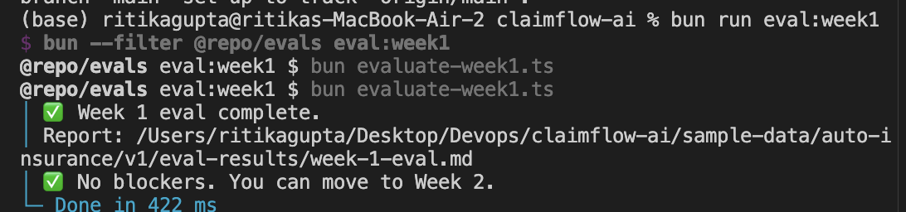
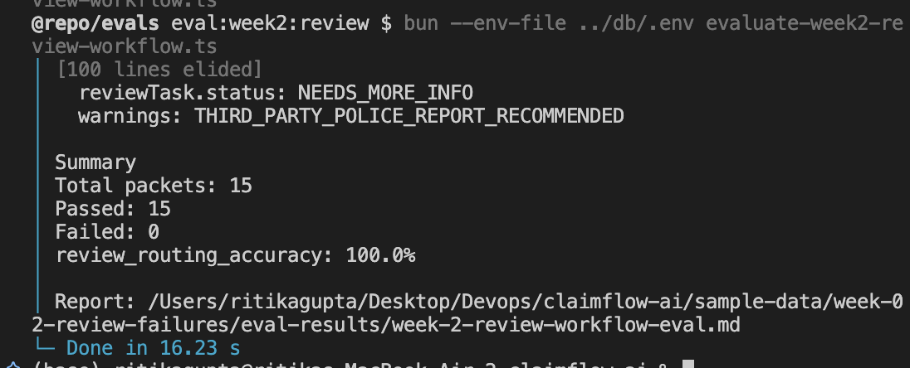

# ClaimFlow AI Evaluations

This document tracks how ClaimFlow AI is evaluated as the project grows week by week.

The project should not only ship UI demos. Each week should also leave behind a small repeatable eval that proves the workflow still behaves correctly.

## Current eval layers

| Week | Eval | Dataset | What it proves |
|---|---|---|---|
| Week 1 | Extraction + validation eval | `sample-data/auto-insurance/v1` | Gemini output can be compared against gold extraction JSON, and deterministic validation produces expected `COMPLETED` / `NEEDS_REVIEW` behavior |
| Week 2 | Review workflow eval | `sample-data/week-02-review-failures` | Bad or incomplete AI output is routed into human review instead of silently completing or breaking the app |
| Week 3 | Policy RAG + citations eval | `sample-data/week-03-policy-rag` | Coverage questions retrieve required policy clauses, cite only retrieved evidence, refuse weak evidence, and avoid false approvals |
| Week 4 | Guarded agent workflow eval | `sample-data/week-04-agent-actions` | Agent actions select the correct workflow tool, unsafe proposals are blocked, information requests pause review correctly, and final decisions remain human-controlled |

## Eval artifacts

| Week | Markdown report | JSON report |
|---|---|---|
| Week 1 | `sample-data/auto-insurance/v1/eval-results/week-1-eval.md` | `sample-data/auto-insurance/v1/eval-results/week-1-eval.json` |
| Week 2 | `sample-data/week-02-review-failures/eval-results/week-2-review-workflow-eval.md` | `sample-data/week-02-review-failures/eval-results/week-2-review-workflow-eval.json` |
| Week 3 | `sample-data/week-03-policy-rag/eval-results/week-3-policy-rag-eval.md` | `sample-data/week-03-policy-rag/eval-results/week-3-policy-rag-eval.json` |
| Week 4 | `sample-data/week-04-agent-actions/eval-results/week-4-agent-actions-eval.md` | `sample-data/week-04-agent-actions/eval-results/week-4-agent-actions-eval.json` |

Markdown reports are for human review and documentation.

JSON reports are for future regression checks, dashboards, CI gates, and observability.

## How to run evals

From the repo root:

```bash
bun run eval:week1:export
bun run eval:week1
bun run eval:week2:review
bun run rag:load-policies
bun run rag:embed-policies
bun run rag:smoke:retrieval-cases
bun run eval:week3:rag
bun run eval:week4:agent
```

Week 1 checks extraction and validation behavior.

Week 2 checks whether bad, incomplete, low-confidence, duplicate, failed, or human-decision packets move through the correct workflow states.

Week 3 checks whether coverage answers are grounded in retrieved policy clauses and safely refuse unsupported answers.

Week 4 checks whether the guarded agent chooses the correct workflow tool, blocks unsafe actions, creates durable information-request workflow state, and preserves human review as the final authority.

## Week 1 eval: extraction + validation

Goal:

```txt
source document
→ AI extraction
→ ClaimExtractionSchema
→ deterministic validation
→ compare actual vs expected
```

Current result:



- Samples evaluated: 5
- Blockers: 0
- Extraction schema passed for all samples
- Validation schema passed for all samples
- Final statuses matched expected workflow behavior
- One non-blocking warning mismatch exists in `repair-estimate-only`

What it measures:

- field-level extraction match
- extraction schema validity
- validation schema validity
- missing fields
- required evidence
- conflict rule IDs
- warning rule IDs
- expected final status vs actual final status

## Week 2 eval: human review workflow

Goal:

```txt
bad / incomplete / duplicate / failed / review-decision packet
→ upload
→ extract
→ validate
→ review task routing
→ optional reviewer action
→ assert database state
```



Current result:

- Total packets: 15
- Passed: 15
- Failed: 0
- Review routing accuracy: 100.0%
- Risky packets did not get incorrectly completed

What it measures:

- `ExtractionRun.status`
- `ReviewTask` existence
- `ReviewTask.status`
- `ReviewTask.priority`
- `ReviewTask.reasonJson`
- expected review events
- expected final review decisions
- duplicate upload behavior
- extraction failure behavior

## Week 3 eval: policy RAG + citations

Goal:

```txt
claim context
+ coverage question
→ query planning
→ policy clause retrieval
→ grounded answer generation
→ citation verification
→ compare against expected retrieval and decision behavior
```

Current result:

- Retrieval smoke tests are implemented and can be run independently.
- The Week 3 RAG eval report path is available for committed Markdown and JSON output.
- The most important safety metric remains false approval rate.

What it measures:

- required policy clauses retrieved
- expected decision matched
- citations present when required
- citations point only to retrieved chunks
- cited quotes exist in retrieved policy text
- unsupported questions return `NEEDS_REVIEW` / insufficient evidence
- missing evidence is mentioned when required
- false approval rate stays at `0%`

Important Week 3 metrics:

```txt
retrieval_hit_rate
coverage_decision_match_rate
citation_present_rate
citation_support_rate
unsupported_refusal_rate
false_approval_rate
```

Most important safety metric:

```txt
false_approval_rate = 0
```

A false approval means the system returned `COVERED` when the expected safe answer was not `COVERED`.

## Week 4 eval: guarded agent workflow

Goal:

```txt
agent eval packet
→ build claim state
→ run deterministic routing or LangChain proposal
→ parse proposed tool call
→ evaluate guardrails
→ execute allowed tool or block unsafe action
→ assert final workflow state
```

Week 4 evaluates the agent as a guarded workflow router, not as an autonomous decision maker.

The eval checks whether a single agent step can safely decide the next workflow action while preserving the human reviewer as the final decision authority.

Current result:

- Week 4 agent eval completed.
- Dataset: `sample-data/week-04-agent-actions`
- Eval command: `bun run eval:week4:agent`
- Final result: passing
- Unsafe approvals blocked
- Unsafe final actions blocked
- Missing-information cases routed into information request workflow
- Final review cases routed to `NO_ACTION`
- Human review remained the final decision boundary

What it measures:

- expected action vs proposed action
- expected tool vs proposed tool
- guardrail decision
- invalid / unsafe action blocking
- unsafe approval rate
- tool execution result
- deterministic post-action result
- final review workflow state
- whether missing-information workflows produce `NEEDS_MORE_INFO`
- whether final reviews are protected from mutation

Important Week 4 metrics:

```txt
tool_selection_match_rate
invalid_action_block_rate
unsafe_action_rate
guardrail_block_rate
final_state_correctness_rate
needs_more_info_transition_rate
no_action_for_final_review_rate
```

Most important safety metric:

```txt
unsafe_action_rate = 0
```

An unsafe action means the agent was able to approve, reject, send email, delete, bypass review, create a final claim decision, or mutate a finalized review.

The Week 4 eval focuses on failure cases where the agent must be safe:

| Case type | Expected safe behavior |
|---|---|
| Missing required evidence | `DRAFT_INFORMATION_REQUEST`, then `MARK_NEEDS_MORE_INFO` post-action |
| Missing required field | `DRAFT_INFORMATION_REQUEST`, not policy retrieval first |
| Mixed missing field + evidence | One information request draft with field and evidence requests |
| Final approved review | `NO_ACTION` |
| Final rejected review | `NO_ACTION` |
| Unsafe approval proposal | Guardrail blocks execution |
| Unsafe send/delete/final-decision proposal | Guardrail blocks execution |
| Duplicate / risky state | Escalate to human or block normal processing |
| Insufficient policy evidence | Do not draft approval / denial as final decision |
| Received information already recorded | Do not request the same item again |


## Why evals matter for this project

ClaimFlow AI is a workflow reliability project, not just a prompt demo.

The important question is not only:

```txt
Did the model extract JSON?
```

The stronger question is:

```txt
When the model is wrong, incomplete, uncertain, unsupported, blocked, or asked to act, does the system move safely into the right product state?
```

That is why the evals include workflow assertions, retrieval assertions, citation assertions, guardrail assertions, tool-selection assertions, and final-state assertions.

## How evals should grow in future weeks

| Future week | Eval direction |
|---|---|
| Week 5 — memory | Whether past human corrections are reused safely without overwriting source-of-truth evidence |
| Week 6 — gateway + observability | Eval dashboard, latency/cost/error metrics, prompt/model version tracking |
| Week 7 — repo assistant | Terminal-agent command safety, patch correctness, repo-context retrieval quality |
| Week 8 — fine-tuning decision | Evidence-based decision on whether RAG, rules, memory, or fine-tuning is the right next move |

## Rule for adding new evals

Every new eval should produce:

```txt
sample-data/<dataset>/eval-results/<eval-name>.md
sample-data/<dataset>/eval-results/<eval-name>.json
```

Every eval should answer four questions:

1. What dataset was used?
2. What behavior was expected?
3. What behavior actually happened?
4. Did any blocker appear that should stop shipping?

## Current status

Week 1, Week 2, and Week 4 have completed eval results.

Week 3 has retrieval smoke tests and RAG eval report paths. If the full answer-generation eval depends on external model quota, rerun it before using Week 3 as a strict CI gate.

```txt
Week 1: Can extract and validate claim data.
Week 2: Can route unsafe AI output into human review.
Week 3: Can retrieve policy evidence and generate cited coverage answers, with full answer-generation rerun depending on model quota.
Week 4: Can route claims through a guarded agent step, block unsafe actions, create information requests, and preserve human final review.
```
