# Week 3 Architecture — Policy RAG + Citations

## What Week 3 adds

Before Week 3, ClaimFlow AI could extract a claim, validate required fields, and route risky cases to human review.

Week 3 adds a policy-grounded decision-support layer:

```txt
reviewed or extracted claim context
+ coverage question
→ policy retrieval query plan
→ embedded query
→ pgvector policy clause search
→ retrieved policy evidence
→ grounded answer generation
→ citation verification
→ CoverageQuestion stored
```

The system should not answer from model memory. It should retrieve policy evidence, generate a grounded answer, verify citations, and refuse when evidence is weak.

This is the central Week 3 RAG system doc. The proof screenshots and product demo evidence are kept here instead of being repeated across the sample-data, ship-log, and bug-fix docs.

Demo: https://x.com/RitikaxG/status/2058472008296583510?s=20

---

## 1. Dataset preparation and DB schema updation

Week 3 starts with a controlled policy dataset:

[Week 03 — Policy RAG + Citations Dataset](https://github.com/RitikaxG/claimflow_ai/blob/main/sample-data/week-03-policy-rag/README.md)

The database was extended so RAG evidence is stored as first-class workflow state, not temporary model context.

```txt
PolicyDocument = one source policy file
PolicyChunk = one retrievable policy clause
CoverageQuestion = one user question asked against an extraction run
```

The existing claim workflow stays connected:

```txt
Document
→ ExtractionRun
→ CoverageQuestion
→ retrieved policy clauses
→ grounded answer
→ final decision
```

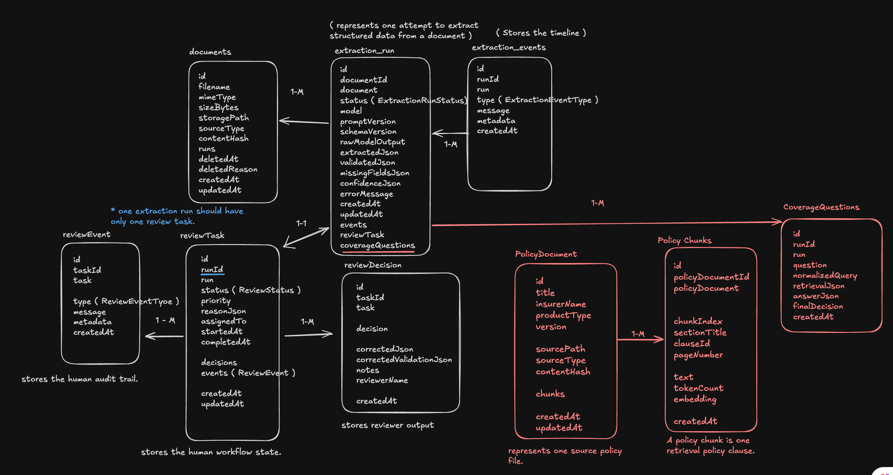

---

## 2. High-level flow

```txt
policy markdown documents
→ metadata parsing
→ clause parsing
→ clause chunks
→ embeddings
→ vector storage

claim context
+ user coverage question
→ query planning
→ vector retrieval
→ retrieval threshold check
→ grounded answer generation
→ citation verification
→ persisted coverage answer
```

The RAG system is a separate decision layer. It does not replace extraction, validation, or human review.

---

## 3. Source-of-truth policy corpus

Week 3 uses synthetic auto-insurance policy markdown as the deterministic source of truth.

The policy corpus is split into three policy areas:

```txt
base coverage clauses
exclusion clauses
required evidence clauses
```

The clause IDs are intentionally stable:

```txt
COV-*      coverage
EV-*       evidence requirements
EX-*       exclusions
LIMIT-*    approval limits
```

This gives the system exact policy references such as:

```txt
COV-TH-001   Theft coverage
EV-TH-001    Theft claim evidence requirements
EX-COM-001   Commercial use exclusion
LIMIT-RP-001 Repair approval limit
```

Stable clause IDs are important because ClaimFlow is an audit-heavy workflow. A reviewer should be able to see exactly which policy clause influenced an answer.

---

## 4. Policy loading

Policy markdown is loaded into Postgres with an idempotent loader.

```bash
bun run rag:load-policies
```

Loader behavior:

```txt
read policy markdown files
→ parse policy metadata + clauses
→ compute content hash
→ upsert PolicyDocument by sourcePath
→ skip unchanged documents
→ rebuild chunks when content changes or force reload is enabled
```

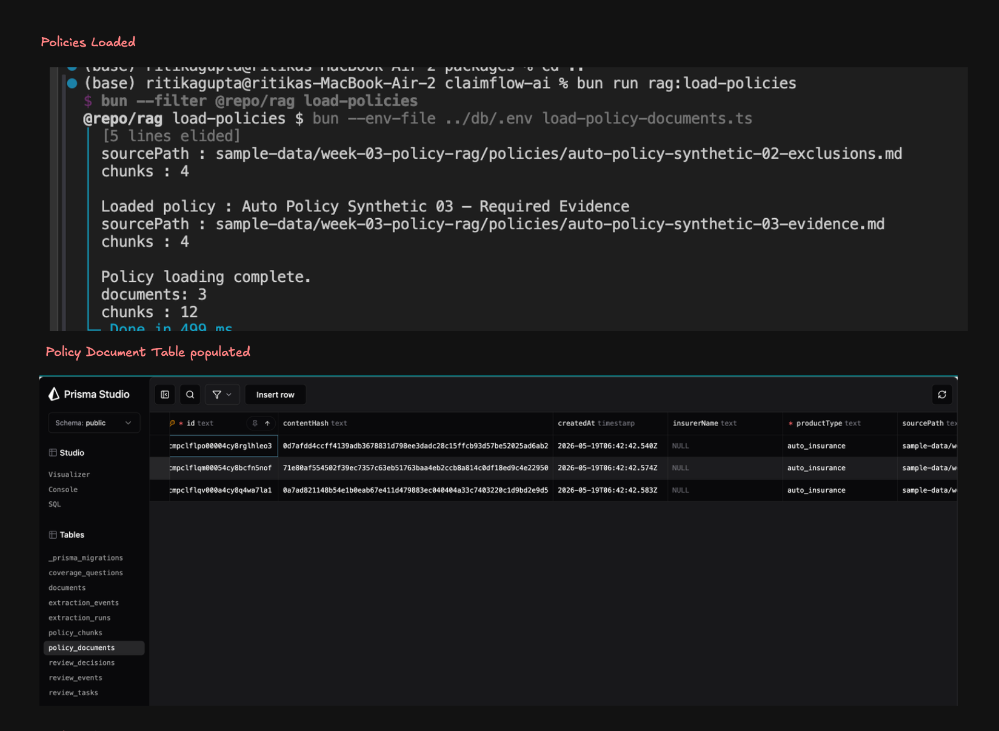

Policy documents and policy chunks are visible in Prisma Studio after loading.

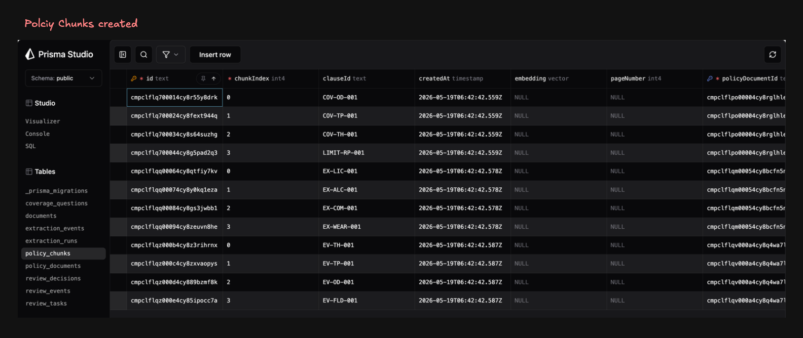

---

## 5. Policy parsing

Each policy markdown file contains:

```txt
title
policy metadata
clause sections
```

The parser extracts:

```txt
policy title
product type
version
source type
content hash
clause ID
section title
full clause text
```

The first-level title becomes the policy title.

Header metadata becomes policy metadata.

Each clause heading becomes one policy clause.

Example clause heading:

```txt
CLAUSE EV-TH-001: Theft claim evidence requirements
```

This becomes:

```txt
clauseId: EV-TH-001
sectionTitle: Theft claim evidence requirements
text: full clause text including heading
```

---

## 6. Chunking strategy

Week 3 uses clause-based chunking.

```txt
one clause = one chunk
```

This is deliberate.

A policy RAG system is different from a generic document chatbot. The answer needs to cite policy rules, not arbitrary text windows.

Clause-based chunks make citations readable:

```txt
The answer cites EV-TH-001, not “chunk 4 from page 2”.
```

This also makes evals easier because expected retrieval can be defined as required clause IDs.

---

## 7. Embedding strategy

The system embeds policy chunks and user queries differently.

Policy chunk embedding format:

```txt
title: <policy title> | text: Clause <clauseId> — <sectionTitle>

<full clause text>
```

Question embedding format:

```txt
task: question answering | query: <coverage question>
```

This is asymmetric retrieval formatting.

The policy chunk is formatted as source knowledge.

The user question is formatted as a question-answering query.

The embeddings are 768-dimensional and stored in Postgres using pgvector.

```bash
bun run rag:embed-policies
```

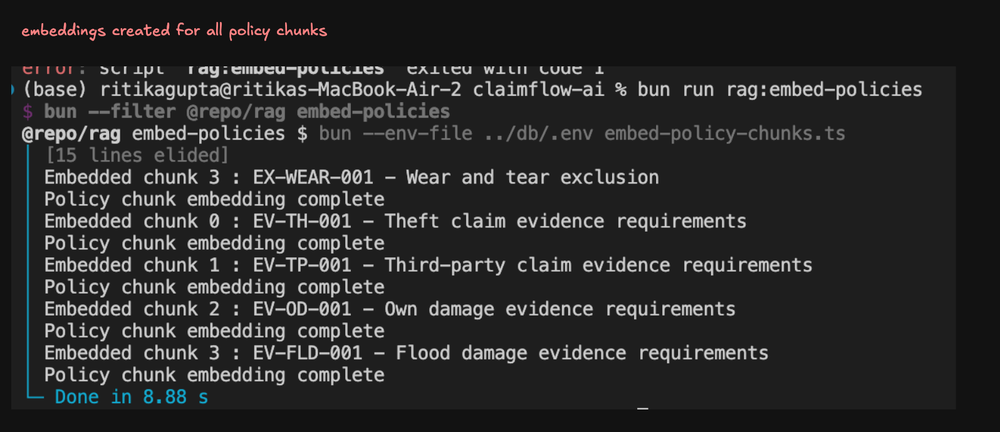

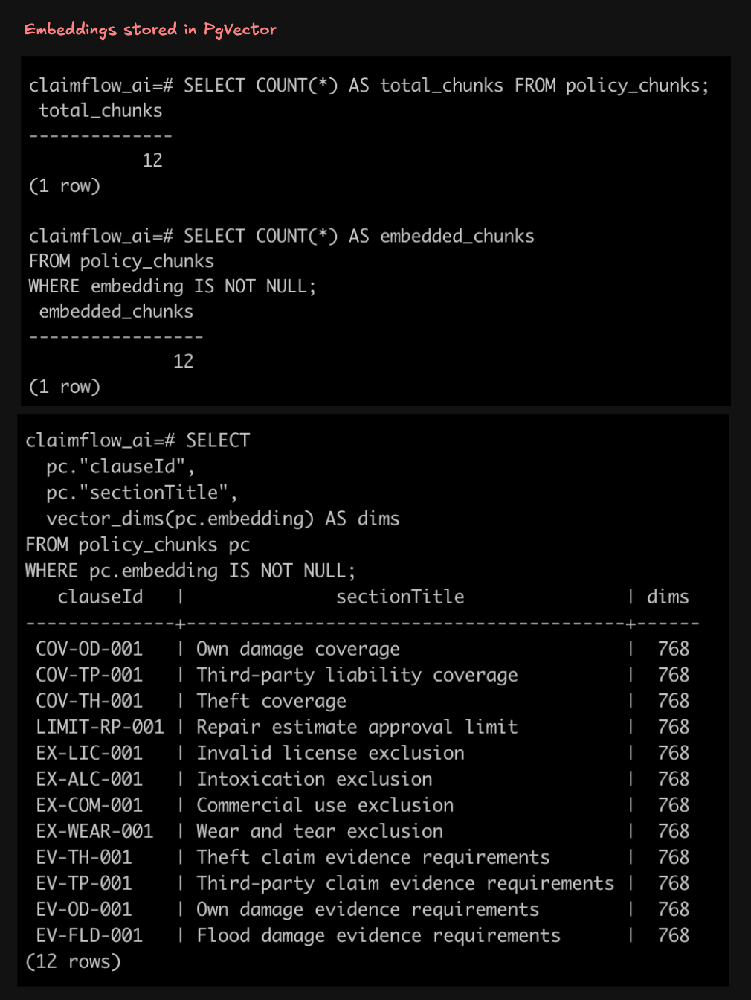

---

## 8. Vector storage and search

Policy chunks are stored as database rows with their embeddings.

Retrieval uses cosine similarity over the stored vectors.

The search returns ranked policy chunks with:

```txt
chunk ID
policy document ID
policy title
clause ID
section title
text
similarity score
source query intent
```

The first vector smoke test verifies that a natural-language question retrieves relevant policy clauses:

```bash
bun --filter @repo/rag smoke:vector-search "Is theft claim ready for approval if FIR number is missing?"
```

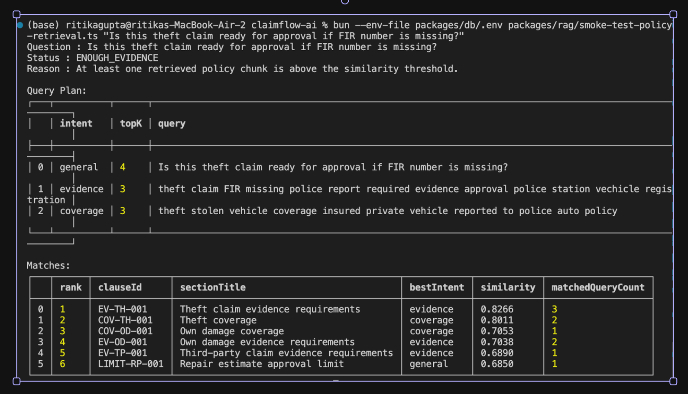

The early result proved vector search was working, while also showing that plain vector search alone is not enough for final answer quality.

---

## 9. Claim-aware query planning

The system does not embed only the raw user question.

A user may ask:

```txt
Is this claim covered?
```

That question is too generic.

The system combines the question with claim context:

```txt
loss type
incident details
missing evidence
required evidence
review-corrected claim data, when available
```

Then it builds multiple retrieval queries.

Example theft claim:

```txt
general:
Is this claim covered?

evidence:
theft claim FIR police report required evidence approval police station vehicle registration

coverage:
theft stolen vehicle coverage insured private vehicle reported to police auto policy
```

This is one of the most important Week 3 design choices.

A coverage question often needs more than one policy angle:

```txt
What is covered?
What evidence is required?
Does an exclusion apply?
Is a repair estimate above the approval threshold?
```

---

## 10. Retrieval intents

The retrieval planner uses intent labels to make retrieval explainable.

Supported intents:

```txt
general    original user question
coverage   policy clauses that say what is covered
evidence   required claim documents or proof
exclusion  policy clauses that say what is not covered
limit      approval thresholds or limits
```

These intents are not final decisions. They are retrieval hints.

They help the system search for the right type of policy evidence.

---

## 11. Multi-query retrieval

Each planned query is embedded and searched separately.

Example:

```txt
query 1 → top policy chunks
query 2 → top policy chunks
query 3 → top policy chunks
```

The raw retrieval results may contain duplicates because the same clause can be relevant to multiple query variants.

For example, a theft evidence clause may appear for both the general query and the evidence query.

The policy retrieval smoke test runs the higher-level retrieval stack:

```bash
bun --env-file packages/db/.env packages/rag/smoke-test-policy-retrieval.ts "Is this theft claim ready for approval if FIR number is missing"
```


---

## 12. Retrieval merge and ranking

After retrieval, duplicate chunks are merged.

Merge strategy:

```txt
dedupe by chunk ID
keep the highest similarity score
keep all matched queries
set best intent from the highest-scoring query
sort final chunks by similarity
return the top final matches
```

This keeps the answer context compact while preserving the retrieval trace.

A final retrieved chunk can explain:

```txt
I was retrieved by the evidence query and also matched the general question.
```

That makes failures easier to debug.

---

## 13. Retrieval thresholding

Before generation, the system checks whether retrieval is strong enough.

The answer generator should not run if there is no good evidence.

Refusal rules include:

```txt
no chunks retrieved
no retrieved chunk has a clause ID
top similarity is below threshold
general-only retrieval is too weak
```

When retrieval fails, the system returns:

```txt
NEEDS_REVIEW
```

Generation is skipped.

This prevents the model from filling gaps with general insurance knowledge.

---

## 14. Retrieval smoke case suite

The retrieval case suite checks supported and unsupported scenarios.

From `packages/rag`:

```bash
bun --env-file ../db/.env scripts/smoke-test-retrieval-cases.ts
```

The runner checks cases such as:

```txt
theft missing FIR
third-party documents
commercial use exclusion
invalid license exclusion
repair estimate approval limit
flood evidence
unsupported racing-performance question
```

The important edge behavior is:

```txt
unsupported questions should return INSUFFICIENT_EVIDENCE
```

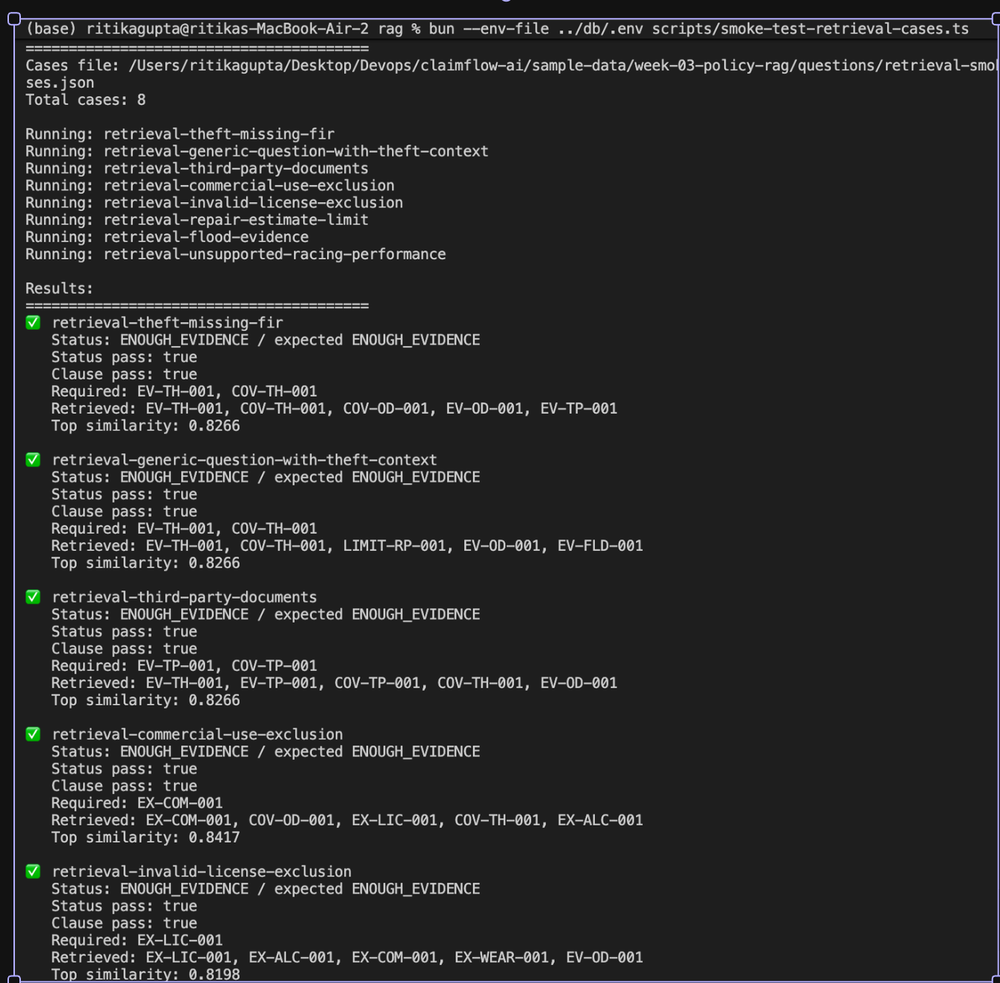

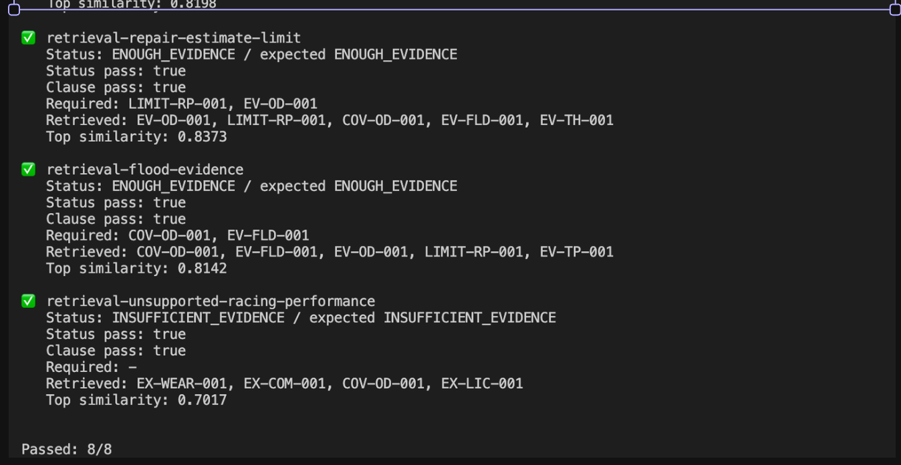

---

## 15. Reviewed claim context precedence

Coverage answering should use the best available claim context.

Priority:

```txt
1. human-approved corrected claim JSON
2. original extracted claim JSON
```

If a reviewer edited and approved a claim, the RAG system should use the corrected claim data.

This avoids stale extraction errors affecting the coverage answer.

Example:

```txt
Original extraction: FIR missing
Reviewer correction: FIR present
Coverage answer should use: FIR present
```

This keeps Week 3 connected to Week 2's human-in-the-loop workflow.

---

## 16. Grounded answer generation

After retrieval succeeds, the model receives only:

```txt
user question
claim context
retrieval status
retrieved policy clauses
```

The model is instructed to:

```txt
answer only from retrieved policy clauses
not use outside insurance knowledge
return structured JSON
cite every coverage reason
copy quotes from retrieved text
return NEEDS_REVIEW when evidence is missing or insufficient
```

Supported decisions:

```txt
COVERED
NOT_COVERED
PARTIALLY_COVERED
NEEDS_REVIEW
```

The generated answer is still treated as untrusted until verified.

---

## 17. Citation verification

The system validates every citation after generation.

A citation is valid only if:

```txt
cited chunk ID was retrieved
cited clause ID matches the retrieved chunk
quoted text exists inside the retrieved chunk text
```

If a citation fails, it is removed.

If no valid citations remain, the answer is forced to:

```txt
NEEDS_REVIEW
```

Additional guardrails apply when the model says `COVERED`.

A `COVERED` answer requires coverage-oriented evidence. Evidence-only or exclusion-only retrieval is not enough for approval.

---

## 18. Persistence model

Each coverage question is saved as a traceable decision record.

Stored information:

```txt
original question
normalized query plan
retrieval status
retrieved matches
retrieval reason
guardrail reasons
final answer JSON
final decision
```

This is useful for:

```txt
reviewing why an answer was given
reusing previous answers
future eval dashboards
future governance and observability work
```

---

## 19. Product surface added in Week 3

Week 3 adds a coverage entry point on the extraction run page.

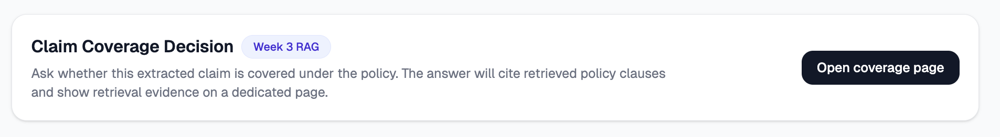

The user opens the coverage page and asks a claim-specific coverage question.

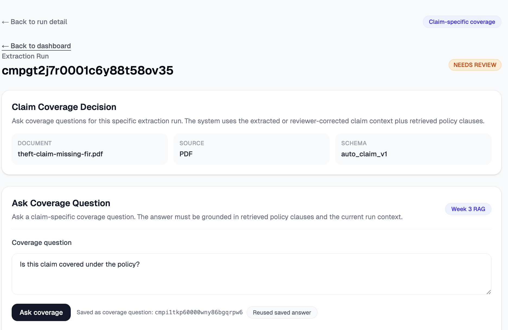

The system runs retrieval, generates a policy-grounded answer, verifies citations, persists the result, and can reuse the saved answer for the same normalized question.

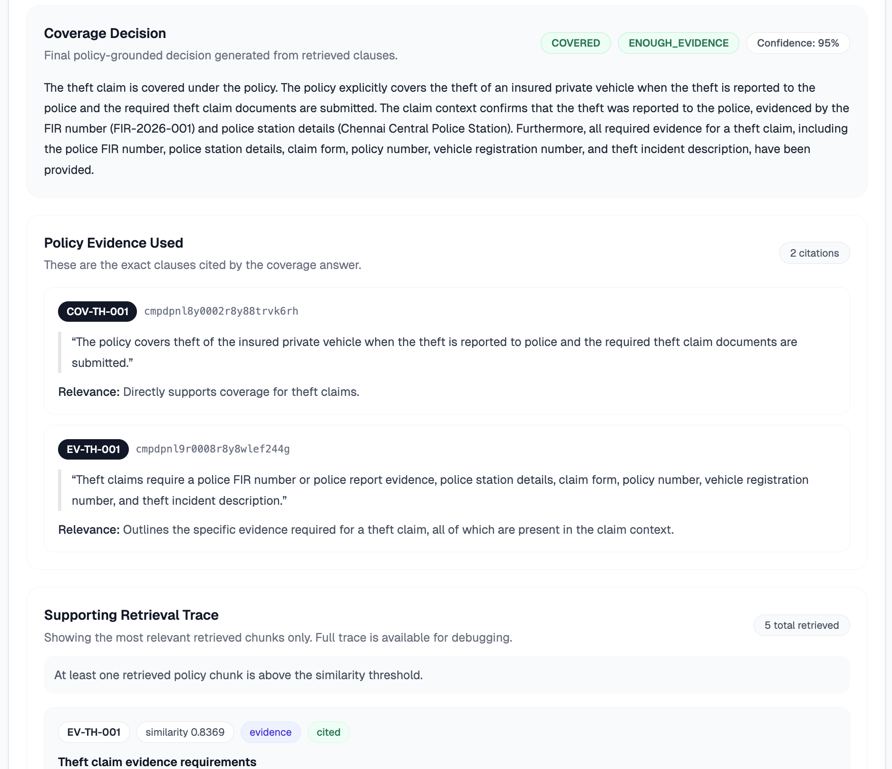

The UI shows exact policy clauses cited by the answer.

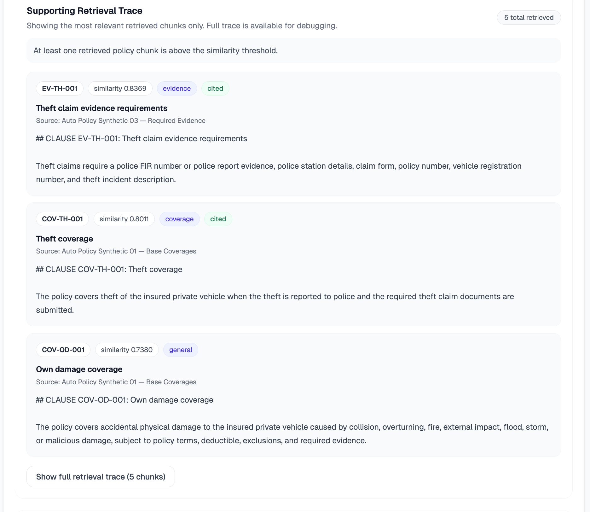

The retrieval trace exposes the retrieved chunks, similarity scores, retrieval intents, and citation status used for debugging.

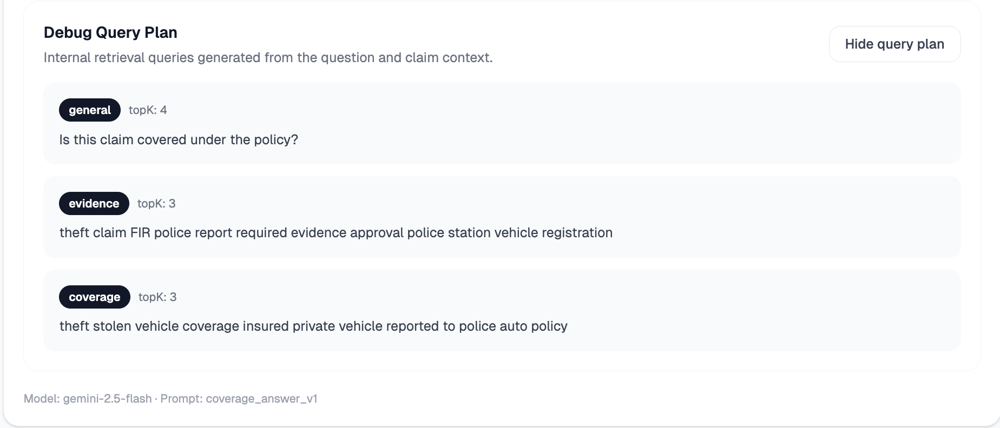

---

## 20. Retrieval strategies used in Week 3

Week 3 uses a simple but real retrieval stack:

```txt
clause-based chunking
asymmetric embedding formatting
Gemini embeddings
pgvector cosine similarity
claim-aware query expansion
multi-query retrieval
intent-labeled retrieval
chunk deduplication
similarity thresholding
general-only stricter threshold
citation verification
safe NEEDS_REVIEW fallback
```

Strategies intentionally not used yet:

```txt
reranking
hybrid BM25 + vector search
query rewriting with an LLM
multi-policy routing
managed file-search RAG
streaming answers
policy PDF OCR
```

Those are later improvements. Week 3 focuses on a manual, inspectable RAG pipeline.

---

## 21. Eval design

The Week 3 eval checks both retrieval and answer behavior.

It measures:

```txt
retrieval hit rate
decision match rate
citation present rate
citation support rate
unsupported refusal rate
false approval rate
```

The most important metric is:

```txt
false approval rate = 0
```

A false approval means the system returned `COVERED` when the expected safe answer was not `COVERED`.

For an insurance workflow, preventing false approvals is more important than giving confident answers.

---

## Final mental model

The model does not own the coverage decision.

The system owns the workflow:

```txt
retrieve evidence
check evidence strength
generate a draft answer
verify citations
force review when unsupported
persist the trace
```

That is the Week 3 RAG architecture.
