# ClaimFlow AI — Week 5 Memory Flow, Evidence, and Validation

This document explains how memory works inside ClaimFlow AI and uses screenshots as supporting proof for each part of the architecture.

The main story is the memory pipeline:

```text
past workflow history
→ normalized memory observations
→ WorkflowMemory DB cards
→ retrieval + scoring
→ safe agent context
→ UI/reviewer guidance
→ human review outcome
→ memory update loop
→ semantic memory creation
→ future retrieval
```

The screenshots are placed inside this flow to show where each part is visible in the product, database, or smoke-test output.

Demo link: [ClaimFlow AI memory UI demo](https://x.com/RitikaxG/status/2065037735145205775?s=20)

---

## 1. What Week 5 memory is proving

Week 5 proves that ClaimFlow AI can use past workflow learning without treating old claims as current claim evidence.

The system remembers workflow lessons such as:

```text
A reviewer previously corrected a policy number.
A prior claim was rejected for a specific entity-risk reason.
A vendor repeatedly had invoice conflicts.
A certain evidence type was repeatedly requested.
A field repeatedly caused extraction or validation problems.
```

But the system does **not** use memory to decide claim truth.

Memory can help with:

```text
routing a claim to review
asking for missing information
warning a reviewer about a known pattern
making agent decisions more cautious
tracking whether a memory was useful later
```

Memory cannot:

```text
auto-approve a claim
auto-reject a claim
overwrite extractedJson
auto-fill missing values
replace current policy evidence
use a previous claim outcome as the current claim outcome
```

The core rule is:

```text
Memory is workflow context, not claim evidence.
```

---

## 2. End-to-end memory architecture

At architecture level, Week 5 memory has two phases.

### Phase A — Bootstrap memory from past eval/history data

The initial memory set was created from past eval-style data and historical workflow records.

That source history included:

```text
historical claims
human corrections
prior review decisions
agent action history
past Week 5 packets
```

Instead of injecting this raw history directly into the agent, the system first normalized it into `memory-observations.json`.

Each observation represented one safe workflow lesson:

```text
sourceType
entityType
entityId
fieldPath
riskLevel
recommendedMemoryKind
summary
safeUse
mustNotDo
evidenceJson
```

This normalized layer was important because old claim packets may contain too much irrelevant data. The memory writer only takes the safe, compact lesson and writes it into the database as a `WorkflowMemory` card.

### Phase B — Ongoing memory from future claims

After bootstrap, the system does not keep manually editing `memory-observations.json` forever.

Future memory growth comes from the live workflow:

```text
new claim is extracted
validation runs
agent routes the claim
human reviewer approves / edits / rejects / asks for more info
system compares extractedJson vs correctedJson
system reads the review decision
system creates or updates memory
```

This is why the update loop matters. Memory becomes a living workflow layer, not a static seed file.

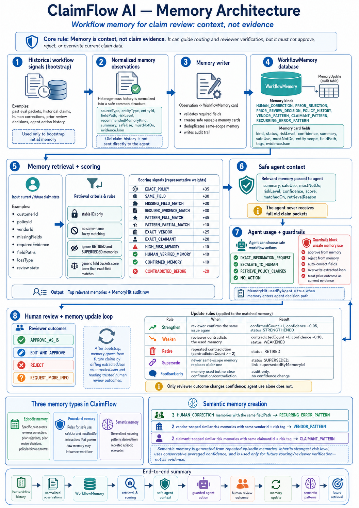

The architecture diagram shows the full system: bootstrap observations, memory writer, DB cards, retrieval/scoring, safe agent context, guardrails, review outcomes, memory updates, and semantic memory creation.

---

## 3. How memory appears in the UI flow

The product UI demonstrates that memory is not hidden backend metadata. It is surfaced to the reviewer at the right workflow stages so the human can understand why the system is being cautious.

The UI flow should be read as a claim moving through review with memory attached as supporting workflow context.

### 3.1 Before validation, the claim has current extracted data

At the start, the system has the current claim extraction and validation state. Memory is not allowed to overwrite this state.

The important idea is:

```text
current claim data remains source of truth
memory is only a prior workflow signal
```

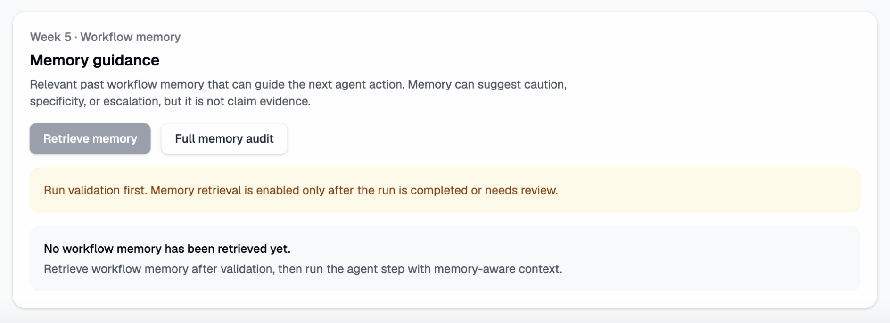

This screen supports the first safety rule: memory is introduced around the claim workflow, but it does not replace the current extraction.

### 3.2 Retrieval surfaces only relevant memory

Once the current claim state is known, the memory retriever builds a structured query using stable workflow signals:

```text
customerId
policyId
vendorId
fieldPath
missingFields
requiredEvidence
lossType
review state
```

It retrieves memory only when the current claim has a meaningful relationship to a stored memory. For example:

```text
same claimant + same missing policyNumber field
same vendor + invoice conflict risk
same required evidence problem across different claimants
```

It avoids unsafe matching such as:

```text
similar claimant name only
old claim packet similarity only
unscoped historical outcome only
```

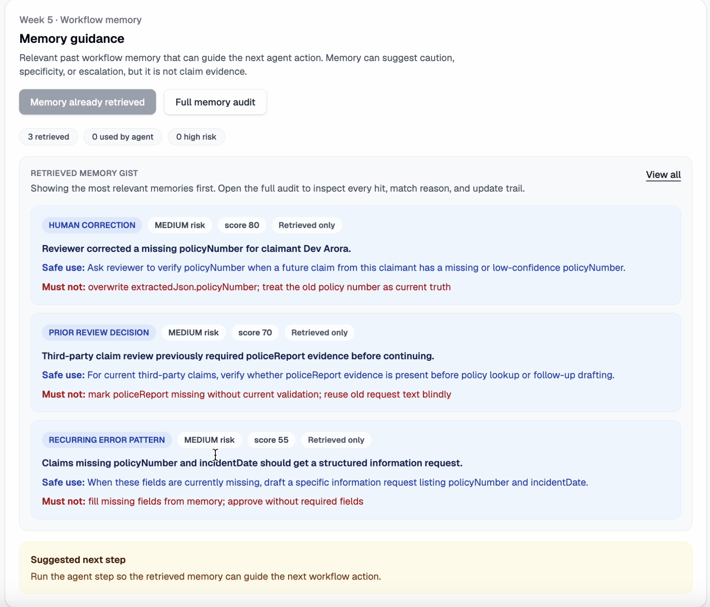

This screen shows the retrieval result in the product flow. The useful point is not just that memory exists; it is that memory was selected because it matched current claim conditions.

### 3.3 Retrieved memory becomes reviewer guidance

After memory is retrieved, the system turns it into reviewer-facing guidance.

The guidance is intentionally constrained. It should answer:

```text
What happened before?
Why is it relevant now?
What should the reviewer verify?
What must the system not do with this memory?
```

It should not say:

```text
approve because the previous claim was approved
reject because the previous claim was rejected
copy old field values into this claim
```

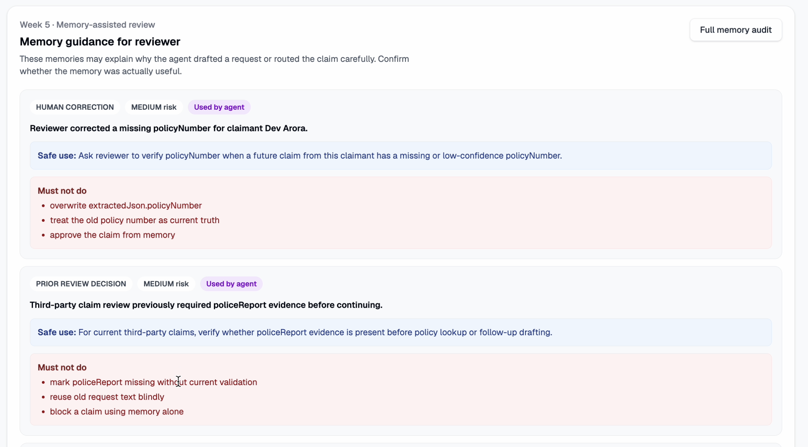

This screen proves the memory is being used as explainable review guidance rather than as an automatic decision.

### 3.4 Reviewer can mark memory as relevant

The reviewer interaction matters because memory confidence should not change merely because the agent retrieved or displayed memory.

The system distinguishes:

```text
memory retrieved
memory used by agent
memory seen by reviewer
memory confirmed or contradicted by reviewer outcome
```

Only trusted review outcomes should update confidence. A UI marker such as “relevant” is useful as feedback, but it is still not the same as claim evidence.

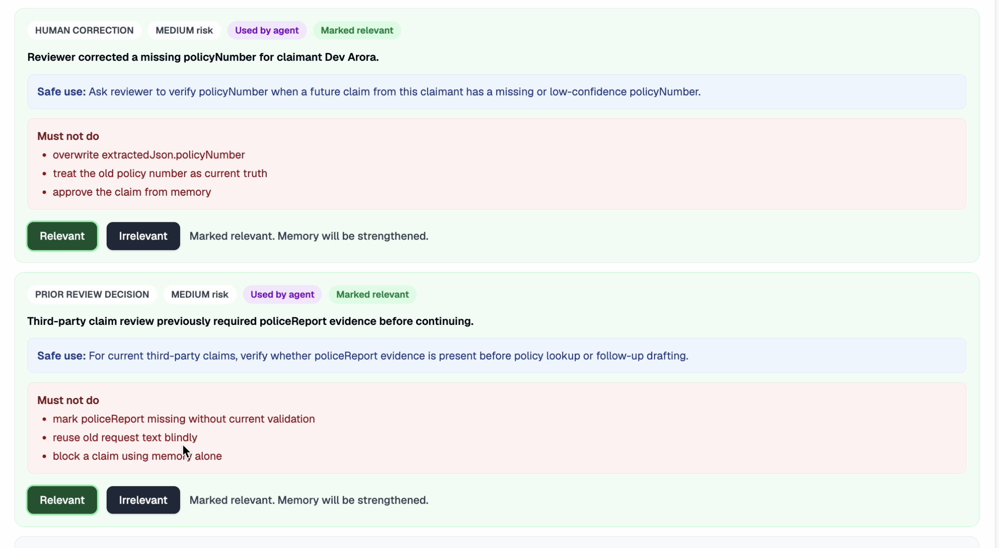

This screen supports the feedback model: memory can be surfaced, inspected, and marked, while still remaining subordinate to the human review decision.

### 3.5 Memory usage is auditable

Once memory enters the claim flow, the system needs to track it.

For a future claim, the system records:

```text
which memory was retrieved
why it matched
what score it received
whether the agent used it
which run it belonged to
```

That is the role of `MemoryHit`.

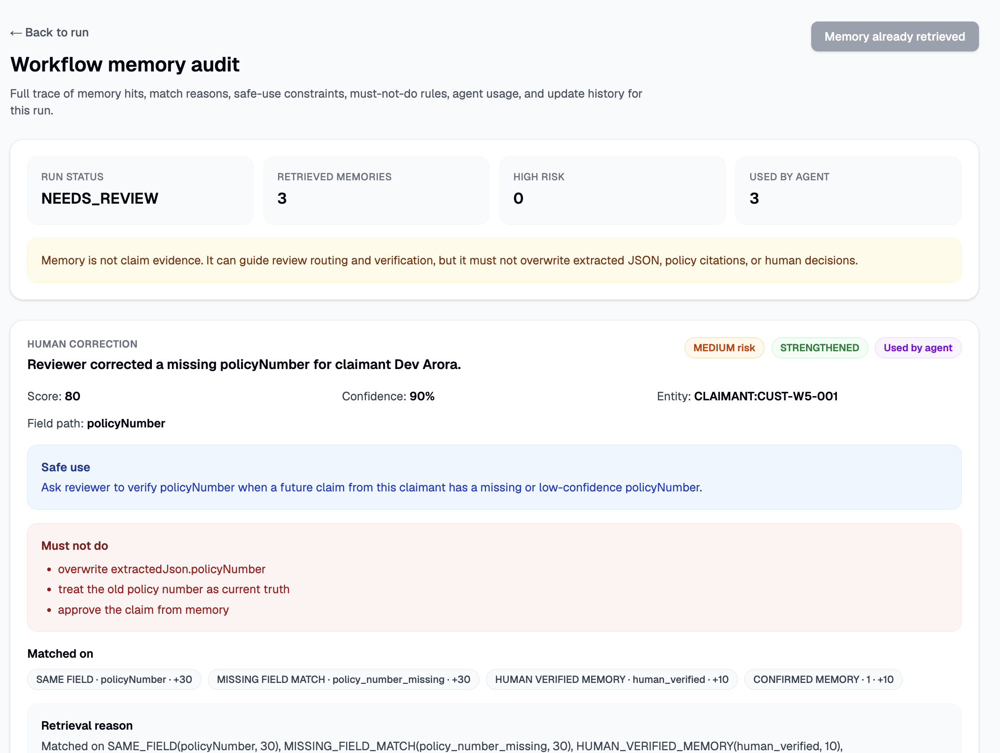

The audit screen shows that memory retrieval is not a black box. The system can explain which memory affected the run.

### 3.6 Memory audit connects retrieval, agent usage, and review

The second audit view completes the traceability story.

A memory should be explainable across its lifecycle:

```text
created from what source
retrieved for which run
matched on what signals
used by agent or not
updated after which review outcome
```

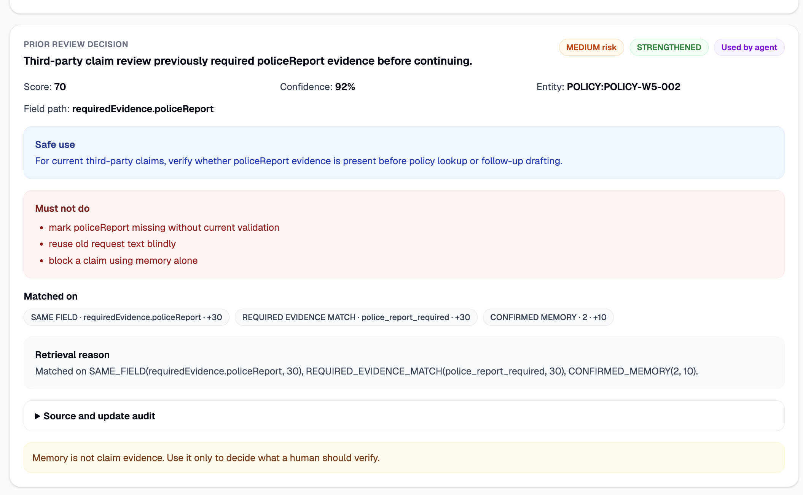

Together, the UI screenshots prove that memory is not just a backend table. It is visible, reviewable, and auditable inside the workflow.

---

## 4. Database design for memory

Memory needed its own database design because a claim workflow has three different concerns:

```text
1. What does the system remember long-term?
2. When was a memory retrieved for a future claim?
3. How did that memory change over time?
```

A single table would mix these concerns and make the system hard to audit.

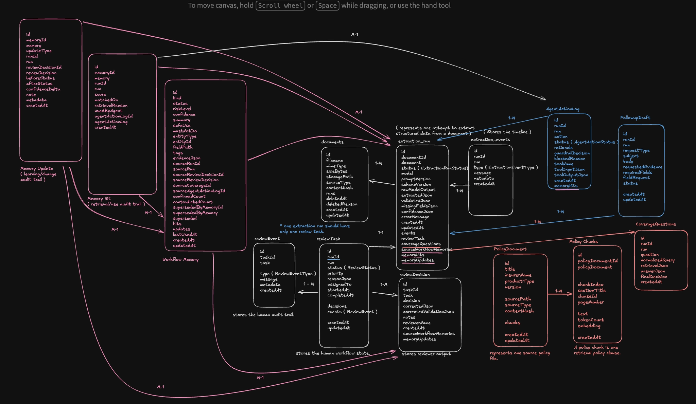

### 4.1 WorkflowMemory

`WorkflowMemory` stores the long-term reusable memory card.

It represents one compact workflow lesson, such as:

```text
Reviewer previously corrected policyNumber for this claimant.
This vendor has repeated invoice conflict signals.
Third-party claims often required policeReport evidence.
```

Important fields include:

```text
kind
status
riskLevel
confidence
summary
safeUse
mustNotDo
entityType
entityId
fieldPath
tags
evidenceJson
confirmedCount
contradictedCount
supersededByMemoryId
lastUsedAt
```

Why it is needed:

```text
The agent needs reusable workflow context.
The reviewer needs compact guidance.
The system needs confidence/status so old or contradicted memories can be controlled.
```

### 4.2 MemoryHit

`MemoryHit` stores retrieval-time audit.

It answers:

```text
Was this memory retrieved for this run?
Why did it match?
What score did it receive?
Did the agent actually use it?
```

Important fields include:

```text
memoryId
runId
score
matchedOn
retrievalReason
usedByAgent
agentActionLogId
```

Why it is needed:

```text
Retrieval should be explainable.
Agent usage should be distinguishable from retrieval.
Confidence should not change just because memory appeared in search results.
```

### 4.3 MemoryUpdate

`MemoryUpdate` stores the audit trail for memory creation and lifecycle changes.

It answers:

```text
When was this memory created?
Was it strengthened?
Was it weakened?
Was it retired?
Was it superseded?
What review outcome caused the change?
```

Important fields include:

```text
memoryId
updateType
beforeStatus
afterStatus
confidenceDelta
runId
reviewDecisionId
note
metadata
```

Why it is needed:

```text
Every memory change must be traceable.
The system should be able to explain why confidence changed.
A reviewer or interviewer should be able to audit the memory lifecycle.
```

---

## 5. Retrieval and scoring proof

Memory retrieval is designed to be conservative.

The retriever scores memories using three groups of signals:

```text
workflow relevance
entity match
trust/risk adjustment
```

Representative scoring signals:

```text
EXACT_POLICY                  +35
SAME_FIELD                    +30
MISSING_FIELD_MATCH           +30
REQUIRED_EVIDENCE_MATCH       +30
PATTERN_FULL_MATCH            +45
PATTERN_PARTIAL_MATCH         +10
EXACT_VENDOR                  +25
EXACT_CLAIMANT                +20
HIGH_RISK_MEMORY              +10
HUMAN_VERIFIED_MEMORY         +10
CONFIRMED_MEMORY              +10
CONTRADICTED_BEFORE           -20
```

The scoring intentionally makes exact workflow problems stronger than vague historical similarity.

### 5.1 Prior rejection retrieval smoke test

This smoke test proves that a prior rejection memory can be retrieved for the same stable claimant/entity and used only as a review-routing signal.

Expected behavior:

```text
retrieve prior rejection memory
surface it as high-risk context
route to human review
record MemoryHit
```

Unsafe behavior that should not happen:

```text
auto-reject the claim
draft denial only from memory
treat the previous rejection as current claim evidence
```

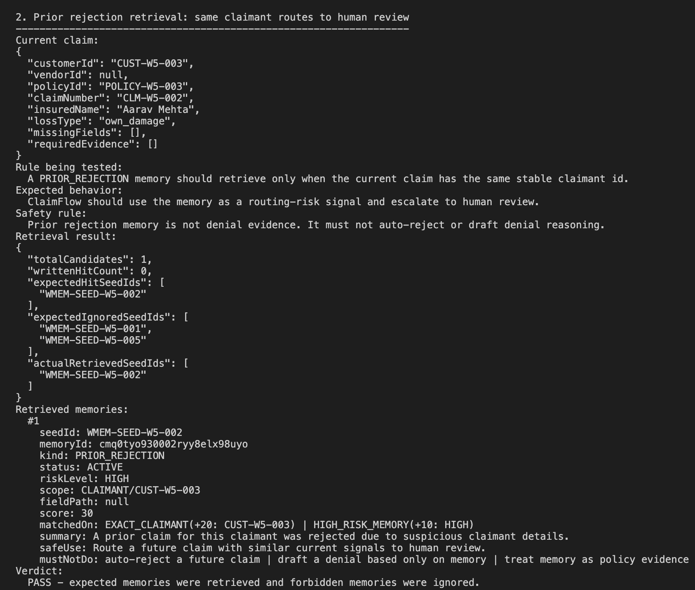

The test proves that risky memory is allowed to increase caution, but not allowed to make the final claim decision.

### 5.2 Required evidence retrieval smoke test

This smoke test proves that generic workflow memory can apply across different claimants or vendors when the current workflow issue matches.

Example:

```text
A previous review required policeReport evidence.
A new claim has requiredEvidence = policeReport.
The memory can be retrieved even if claimant/vendor are different.
```

Why this is safe:

```text
This is not claimant-risk memory.
It is field/evidence workflow memory.
It helps request missing evidence, not decide claim truth.
```

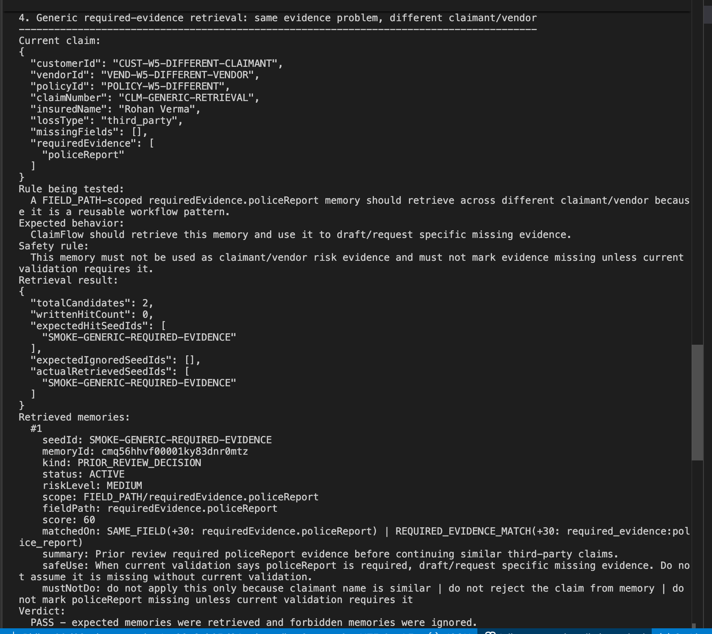

The test proves that ClaimFlow can reuse workflow lessons without leaking one claimant's history into another claimant's claim.

---

## 6. Agent memory integration proof

The agent receives a compact memory context, not full old claims.

The safe memory context includes:

```text
summary
safeUse
mustNotDo
riskLevel
confidence
score
matchedOn
retrievalReason
```

The agent can use this to choose safe workflow actions:

```text
DRAFT_INFORMATION_REQUEST
ESCALATE_TO_HUMAN
RETRIEVE_POLICY_CLAUSES
NO_ACTION
```

The guardrails block unsafe actions:

```text
approve from memory
reject from memory
auto-correct fields
overwrite extractedJson
treat previous outcome as current evidence
```

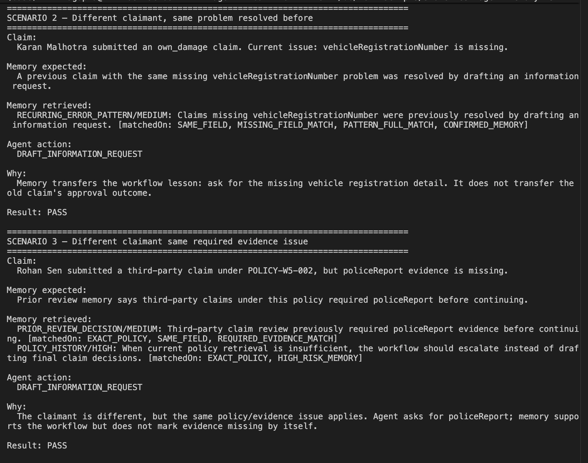

This smoke test proves that memory can enter the agent decision path while remaining constrained by guardrails.

The key behavior is:

```text
MemoryHit.usedByAgent = true
agent action is linked to memory usage
confidence still does not change from agent usage alone
```

---

## 7. Memory update loop proof

The memory update loop starts after the claim is reviewed by a human.

The important sequence is:

```text
memory retrieved
agent may use memory safely
human reviewer records outcome
system compares extractedJson vs correctedJson
system creates new memory if useful
system updates previously used memory if confirmed or contradicted
```

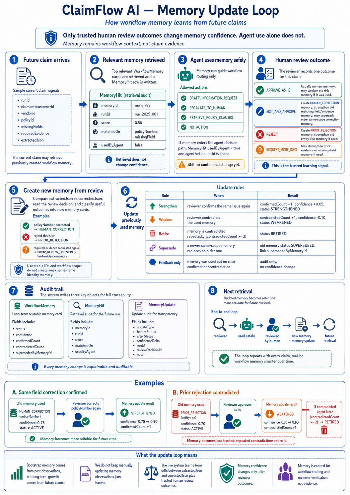

The update loop proves the difference between initial bootstrap memory and long-term learning.

Bootstrap memory came from past observations. Long-term memory growth comes from future claims and trusted human review outcomes.

### 7.1 Strengthen memory

A memory is strengthened when it was used and the reviewer confirms the same issue again.

Example:

```text
Old memory:
HUMAN_CORRECTION on policyNumber

Future claim:
agent routes to review because policyNumber looks risky

Reviewer outcome:
reviewer corrects policyNumber again

Result:
confirmedCount +1
confidence +0.05
status STRENGTHENED
```

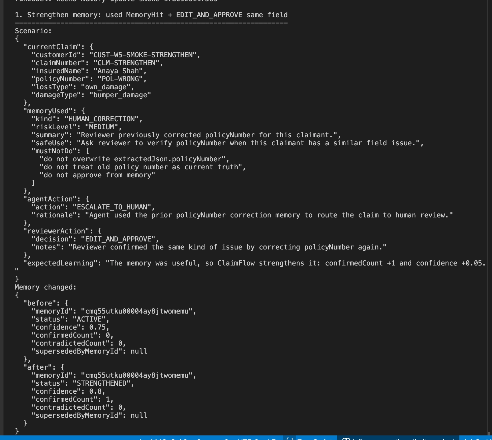

This proves that memory becomes more trusted only after a human confirms the same workflow issue.

### 7.2 Weaken memory

A memory is weakened when it was used but the reviewer contradicts it.

Example:

```text
Old memory:
PRIOR_REJECTION for an entity-risk pattern

Future claim:
agent escalates because prior rejection memory matched

Reviewer outcome:
reviewer approves the claim as-is

Result:
contradictedCount +1
confidence -0.10
status WEAKENED
```

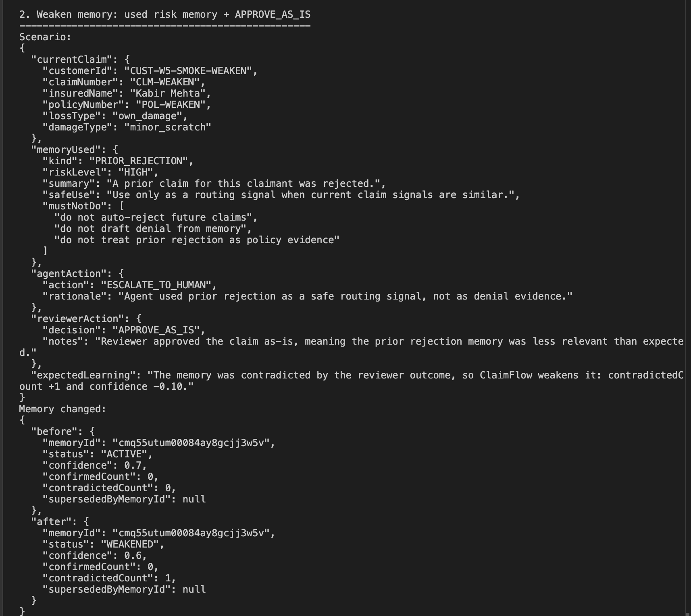

This proves memory is not blindly trusted forever. If future human outcomes disagree with it, confidence decreases.

### 7.3 Retire memory

A memory is retired when it is contradicted repeatedly.

Rule:

```text
contradictedCount >= 2
→ status RETIRED
```

Retired memories should no longer be retrieved for future claims.

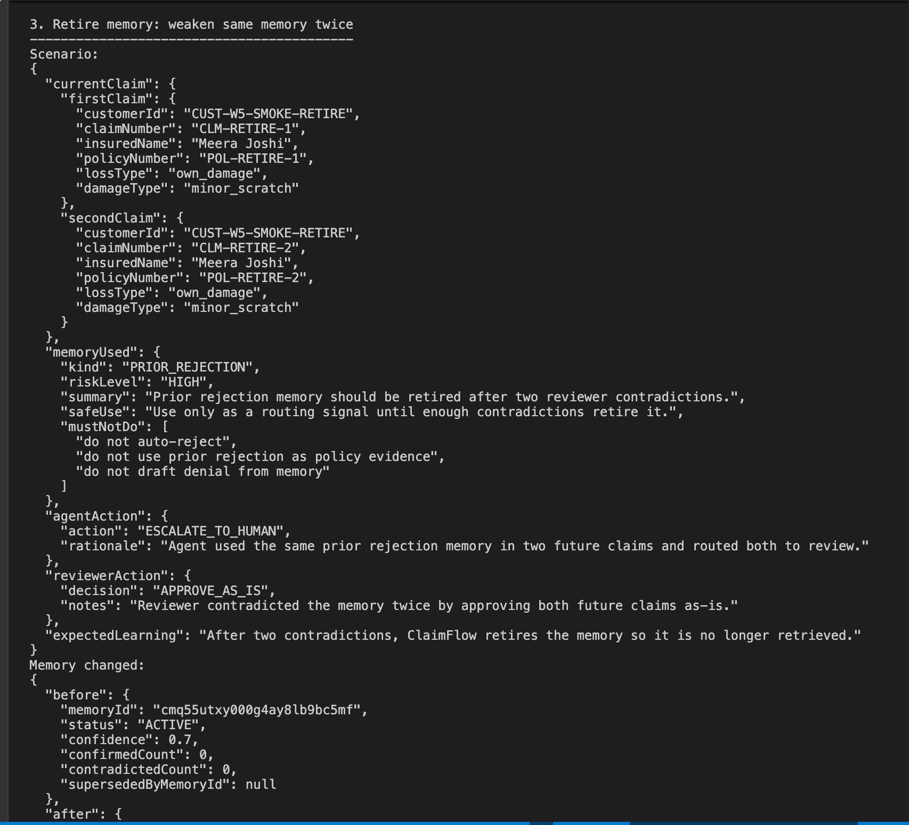

This proves the system has a forgetting mechanism. It does not keep surfacing stale or unreliable memory.

### 7.4 Supersede memory

A memory is superseded when a newer same-scope memory replaces an older one.

Same-scope means the memory has the same core matching scope, such as:

```text
same kind
same entityType
same entityId
same fieldPath
```

Example:

```text
Old memory:
HUMAN_CORRECTION / CLAIMANT CUST-001 / policyNumber

New memory:
newer HUMAN_CORRECTION / CLAIMANT CUST-001 / policyNumber

Result:
old memory status SUPERSEDED
old memory links to supersededByMemoryId
```

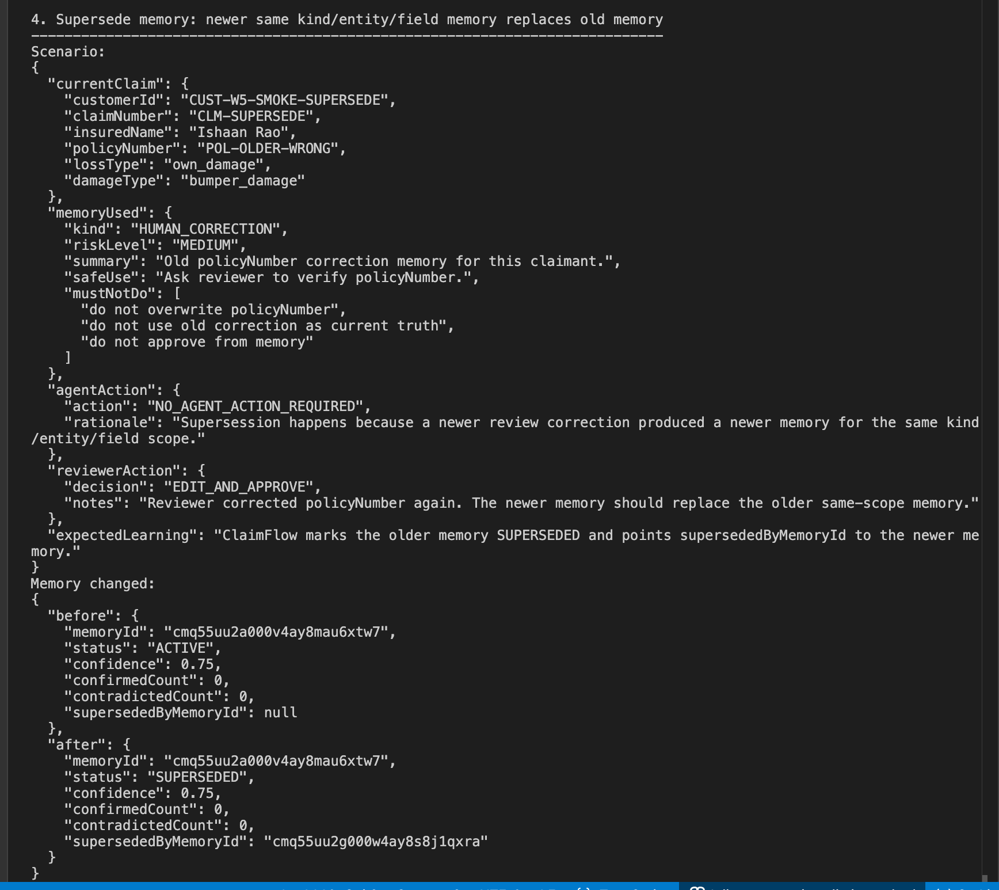

This proves the system can replace outdated same-scope memory without losing audit history.

---

## 8. Semantic memory proof

Episodic memory remembers specific events.

Examples:

```text
Reviewer corrected policyNumber in one claim.
Reviewer requested policeReport in one claim.
A vendor had invoice conflict in one claim.
```

Semantic memory generalizes repeated episodic memories into reusable patterns.

Examples:

```text
policyNumber is a recurring extraction-risk field.
This vendor repeatedly has invoice conflict signals.
This claimant repeatedly has duplicate-like review signals.
```

The semantic memory thresholds are deterministic:

```text
3 HUMAN_CORRECTION memories with same fieldPath
→ RECURRING_ERROR_PATTERN

2 vendor-scoped similar risk memories with same vendorId + risk tag
→ VENDOR_PATTERN

2 claimant-scoped similar risk memories with same claimantId + risk tag
→ CLAIMANT_PATTERN
```

The pattern is not created by vague LLM interpretation. It is created from repeated structured memories.

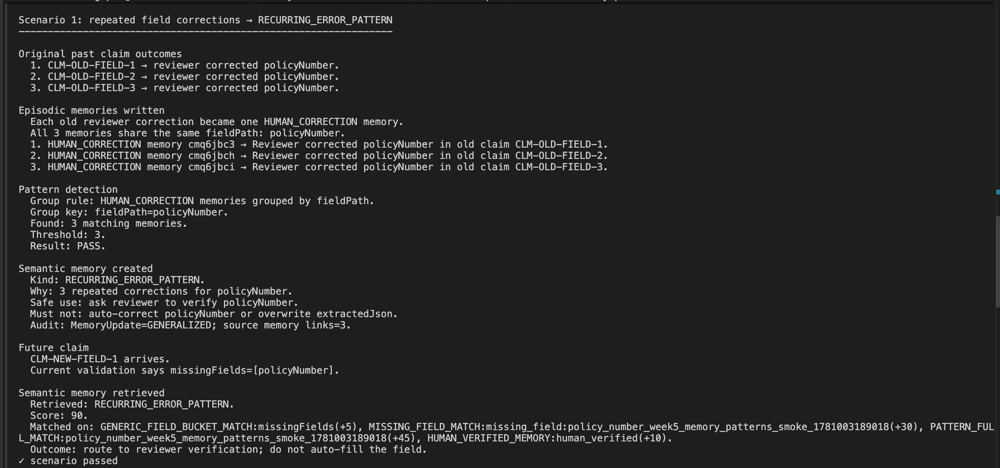

This screenshot proves semantic memory can be retrieved when a new claim matches a generalized workflow pattern.

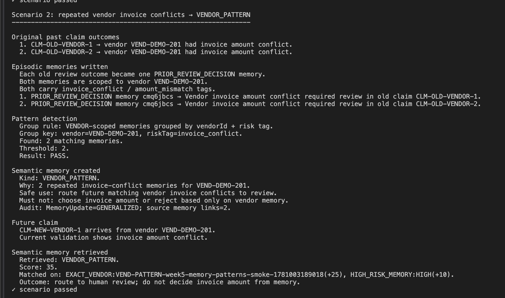

The second semantic retrieval screenshot supports the same idea from another run or view: semantic memory is available to future claims as workflow context.

The safety rule remains unchanged:

```text
semantic memory can route or warn
semantic memory cannot approve, reject, or overwrite current claim data
```

---

## 9. What each proof category demonstrates

### UI screenshots prove product behavior

The UI screenshots prove that memory is visible in the actual claim flow:

```text
memory appears near validation/review
retrieved memory becomes reviewer guidance
reviewer can mark memory relevance
memory usage is auditable
```

### DB schema proves persistence and auditability

The DB design proves that memory is not temporary prompt text.

It is stored with lifecycle state, confidence, scope, retrieval audit, and update audit.

### Retrieval smoke tests prove matching rules

The retrieval tests prove:

```text
same stable entity can retrieve entity-scoped memory
same workflow issue can retrieve field/evidence memory
wrong same-name entity does not retrieve unsafe memory
retired/superseded memories are excluded
scores explain why memory ranked higher or lower
```

### Agent smoke test proves safe usage

The agent test proves:

```text
memory enters agent context
agent can use memory for routing
MemoryHit.usedByAgent is recorded
guardrails block unsafe final decisions from memory
```

### Update smoke tests prove learning behavior

The update tests prove:

```text
confirmed memory strengthens
contradicted memory weakens
repeated contradiction retires memory
newer same-scope memory supersedes older memory
memory confidence changes only after trusted review outcome
```

### Semantic memory tests prove pattern learning

The semantic memory tests prove:

```text
ClaimFlow does not only recall old events
it can generalize repeated episodic memories into semantic workflow patterns
semantic memories are still safely used only for future routing and verification
```

---

## 10. Interview-ready summary

Week 5 memory adds a controlled learning layer to ClaimFlow AI.

The system first bootstraps memory from past observations, but it does not dump past claims into the agent. It converts old workflow history into safe memory cards with `summary`, `safeUse`, `mustNotDo`, entity scope, field path, risk level, confidence, and evidence trail.

For every new claim, the retriever builds a structured memory query from stable IDs and workflow conditions. It scores memories by exact field match, missing field match, required evidence match, policy/vendor/claimant identity, risk, human verification, and contradiction history. It ignores retired and superseded memories and avoids weak same-name matching.

The agent receives only compact relevant memory, not old claim packets. It can use memory to ask for information, escalate to human review, retrieve policy clauses, or take no action. Guardrails prevent memory from approving, rejecting, overwriting fields, or replacing current evidence.

The memory update loop is driven by human review. When a reviewer edits, approves, rejects, or asks for more information, the system compares `extractedJson` with `correctedJson` and reads the review outcome. Confirmed memories are strengthened, contradicted memories are weakened, repeatedly contradicted memories are retired, and newer same-scope memories supersede older ones. Every update is written to `MemoryUpdate`.

Finally, repeated episodic memories can become semantic memory. Three corrections on the same field can become a recurring error pattern. Two similar vendor-risk memories can become a vendor pattern. Two similar claimant-risk memories can become a claimant pattern. These patterns improve future routing but still remain context, not evidence.

This proves ClaimFlow AI can learn from past human workflow behavior while preserving safety, auditability, and human control.
