# ClaimFlow AI — Week 6 Gateway Observability Flow, Evidence, and Validation

This document explains how Week 6 observability works inside ClaimFlow AI and uses screenshots as proof for each part of the flow.

The main story is:

```text
claim workflow reaches an AI-backed step
→ AI call passes through the gateway
→ call is linked to the claim run and trace
→ model, prompt, schema, latency, tokens, cost, and status are recorded
→ failures are classified as failed, retryable, or blocked
→ workflow continues through validation, RAG, memory, agent, and review
→ one-run trace explains the complete claim
→ synthetic evals prove known AI failure modes
→ eval dashboard shows system-level reliability
```

The screenshots are placed in the order a reader should use them: foundation, historical workflow coverage, one-run trace, and system-level evaluation.

---

## 1. What Week 6 is proving

Weeks 1–5 proved that ClaimFlow AI could perform important claim tasks:

```text
extract and validate claim data
route uncertain cases to human review
answer coverage questions from policy evidence
run guarded agent actions
retrieve and update workflow memory
```

Week 6 proves that those capabilities are operable as one production-style AI workflow.

The system can now answer:

```text
Which model call occurred?
Which claim run did it belong to?
Which model, prompt, and schema versions were used?
How long did the call take?
How many tokens did it use?
What was its estimated cost?
Did it succeed, fail, become retryable, or get blocked?
What happened before and after the call?
What did the agent propose?
Did guardrails allow that action?
Which memory was retrieved or used?
What did the human reviewer finally do?
```

Week 6 provides two kinds of proof:

```text
one-run trace
→ explains one real claim from start to finish

eval dashboard
→ proves the system handles controlled failure scenarios correctly
```

The distinction is important. A trace explains one workflow; an eval tests reliability across many predefined conditions.

---

## 2. Gateway persistence and database proof

The gateway needs durable storage because a provider call can fail before returning a useful answer.

ClaimFlow therefore creates an AI-call record when a governed call starts and completes the same record after the outcome is known.

```text
STARTED → SUCCEEDED
STARTED → FAILED
STARTED → RETRYABLE
STARTED → BLOCKED
```

The persisted evidence includes:

```text
claim run and trace identity
AI-call kind
provider and model
model, prompt, and schema versions
latency
input and output tokens
estimated cost
final status
retryability
failure type and reason
compact input/output metadata
```

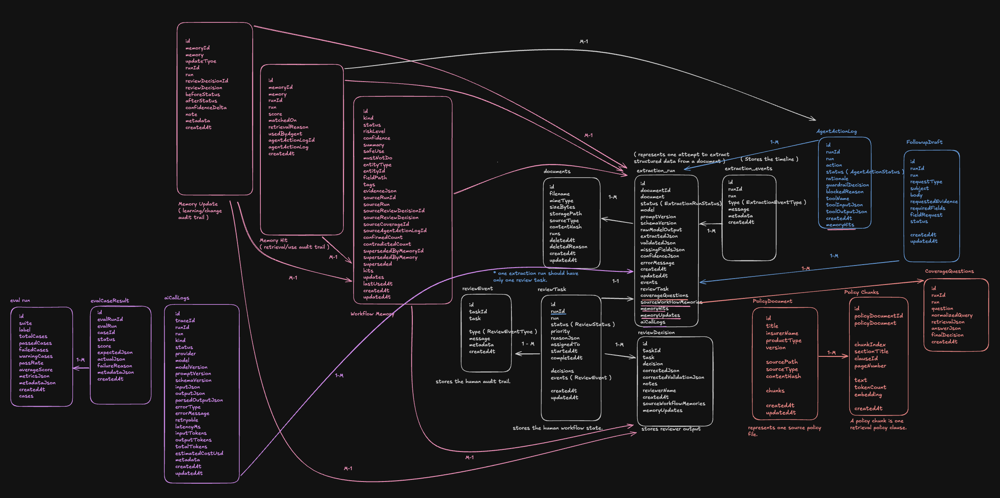

This database view proves that observability is not temporary console output. Model-call evidence is stored in a form that can be joined with the claim workflow, queried later, and shown in dashboards.

The database design also separates concerns:

```text
feature records
→ claim extraction, validation, coverage, agent, memory, and review meaning

AI-call records
→ provider execution, model governance, latency, cost, and failure meaning

eval records
→ expected-vs-actual regression evidence
```

---

## 3. Gateway wrapper proof

The shared gateway surrounds real model calls made for:

```text
PDF and email extraction
policy coverage-answer generation
model-backed agent planning
```

It intentionally does not log deterministic business logic as an AI provider call.

The gateway classifies important outcomes:

```text
valid response          → SUCCEEDED
invalid JSON            → FAILED / INVALID_JSON_RESPONSE
timeout                 → RETRYABLE / MODEL_TIMEOUT
provider error          → RETRYABLE / PROVIDER_ERROR
missing model version   → BLOCKED / MISSING_MODEL_VERSION
cost limit exceeded     → BLOCKED / COST_LIMIT_EXCEEDED
valid but slow response → SUCCEEDED with LATENCY_SPIKE warning
```

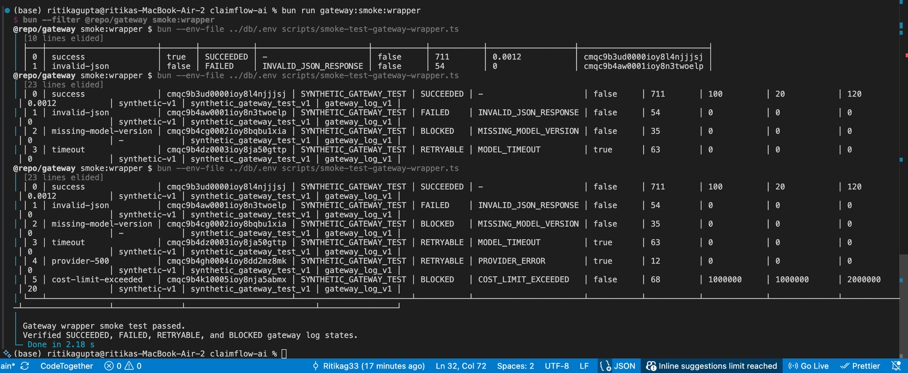

The smoke-test output proves two things at once:

```text
the gateway returns the correct structured outcome
the corresponding AI-call evidence is persisted
```

This matters because correct in-memory behavior alone would not support later trace investigation or dashboard reporting.

---

## 4. Eval dashboard proof across Weeks 1–6

The eval dashboard is the system-level observability surface. It keeps the quality proof from every completed subsystem in one place.

The following screenshot pairs are the detail views behind the dashboard cards. Together they prove that Week 6 observability did not begin with gateway metrics; it made the complete Week 1–6 evaluation history visible and comparable.

### 4.1 Week 1 — extraction and deterministic validation

The Week 1 eval verifies:

```text
document uploaded
→ model extracts structured claim data
→ deterministic validation checks missing fields, conflicts, and evidence
→ run becomes completed or needs review
```

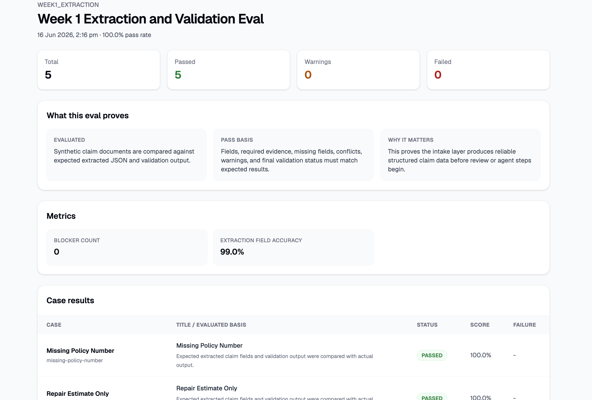

This view shows the Week 1 pass rate, evaluated scope, pass basis, extraction accuracy, blocker count, and the beginning of the case results.

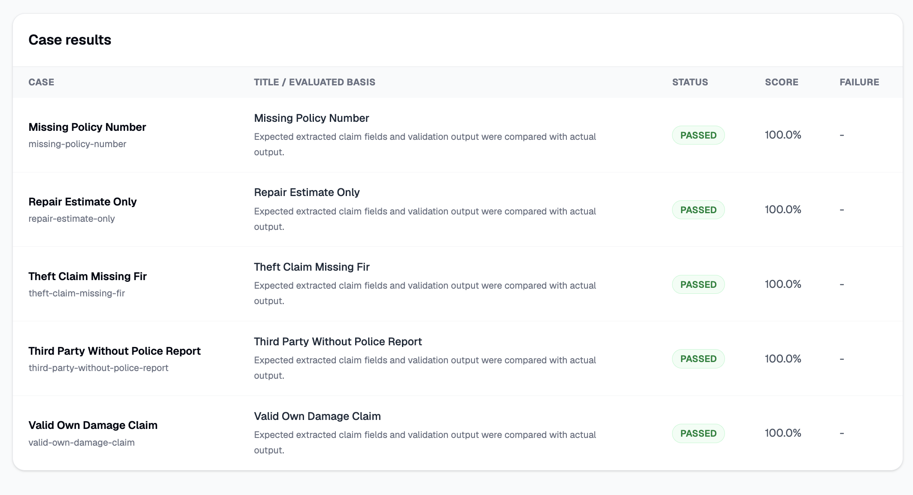

This view shows the individual extraction and validation cases, proving that the dashboard result is backed by packet-level evidence rather than only an aggregate percentage.

### 4.2 Week 2 — human review workflow

The Week 2 eval verifies the human-control boundary:

```text
unsafe or incomplete claim
→ review task created
→ reviewer sees reasons and required work
→ reviewer approves, edits, rejects, or requests information
```

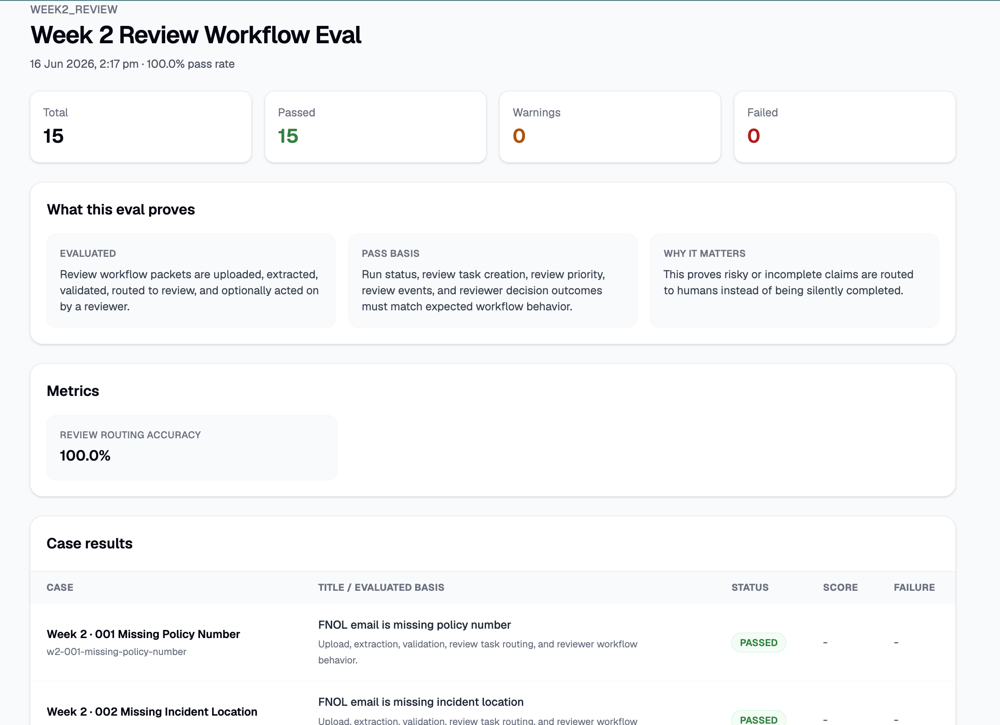

This view shows the Week 2 pass rate, review-routing accuracy, evaluated workflow, pass basis, and initial case results.

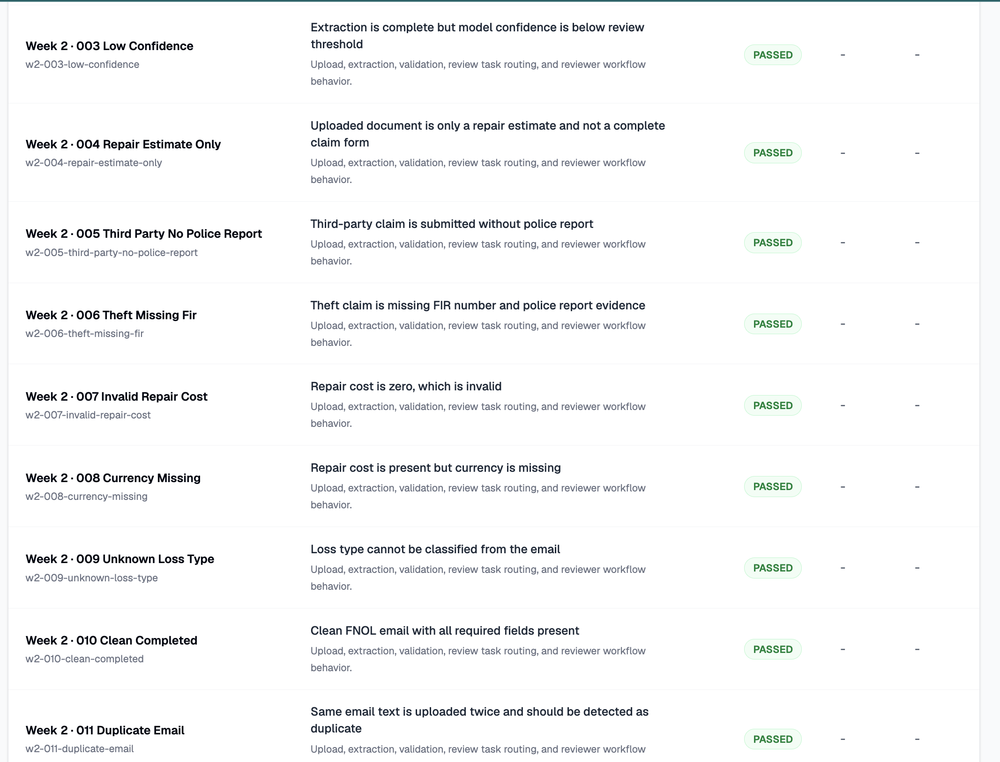

This view shows review failure packets such as low confidence, incomplete documents, missing evidence, invalid values, duplicates, and clean completion. It proves the dashboard preserves the cases behind the routing metric.

### 4.3 Week 3 — policy RAG and citations

The Week 3 eval verifies policy evidence and citation safety:

```text
coverage question
→ retrieve policy clauses
→ decide whether evidence is sufficient
→ generate a grounded answer only when allowed
→ preserve citations
```

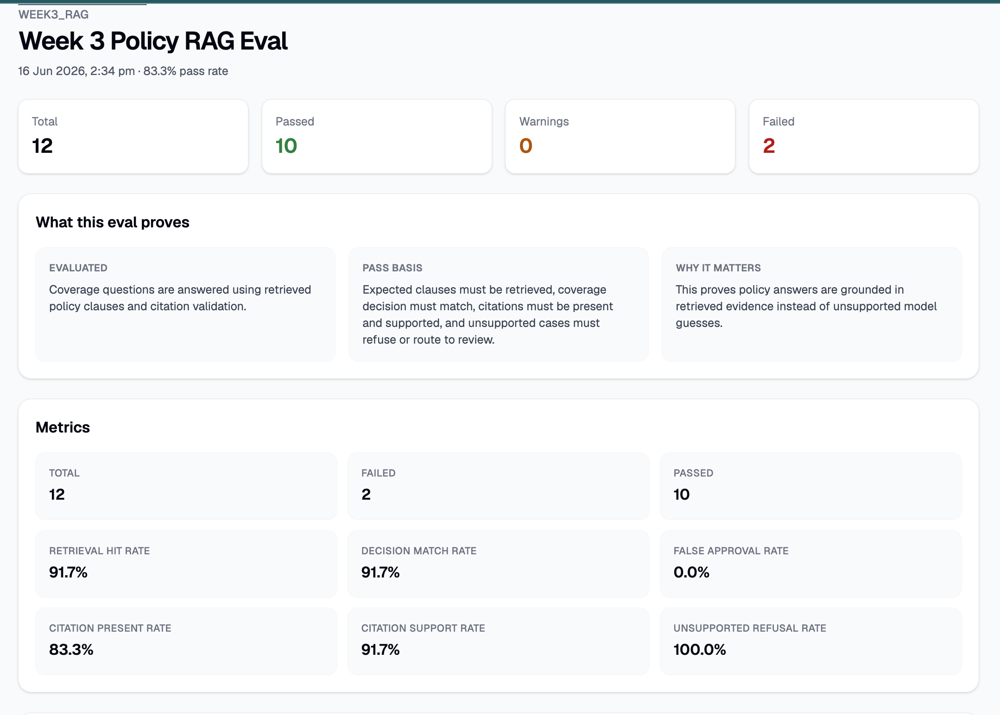

This view shows retrieval hit rate, coverage-decision match rate, citation presence, citation support, failed cases, and the overall pass rate.

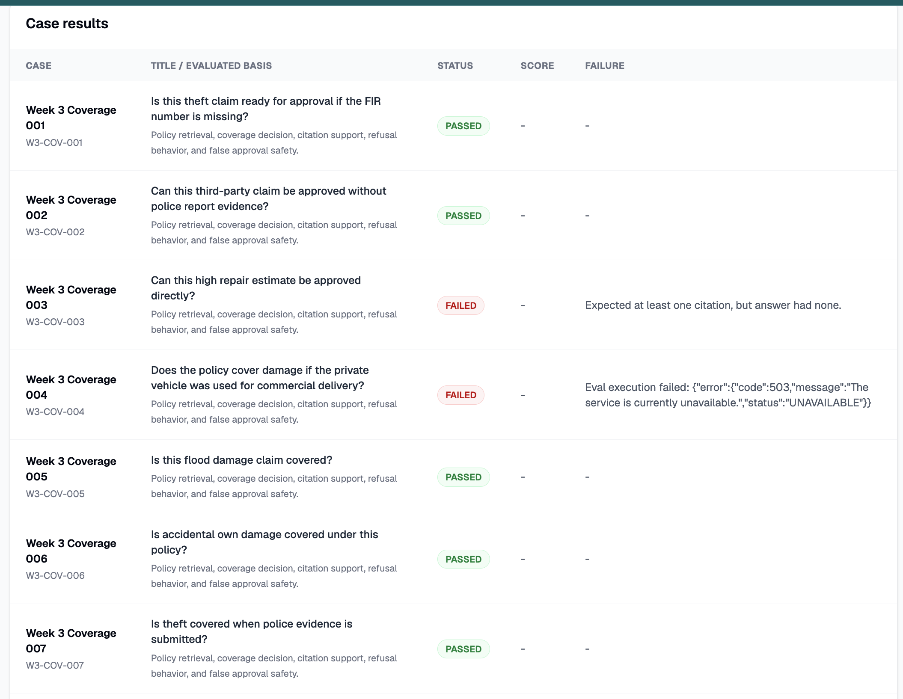

This view shows the individual coverage questions used to test retrieval, grounded decisions, citation support, refusals, and false-approval safety.

### 4.4 Week 4 — guarded agent action

The Week 4 eval verifies the guarded agent loop:

```text
current claim context
→ deterministic router or model-backed planner
→ proposed workflow action
→ guardrail decision
→ allowed tool executes or unsafe action is blocked
```

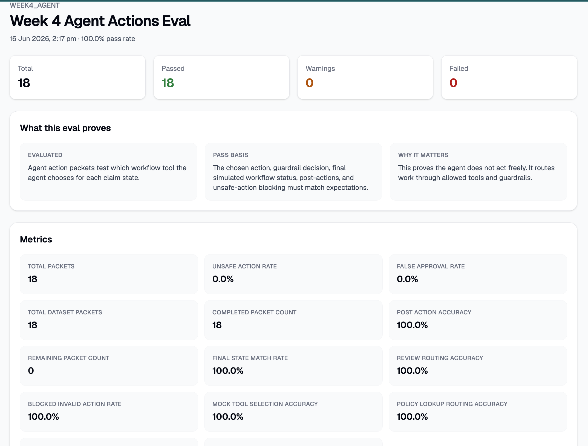

This view shows the agent-action pass rate, blocked-invalid-action rate, unsafe-action rate, evaluated scope, and pass basis.

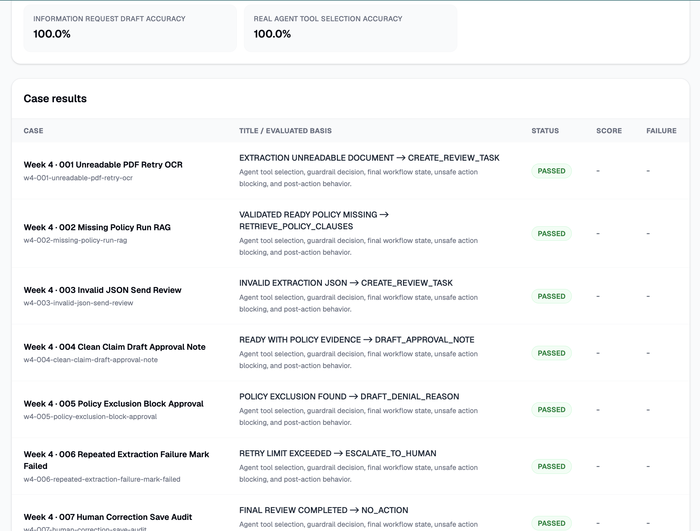

This view shows packet-level tool selection, guardrail, final-state, post-action, and unsafe-action assertions. It proves that the aggregate safety result is traceable to concrete agent scenarios.

### 4.5 Week 5 — workflow memory

The Week 5 eval verifies historical workflow guidance:

```text
current claim signals
→ retrieve relevant safe memory
→ optionally use memory in agent routing
→ show guidance to reviewer
→ update memory only after trusted review outcome
```

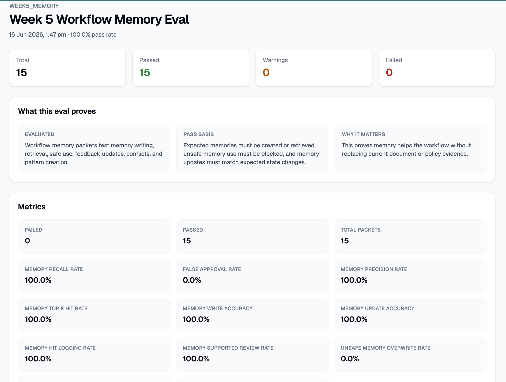

This view shows memory write, retrieval, safe-use, update, conflict, and semantic-pattern evaluation alongside recall, precision, false-approval, and source-of-truth safety metrics.

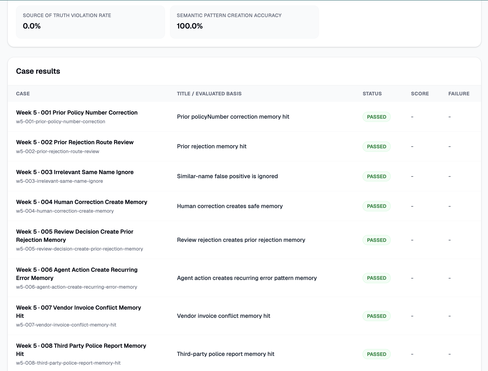

This view shows the individual memory cases behind those metrics, including prior corrections, prior rejection routing, irrelevant-name rejection, memory creation, recurring-error memory, and semantic-pattern behavior.

### 4.6 Week 6 — gateway observability

The Week 6 eval verifies operational evidence around AI-backed steps:

```text
model and prompt identity
status and failure class
latency and token usage
estimated cost
retryability
trace correlation
```

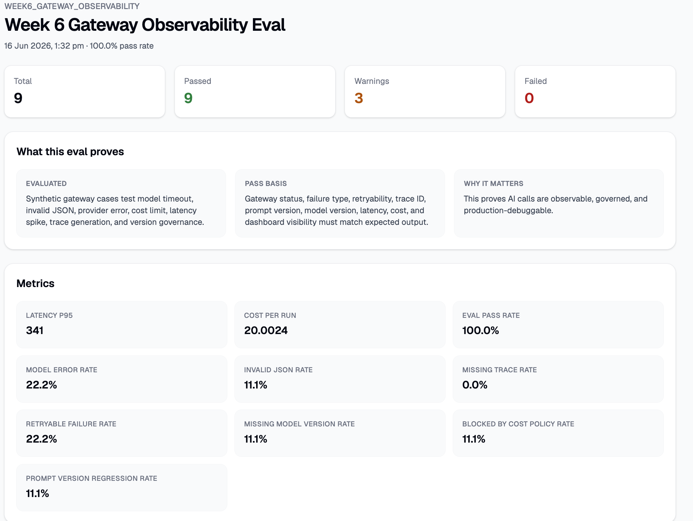

This view shows the 100% suite pass rate alongside latency p95, model-error rate, retryable-failure rate, prompt-regression rate, cost, invalid-JSON rate, and the exact pass basis.

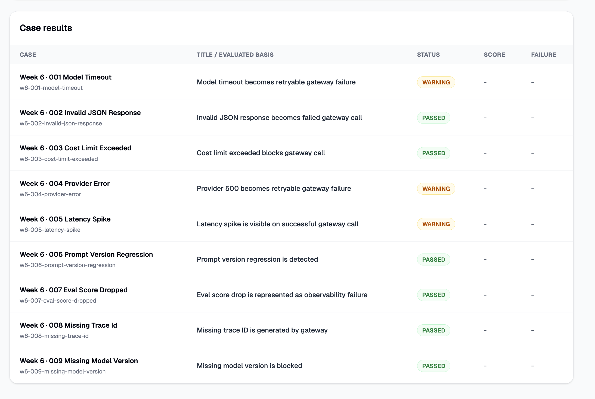

This view shows all nine gateway cases and the behavior each one proves: timeout, invalid JSON, cost block, provider error, latency warning, prompt regression, eval regression, generated trace ID, and missing-model-version block.

---

## 5. Complete one-run trace proof

The nine trace screenshots should be read as one claim moving through the complete workflow.

The trace is not only a list of AI calls. It is an ordered explanation across all subsystems:

```text
trace summary and gateway call
→ agent decision summary
→ memory influence
→ document and extraction timeline
→ validation and review routing
→ memory retrieval and agent use
→ information-request proposal and draft
→ tool execution and information received
→ human edit-and-approve and memory strengthening
```

### 5.1 Trace summary and gateway visibility

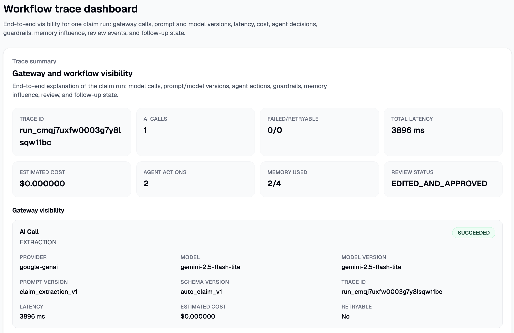

The first view opens the workflow trace dashboard for one claim. It shows the trace ID, AI-call count, failed/retryable count, estimated cost, agent-action count, memory usage, and the extraction gateway call.

What this proves:

```text
the trace belongs to one claim run
the extraction call is visible as a governed AI call
provider, model, prompt version, schema version, latency, and cost are visible
the reader receives a concise run-level summary before opening the timeline
```

### 5.2 Agent decision summary

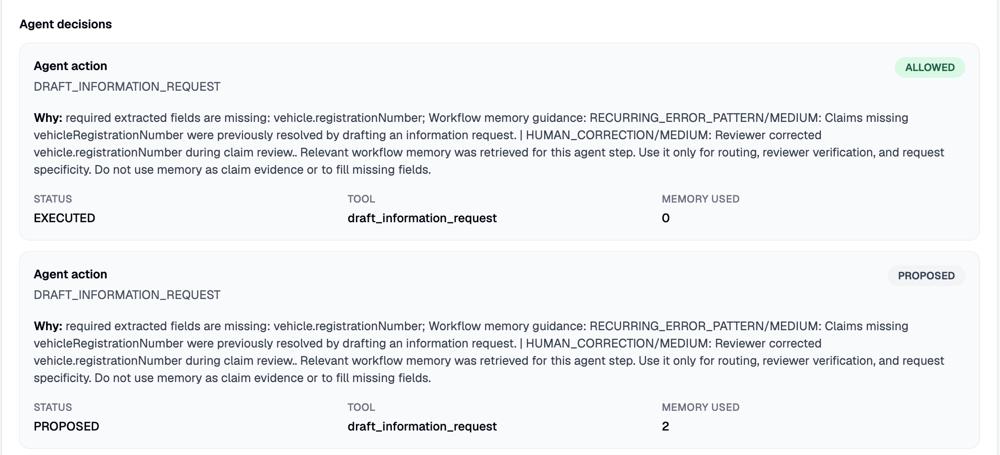

The second view shows both the proposed and allowed `DRAFT_INFORMATION_REQUEST` actions, the selected tool, execution status, reasoning, and memory-use count.

What this proves:

```text
agent proposal and executed/allowed result are distinguishable
the reason identifies vehicle.registrationNumber as the missing field
memory guidance is visible in the agent explanation
the explanation explicitly forbids treating memory as claim evidence
```

### 5.3 Memory influence and safety instructions

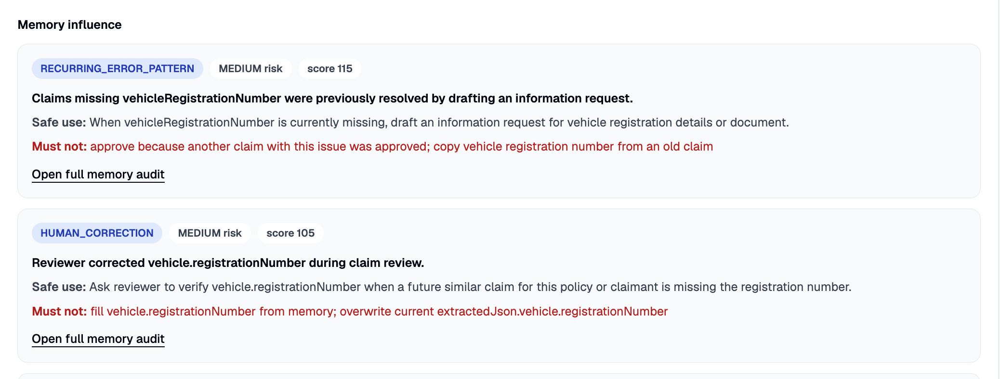

The third view shows the two memories that influenced the run: a recurring-error pattern and a human correction for `vehicle.registrationNumber`.

What this proves:

```text
each memory has a kind, risk level, and relevance score
safe-use guidance explains how the memory may help
must-not-do guidance blocks copying an old registration value
recurring pattern memory and claim-specific human correction remain distinguishable
```

### 5.4 Timeline begins with document intake and extraction

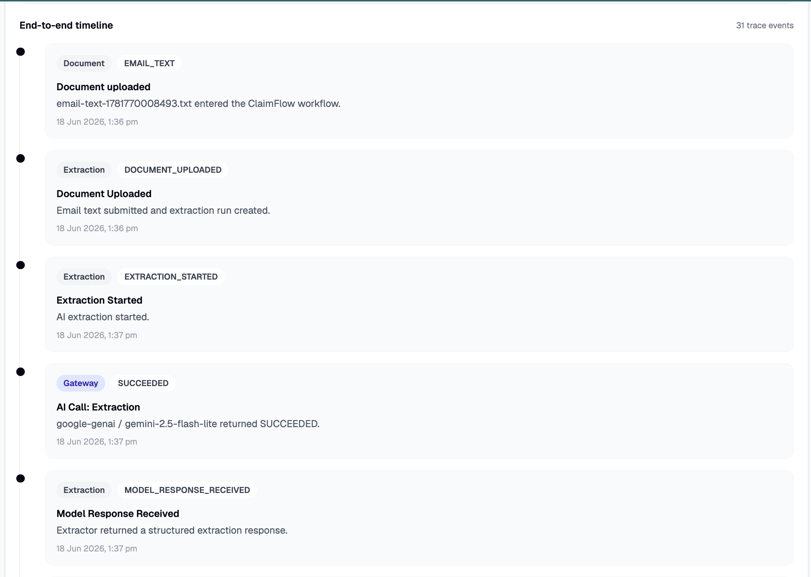

The fourth view starts the chronological timeline. It shows the email document entering ClaimFlow, extraction starting, the governed gateway call succeeding, and the model response being received.

What this proves:

```text
the trace begins with the actual document
the extraction provider call is placed in workflow order
gateway success and model-response receipt are separate events
timestamps explain when each stage occurred
```

### 5.5 Validation creates the review boundary

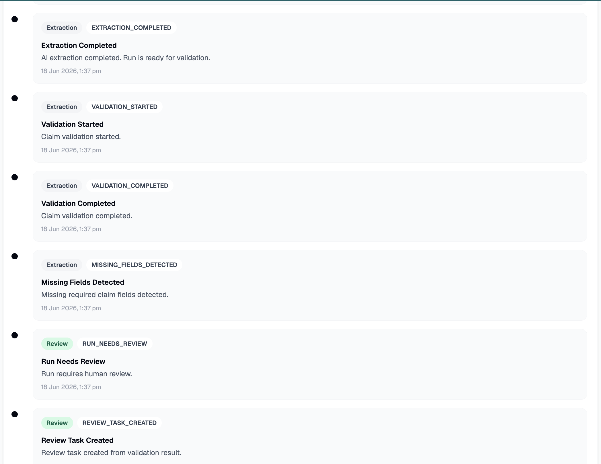

The fifth view continues from extraction completion into deterministic validation. Validation detects missing required fields, marks the run as needing review, and creates a review task.

What this proves:

```text
AI output and deterministic validation remain separate
the reason for needs-review status is explainable
missing fields create durable workflow events
human review is created before the agent attempts follow-up work
```

### 5.6 Memory retrieval and agent use are separate events

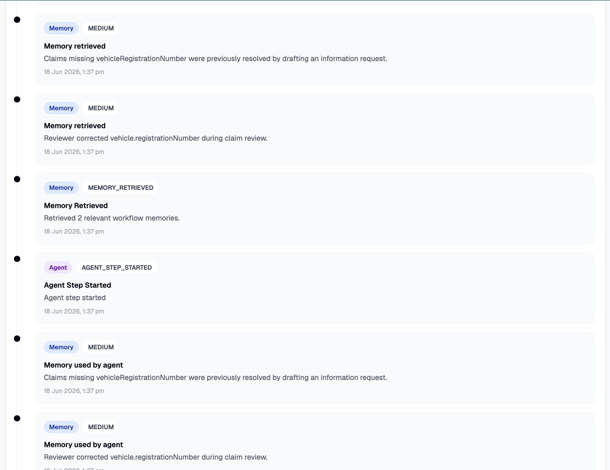

The sixth view shows two memories being retrieved, a combined `MEMORY_RETRIEVED` event, the agent step starting, and the same memories later being marked as used by the agent.

What this proves:

```text
retrieval does not automatically imply agent use
the trace records which memory entered the decision path
memory use occurs after the agent step begins
the reader can audit both relevant memories independently
```

### 5.7 Agent proposes and drafts the information request

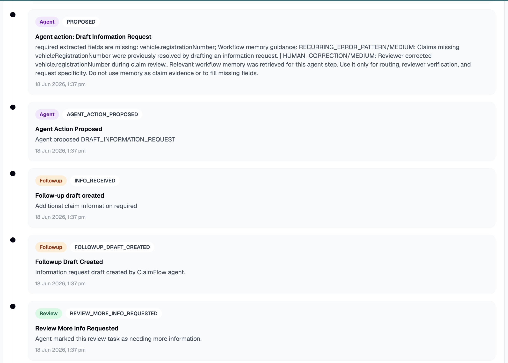

The seventh view shows the agent proposing `DRAFT_INFORMATION_REQUEST`, recording the proposal event, creating a follow-up draft, and moving the review task into a needs-more-information state.

What this proves:

```text
the proposed action identifies the exact missing field
memory improves request specificity without supplying the value
the draft is a durable workflow object
the review state reflects that more information is still required
```

### 5.8 Tool execution, information receipt, and review reopening

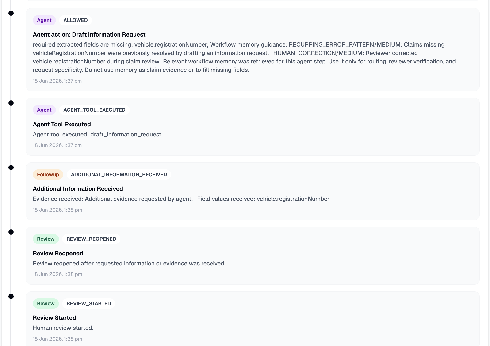

The eighth view shows the action being allowed, the information-request tool executing, `vehicle.registrationNumber` being received, the review reopening, and human review starting.

What this proves:

```text
proposal and tool execution remain distinct
the specific requested field is recorded as received
review advances only after the requested information exists
the agent does not make the final claim decision
```

### 5.9 Human edit-and-approve strengthens the memories

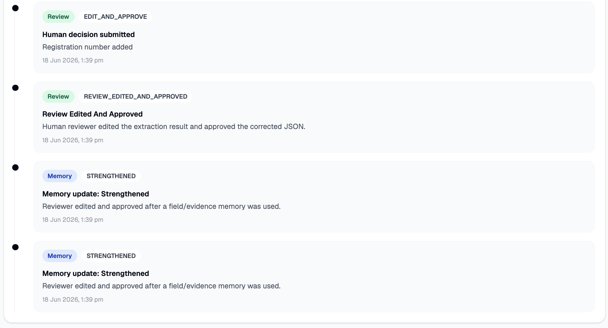

The final view shows the reviewer submitting an `EDIT_AND_APPROVE` decision with the registration number added. Both memories used for the field request are then strengthened.

What this proves:

```text
human review remains the final authority
the corrected JSON is approved explicitly by a reviewer
memory confidence changes only after the trusted human outcome
the recurring pattern and human-correction memories both receive audit updates
the complete claim is explained from intake to learning
```

---

## 6. Information-request and recurring-memory correctness

The full trace test exposed two important workflow invariants.

### 6.1 A review cannot advance without the requested information

An information-request draft is not proof that information was received.

The safe flow is:

```text
missing required field/evidence detected
→ information request drafted
→ claimant/reviewer supplies the requested item
→ system checks the specific outstanding requirements
→ only then may the review move to pending/continue
```

This prevents a trace from reporting successful progress when the blocking information is still absent.

### 6.2 Human correction must complete the memory loop

When a reviewer uses edit-and-approve to supply a genuinely missing required field, the correction is a trusted learning event.

Example:

```text
first claim is missing vehicle.registrationNumber
→ reviewer supplies the registration number
→ edit-and-approve records the corrected field
→ field-scoped correction memory is created

future claim is missing vehicle.registrationNumber
→ recurring-field memory can be retrieved
→ system asks for/flags the field again
→ system does not copy the previous vehicle value
```

The same behavior should work for other recurring missing fields, not only vehicle registration number.

This is why the trace includes memory creation and future retrieval: without those events, the product would show the initial correction but could not prove that the learning loop completed.

---

## 7. Eval dashboard proof

The one-run trace proves explainability for one claim. The eval dashboard proves repeatable system reliability.

The Week 6 eval executes controlled cases for:

```text
model timeout
invalid JSON
provider error
cost limit exceeded
latency spike
prompt regression
eval-score regression
missing trace ID
missing model version
```

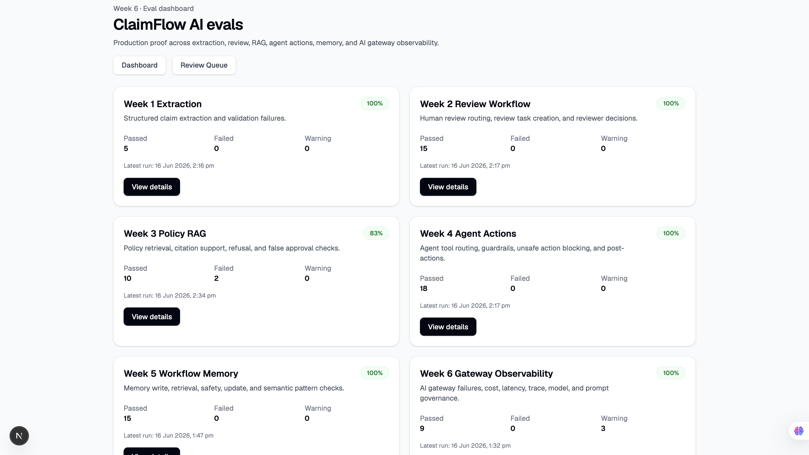

The dashboard proves that synthetic cases become persisted, comparable evidence rather than one-off console demonstrations.

The most important interpretation is:

```text
eval_pass_rate
→ Did ClaimFlow detect and classify each case as expected?

failure and warning rates
→ Which intentional production-risk signals appeared during the suite?
```

Therefore this can be a healthy result:

```text
eval pass rate: 100%
model error rate: greater than 0
invalid JSON rate: greater than 0
blocked-by-cost rate: greater than 0
```

The non-zero rates are expected because the suite deliberately creates those failures.

Latest recorded result:

```text
cases: 9
passed: 9
failed: 0
pass rate: 100%
```

---

## 8. What each proof category demonstrates

### Database screenshot proves durable observability

```text
AI calls are persisted
run and trace correlation exists
version, latency, token, cost, and failure metadata have a durable home
eval evidence is separable from feature records
```

### Gateway smoke-test screenshot proves control behavior

```text
success and failure paths are executable
timeouts and provider errors are marked retryable
governance blocks are distinguishable from failures
valid latency spikes remain successful warnings
returned results agree with persisted records
```

### Week 1–6 screenshot pairs prove eval coverage

```text
every completed subsystem has a persisted eval detail view
aggregate percentages are backed by case results
extraction, review, RAG, agent, memory, and gateway metrics are visible
the dashboard distinguishes pass, failure, warning, and safety measures
```

### Nine trace screenshots prove one-run explainability

```text
one claim can be followed chronologically
AI calls are connected to their workflow causes and consequences
deterministic and model-backed steps are distinguishable
human review and learning complete the story
```

### Eval dashboard proves system-level reliability

```text
known AI failure modes are tested intentionally
expected and actual behavior are compared
operational metrics can be surfaced
regressions can be detected without waiting for a real incident
```

---

## 9. Evidence checklist

| Question | Evidence in this document |
|---|---|
| Are model calls durably logged? | Database design and gateway smoke-test screenshots |
| Can failed calls remain traceable? | `STARTED → final status` lifecycle and smoke-test proof |
| Are prompt/model/schema versions visible? | Gateway record and run-trace gateway stage |
| Are latency, tokens, and cost visible? | Gateway record, run trace, and eval metrics |
| Are retryable and blocked outcomes distinct? | Gateway classification and synthetic cases |
| Does the trace cover more than model calls? | Nine-step trace from document intake through human review and memory update |
| Does the eval dashboard cover the complete project? | Week 1–6 eval detail screenshot pairs |
| Is RAG evidence separate from model telemetry? | Week 3 views and trace RAG stage |
| Are agent proposal and execution separate? | Week 4 views and trace guardrail stage |
| Is memory retrieval separate from use? | Week 5 views and trace memory stage |
| Does human review remain final? | Week 2 views and final trace stage |
| Can the system be evaluated repeatedly? | Gateway smoke test and eval dashboard |
| Are workflow state and memory-learning bugs covered? | Information-request and recurring-memory section |

---

## 10. Final proof summary

The screenshots collectively prove this complete path:

```text
current claim enters ClaimFlow
→ extraction model call is governed and logged
→ deterministic validation checks the result
→ policy RAG remains grounded in current clauses
→ workflow memory is retrieved only as guidance
→ model-backed agent planning is logged
→ guardrails control tool execution
→ missing information prevents premature workflow progress
→ human review makes the final decision
→ trusted corrections can update memory
→ the one-run trace explains the complete sequence
→ synthetic evals prove known failure handling
→ the eval dashboard shows system-level evidence
```

The production meaning is:

```text
ClaimFlow AI can show what the AI called,
why it was called,
which version ran,
how it performed,
what failed or was blocked,
what happened next,
what the human decided,
and whether the system learned safely.
```

That is the Week 6 observability proof: the AI layer is measurable, the workflow is traceable, and the final claim process remains governed.
