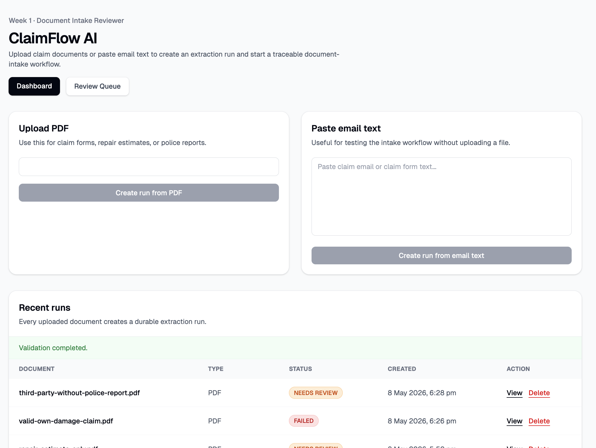
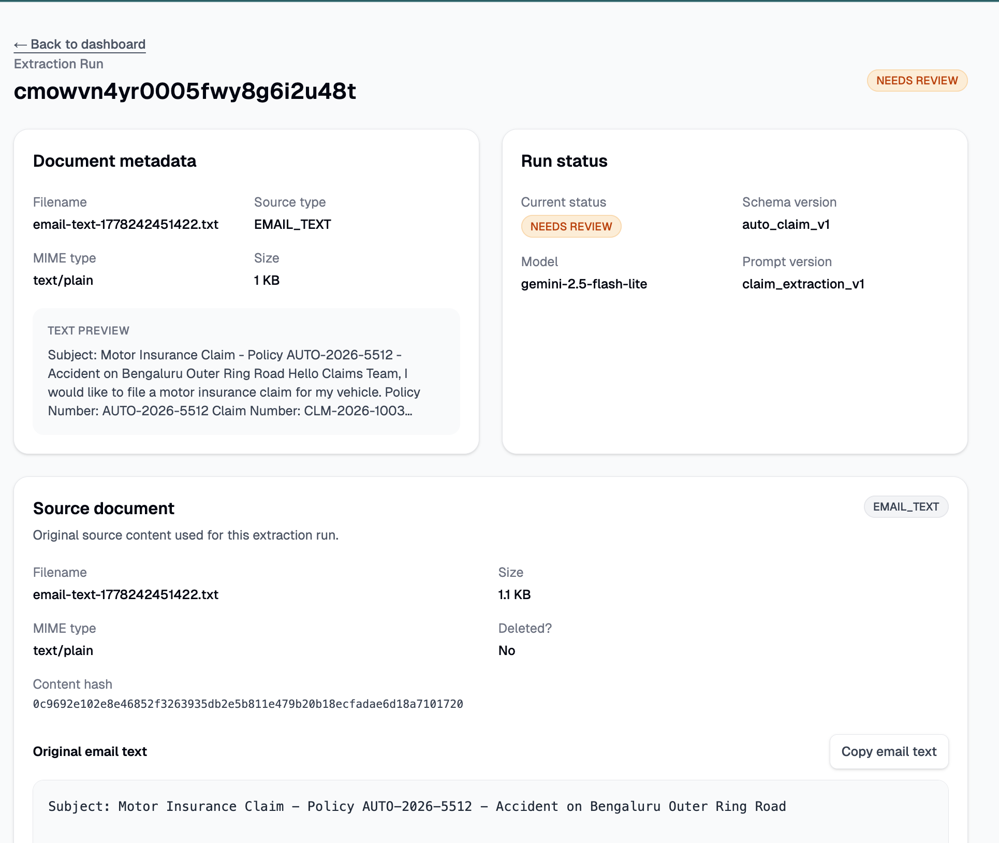
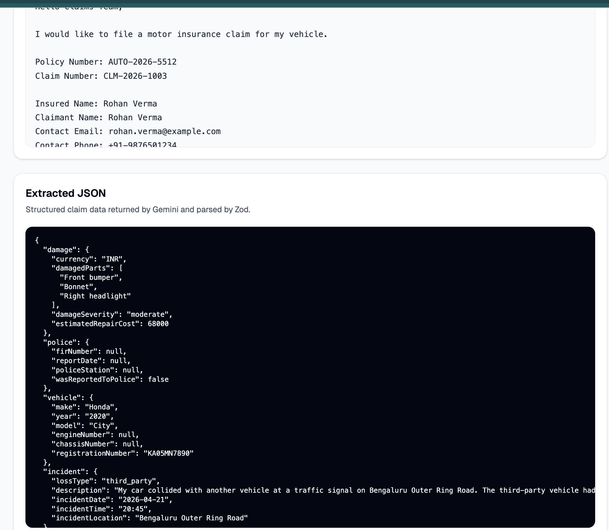
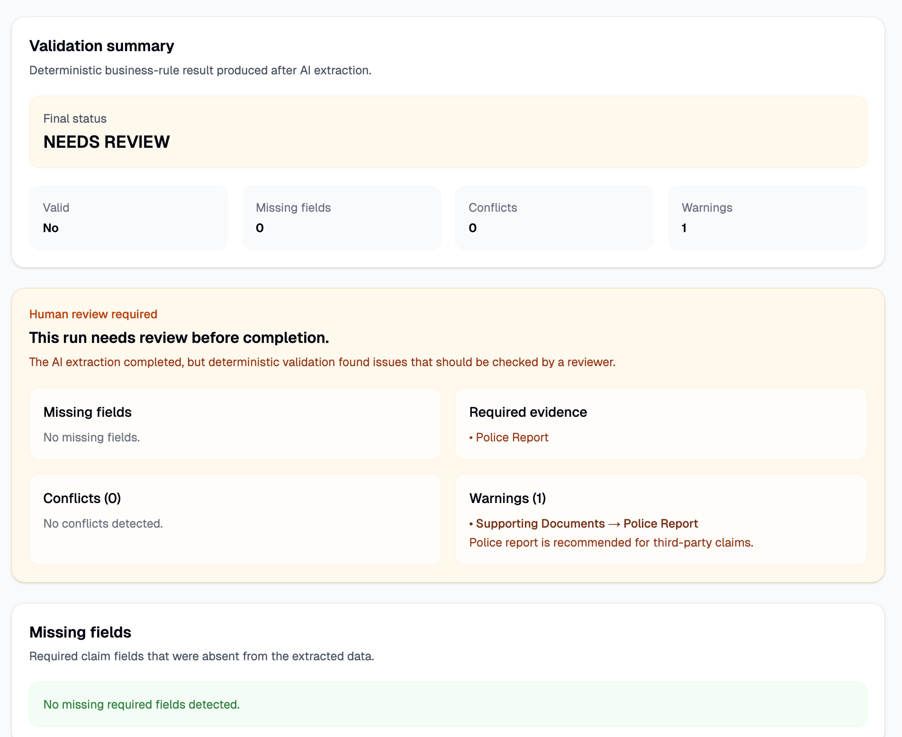
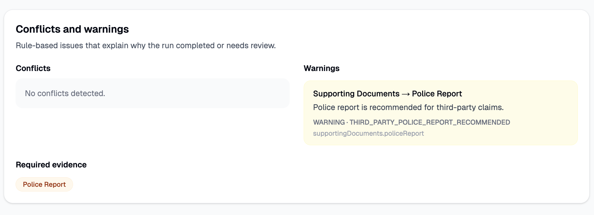
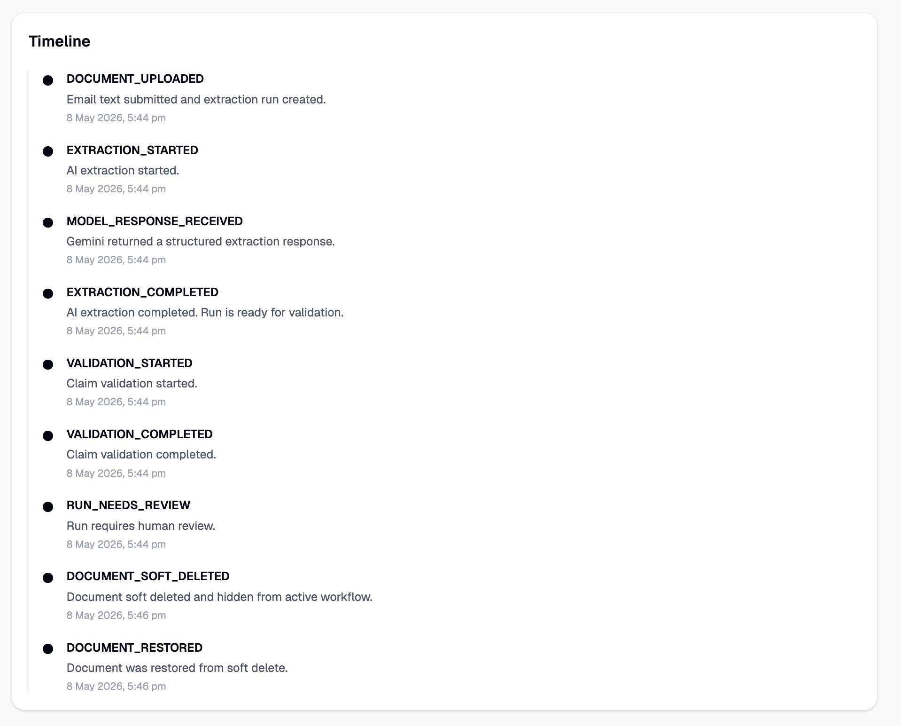
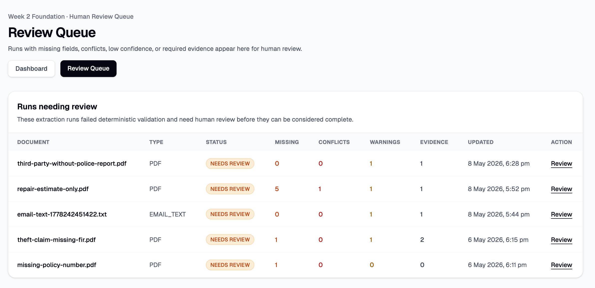
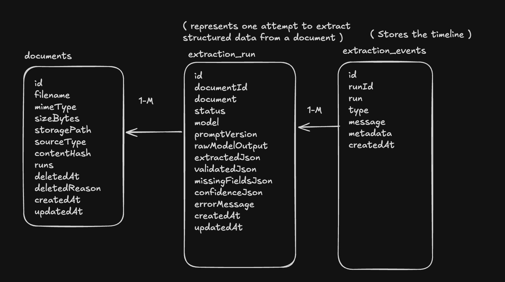
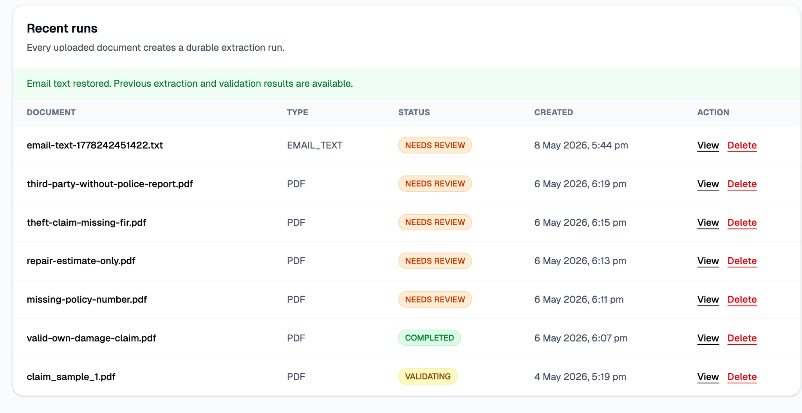
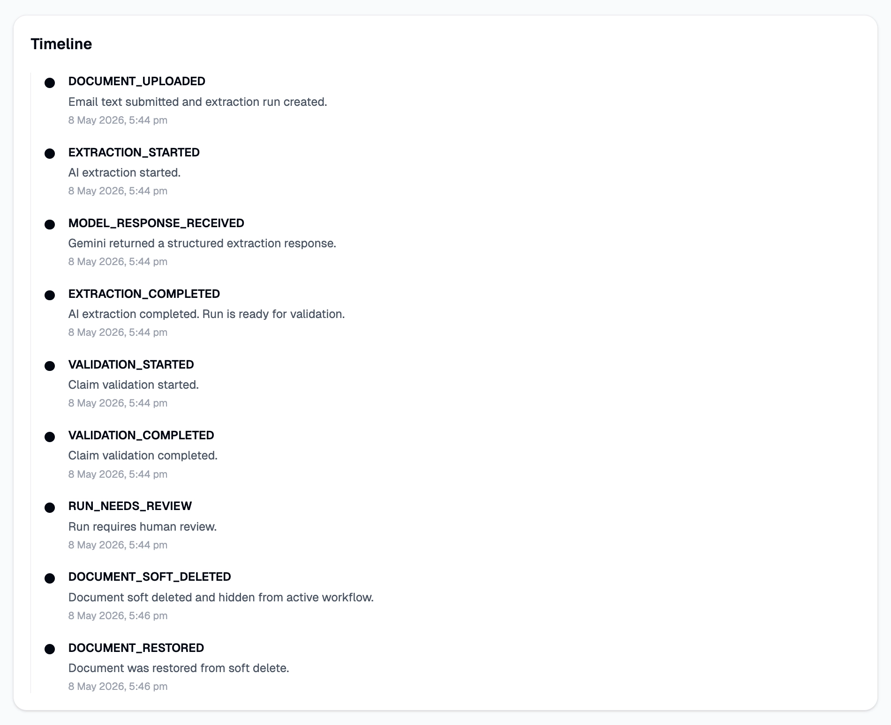

# Week 1 — Auto Insurance Document Intake Reviewer

## What is this?

ClaimFlow AI Week 1 built an **Auto Insurance Document Intake Reviewer**.

It accepts an auto insurance claim **PDF** or pasted **email text**, extracts structured claim JSON using Gemini, validates the extracted data with deterministic rules, and updates the run status to either `COMPLETED` or `NEEDS_REVIEW`.

```txt
PDF / Email text
→ Gemini extraction
→ structured claim JSON
→ deterministic validation
→ COMPLETED or NEEDS_REVIEW
→ timeline + validation explanation
```

The goal was to prove that AI output should not be blindly trusted. It should become product data only after validation, persistence, and traceability.

---

## Demo

Demo video: [Week 1 ClaimFlow AI demo](https://x.com/RitikaxG/status/2052737543192629329?s=20)

### Dashboard

The dashboard supports PDF upload, email text submission, recent runs, and access to the review queue.



### Run detail

Each uploaded document creates an extraction run. The run detail page shows document metadata, current status, source document, extracted JSON, validation result, and timeline.





---

## What was built

### 1. Document intake

Supported inputs:

- `PDF`
- `EMAIL_TEXT`

PDFs are stored locally during development using `Document.storagePath`.

Email text is stored directly in Postgres using `Document.contentText`, so the original submitted email can be recovered later.

---

### 2. Structured JSON extraction

Gemini extracts auto insurance claim data into a structured schema.

The app stores:

- `rawModelOutput`
- `extractedJson`
- `model`
- `promptVersion`
- `confidenceJson`

This makes the AI extraction debuggable and traceable.

---

### 3. Deterministic validation

The extracted JSON is validated using deterministic rules.

Validation checks:

- missing fields
- conflicts
- warnings
- required evidence
- low confidence

The final status becomes:

```txt
COMPLETED
NEEDS_REVIEW
```



If the claim needs review, the UI explains why.



---

### 4. Timeline events

Every important workflow step is stored as an event.

Examples:

```txt
DOCUMENT_UPLOADED
EXTRACTION_STARTED
MODEL_RESPONSE_RECEIVED
EXTRACTION_COMPLETED
VALIDATION_STARTED
VALIDATION_COMPLETED
MISSING_FIELDS_DETECTED
CONFLICTS_DETECTED
RUN_COMPLETED
RUN_NEEDS_REVIEW
RUN_FAILED
DOCUMENT_SOFT_DELETED
DOCUMENT_RESTORED
DUPLICATE_UPLOAD_DETECTED
```

This gives every run an audit-style history.



---

### 5. Basic review queue foundation

Week 1 includes a basic review queue that shows runs where:

```txt
ExtractionRun.status === NEEDS_REVIEW
```

This is the foundation for Week 2, where `ReviewTask`, `ReviewDecision`, and `ReviewEvent` will be added.



---

## Schema design for Week 1

Week 1 uses three core entities:

```txt
Document
ExtractionRun
ExtractionEvent
```



### Document

Represents the original source input.

Important fields:

```txt
filename
mimeType
sizeBytes
sourceType
storagePath
contentText
contentHash
deletedAt
deletedReason
```

Design decision:

```txt
PDF → local file path
EMAIL_TEXT → stored in Postgres
```

---

### ExtractionRun

Represents one workflow attempt for a document.

Important fields:

```txt
status
model
promptVersion
schemaVersion
rawModelOutput
extractedJson
validationJson
missingFieldsJson
confidenceJson
errorMessage
```

Statuses:

```txt
UPLOADED
EXTRACTING
VALIDATING
COMPLETED
NEEDS_REVIEW
FAILED
```

---

### ExtractionEvent

Represents the timeline for a run.

It answers:

```txt
What happened?
When did it happen?
Why did the status change?
What metadata explains the event?
```

---

## Key architecture decisions

### 1. AI output is not trusted directly

The app does not stop at:

```txt
PDF → Gemini → JSON
```

It continues with:

```txt
JSON → validation → status decision → timeline
```

This makes the system safer for insurance workflows.

---

### 2. `NEEDS_REVIEW` is not failure

`NEEDS_REVIEW` means the system worked correctly.

It found that the claim needs human attention because something is missing, inconsistent, uncertain, or evidence-dependent.

---

### 3. Soft delete instead of hard delete

Soft delete means:

```txt
Keep the document
Keep extraction runs
Keep extractedJson
Keep validationJson
Keep timeline events
Set deletedAt and deletedReason
Hide from active dashboard/review queue
```

Reason:

Insurance workflows need traceability. A deleted claim document may still need to be audited, restored, or inspected later.





---

### 4. Restore saves Gemini API calls

If the same soft-deleted document is uploaded again:

```txt
same sourceType + same contentHash
→ restore existing document
→ return existing latest run
→ reuse extractedJson and validationJson
→ no Gemini call needed
```

This saves API cost and keeps workflow history clean.

---

### 5. Upload is idempotent by `sourceType + contentHash`

Filename is not used as the source of truth.

Behavior:

| Case | Result |
|---|---|
| Same active document uploaded again | Return existing document/run |
| Same soft-deleted document uploaded again | Restore existing document |
| Same filename, different content | Create new document/run |
| Same content, different filename | Return or restore existing document |

Reason:

Filenames are unreliable. Content hash identifies the actual document.

---

## What Week 1 intentionally did not build

Week 1 did not build:

- full human review system
- corrected JSON editor
- reviewer assignment
- multi-reviewer review
- policy RAG
- S3 storage
- background worker queue
- production auth

These are Week 2+ concerns.

---

## Week 2 bridge

Week 2 will turn `NEEDS_REVIEW` into a real human review workflow:

```txt
ExtractionRun.status === NEEDS_REVIEW
→ create ReviewTask
→ reviewer opens task
→ reviewer approves / edits / rejects
→ correctedJson is stored separately
→ ReviewEvent stores audit trail
```

---

## Final Week 1 summary

By the end of Week 1, ClaimFlow AI can:

```txt
Upload PDF or email text
Extract structured auto insurance claim JSON
Validate extracted JSON
Mark the run COMPLETED or NEEDS_REVIEW
Show missing fields, conflicts, warnings, and required evidence
Store timeline events
Soft delete and restore documents
Avoid duplicate uploads using sourceType + contentHash
Reuse old extraction/validation results on restore
```

This is the foundation for a reliable insurance document workflow where AI assists the process, but validation and review keep the system safe.
