# Week 2 — Human Review System

## What Week 2 adds

Week 1 could mark an extraction run as `NEEDS_REVIEW`.

Week 2 turns that status into a real human-in-the-loop workflow:

```txt
AI extracts claim JSON
→ validation detects missing/conflicting data
→ ExtractionRun becomes NEEDS_REVIEW
→ ReviewTask is created
→ human reviewer starts review
→ reviewer approves / edits / rejects / requests more info
→ ReviewDecision + ReviewEvent are stored
```

Demo: https://x.com/RitikaxG/status/2054898032509108266?s=20

---

## 1. Human-in-the-loop architecture

The review system separates AI workflow state from human review state.

```txt
ExtractionRun = AI extraction + validation result
ReviewTask = human work item
ReviewDecision = final human decision
ReviewEvent = human review audit timeline
```

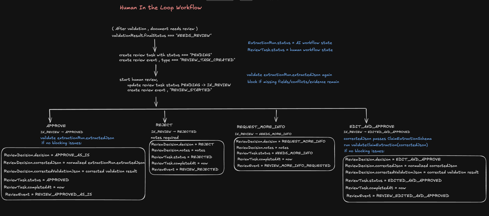

---

## 2. Database design

Week 2 added review-specific tables instead of overloading `ExtractionRun`.

Core review models:

```txt
ReviewTask
ReviewDecision
ReviewEvent
```

This lets the system keep these separately:

```txt
original AI output
validation result
review task status
human decision
corrected JSON
review audit events
```

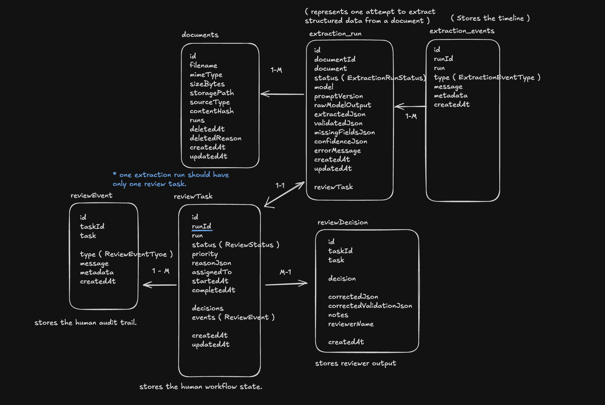

---

## 3. Review queue

When validation returns `NEEDS_REVIEW`, the backend creates a `ReviewTask`.

```txt
ExtractionRun.status = NEEDS_REVIEW
ReviewTask.status = PENDING
ReviewTask.priority = NORMAL
ReviewTask.reasonJson = missing fields / conflicts / warnings / required evidence
ReviewEvent.type = REVIEW_TASK_CREATED
```

The review queue shows human-reviewable tasks instead of only listing extraction runs.

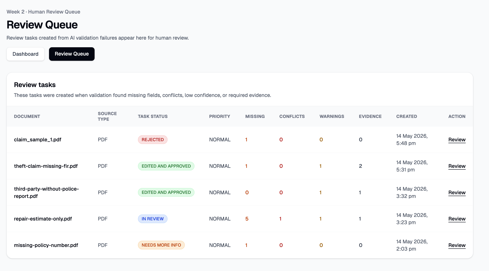

---

## 4. Review task lifecycle

The review task follows a strict state machine.

```txt
PENDING → IN_REVIEW
IN_REVIEW → APPROVED
IN_REVIEW → EDITED_AND_APPROVED
IN_REVIEW → REJECTED
IN_REVIEW → NEEDS_MORE_INFO
```

Invalid transitions return `409`, so a completed task cannot be approved/rejected again.

---

## 5. Approve as-is

If the AI extraction is already correct, the reviewer can approve it without editing.

Backend checks before approval:

```txt
existing extractedJson matches ClaimExtractionSchema
business rules pass
required fields/evidence are present
```

If valid:

```txt
ReviewTask.status = APPROVED
ReviewDecision.decision = APPROVE_AS_IS
ReviewEvent.type = REVIEW_APPROVED_AS_IS
```

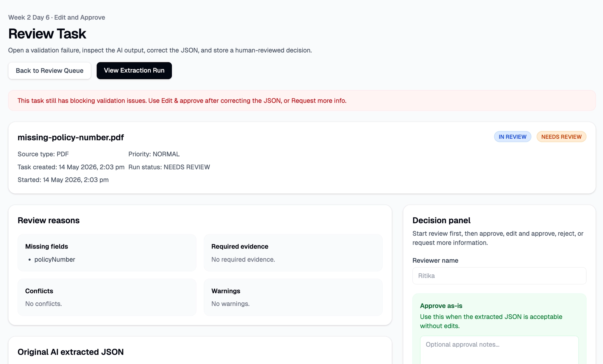

---

## 6. Backend re-validation before approval

Approval is not just a UI button.

Before approving corrected JSON, the backend runs:

```txt
correctedJson
→ ClaimExtractionSchema validation
→ deterministic claim validation rules
→ approval blocked if blocking issues remain
```

Approval is blocked when important fields/evidence are still missing, such as:

```txt
policyNumber
FIR for theft claim
required police report
error-level conflicts
```

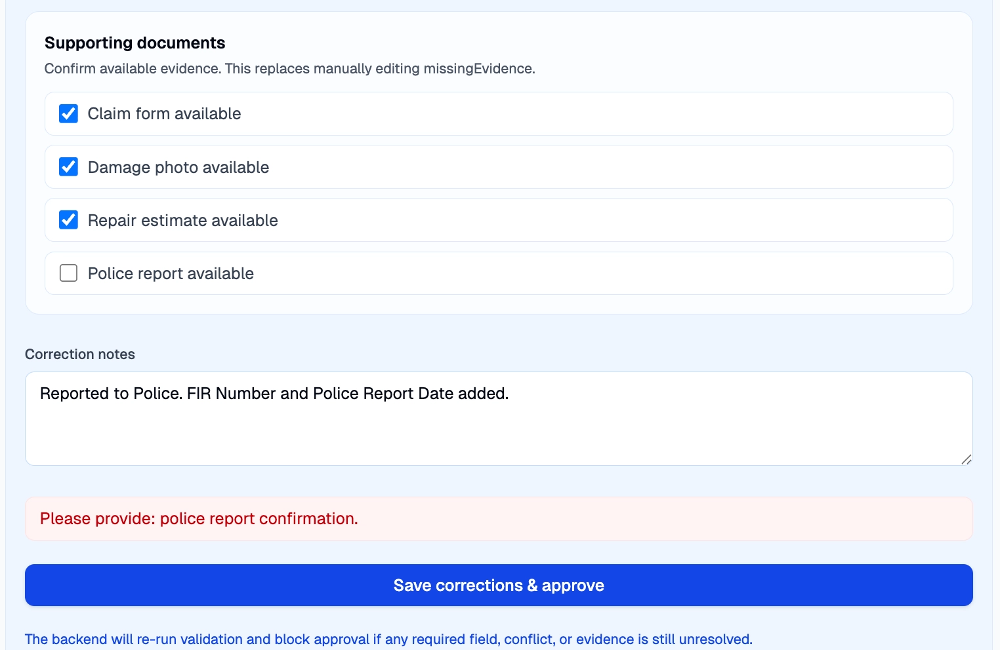

---

## 7. Edit and approve

The main Week 2 workflow is editing bad AI output and approving the corrected version.

```txt
Reviewer edits extracted JSON
→ submits correctedJson
→ backend validates schema
→ backend runs claim validation rules
→ backend normalizes missingEvidence
→ ReviewTask becomes EDITED_AND_APPROVED
```

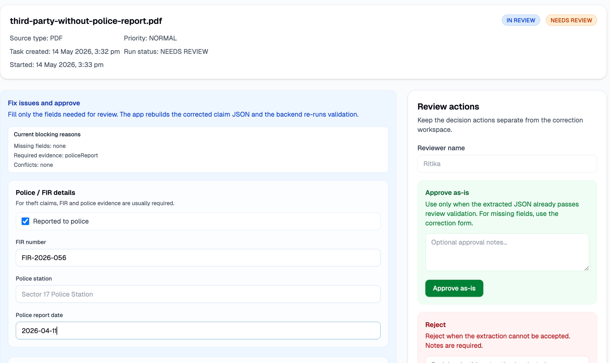
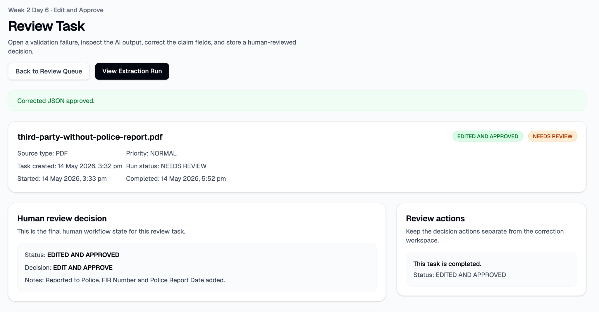

---

## 8. Corrected JSON is stored separately

The original AI output is not overwritten.

AI output stays on `ExtractionRun`:

```txt
ExtractionRun.extractedJson
ExtractionRun.validationJson
```

Human-corrected output is stored on `ReviewDecision`:

```txt
ReviewDecision.correctedJson
ReviewDecision.correctedValidationJson
```

This keeps the audit trail clean:

```txt
what AI extracted
vs
what human approved
```

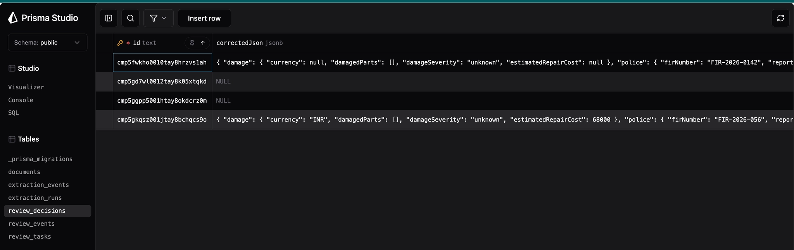

---

## 9. Audit evidence after approval

Every human action creates a `ReviewEvent`.

Examples:

```txt
REVIEW_STARTED
REVIEW_APPROVED_AS_IS
REVIEW_EDITED_AND_APPROVED
REVIEW_REJECTED
REVIEW_MORE_INFO_REQUESTED
```

Final actions also create `ReviewDecision`.

This makes the workflow explainable and auditable.

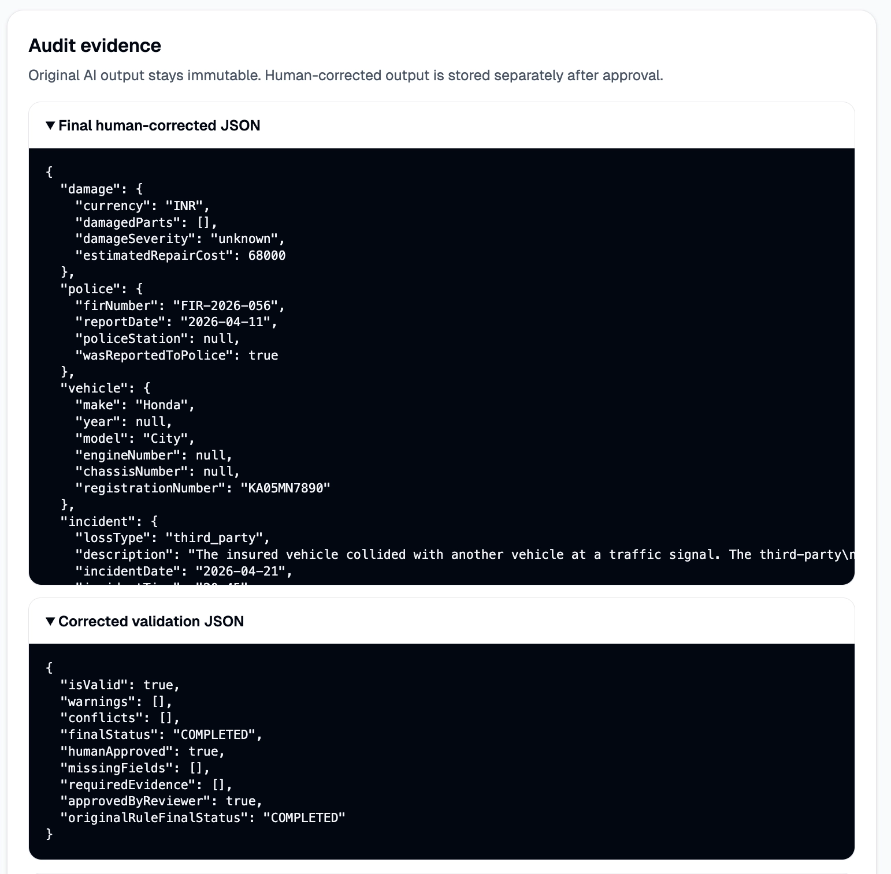

---

## 10. Reject flow

If the reviewer decides the claim cannot be approved, they can reject it.

Reject requires notes.

```txt
POST /api/review-tasks/[taskId]/reject
→ requires notes
→ ReviewTask.status = REJECTED
→ ReviewDecision.decision = REJECT
→ ReviewEvent.type = REVIEW_REJECTED
```

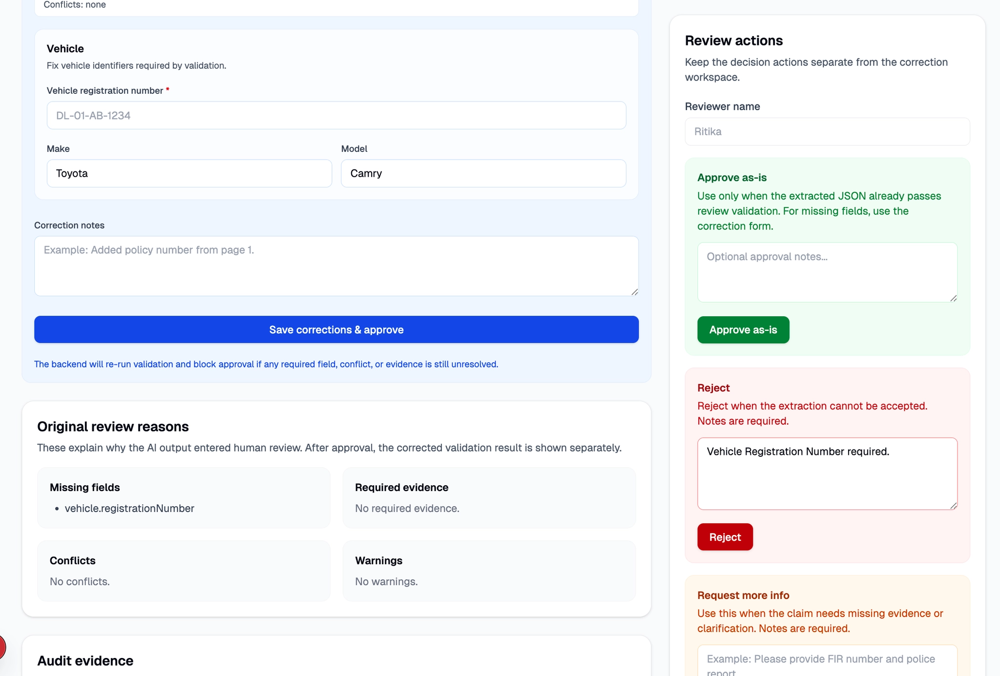
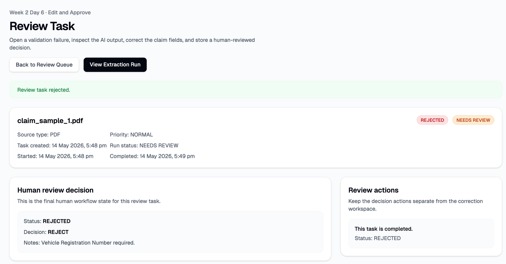

---

## 11. Request more information flow

If the claim is not ready but should not be rejected, the reviewer can request more information.

Request-more-info also requires notes.

```txt
POST /api/review-tasks/[taskId]/request-more-info
→ requires notes
→ ReviewTask.status = NEEDS_MORE_INFO
→ ReviewDecision.decision = REQUEST_MORE_INFO
→ ReviewEvent.type = REVIEW_MORE_INFO_REQUESTED
```

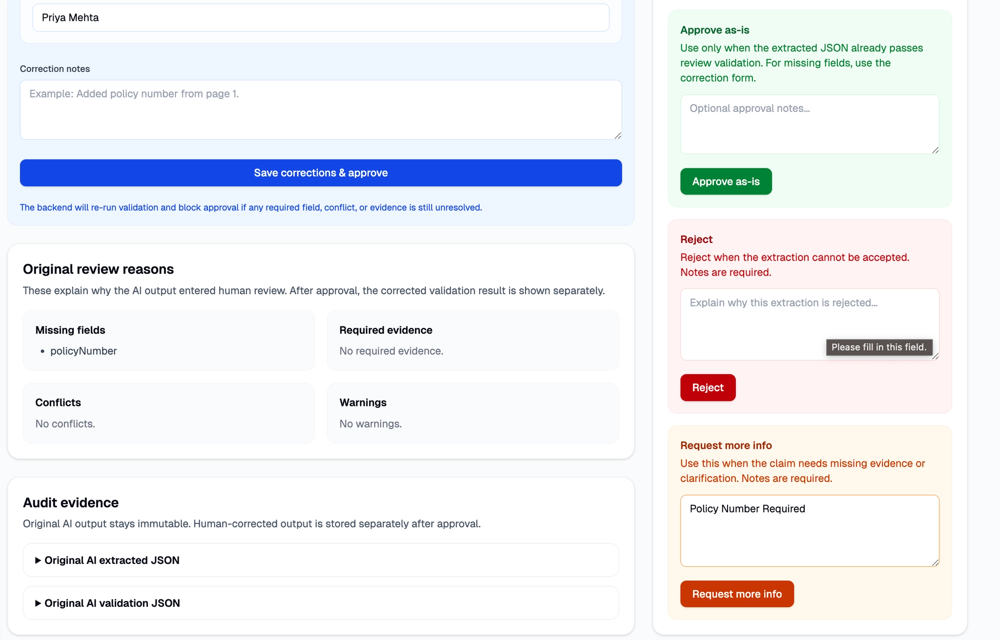
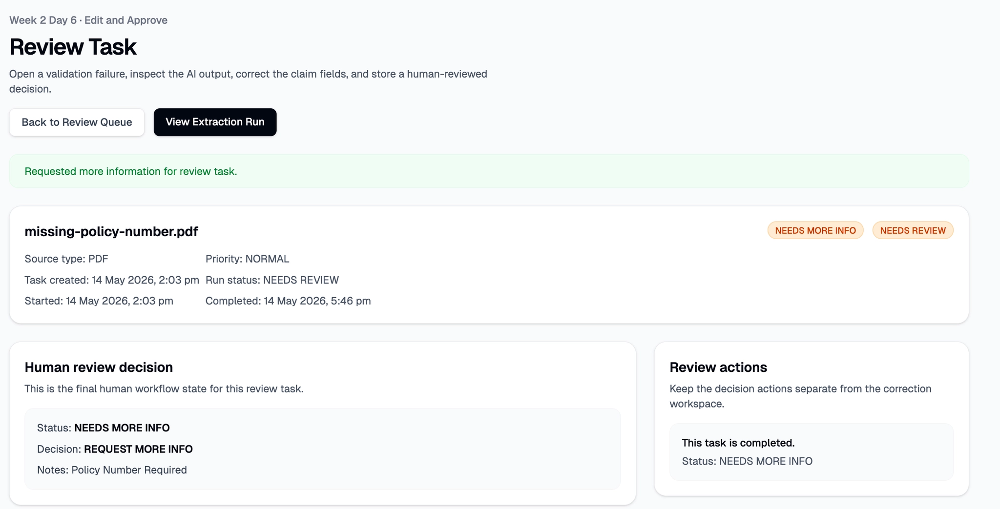

---

## 12. API ownership

The system keeps AI validation and human review separate.

### Validation route

```txt
POST /api/extraction-runs/[runId]/validate
```

Owns:

```txt
claim validation
ExtractionRun status
ExtractionEvent timeline
ReviewTask creation when NEEDS_REVIEW
```

### Review routes

```txt
GET /api/review-tasks
GET /api/review-tasks/[taskId]
POST /api/review-tasks/[taskId]/start
POST /api/review-tasks/[taskId]/approve
POST /api/review-tasks/[taskId]/edit-and-approve
POST /api/review-tasks/[taskId]/reject
POST /api/review-tasks/[taskId]/request-more-info
```

Own:

```txt
human state transitions
ReviewDecision creation
ReviewEvent timeline
corrected JSON validation
approval/rejection/more-info decisions
```

---

## 13. Postgres vs S3/A2I-style architecture

This project references the idea behind human-in-the-loop systems like A2I:

```txt
AI output
→ confidence/validation issue
→ human review
→ corrected human output
→ audit trail
```

For Week 2, review state is stored in Postgres:

```txt
ReviewTask
ReviewDecision
ReviewEvent
correctedJson
correctedValidationJson
```

Why Postgres is enough for now:

```txt
easy to query review queue
easy to join task + run + document + events
simple local development
clear proof of workflow
```

What can move to S3 later:

```txt
uploaded PDFs/images
raw model outputs
large audit bundles
review exports
```

Current design:

```txt
Postgres = workflow state + review data
S3 later = large artifacts / production storage
```

---

## 14. Evaluation evidence

Week 2 is now backed by a synthetic review workflow failure dataset and a repeatable eval.

Dataset:

```txt
sample-data/week-02-review-failures/
```

Eval command:

```bash
bun run eval:week2:review
```

Eval reports:

```txt
sample-data/week-02-review-failures/eval-results/week-2-review-workflow-eval.md
sample-data/week-02-review-failures/eval-results/week-2-review-workflow-eval.json
```


Current result:

```txt
Total packets: 15
Passed: 15
Failed: 0
review_routing_accuracy: 100.0%
```

The eval checks that:

```txt
missing-field packets create ReviewTask
low-confidence packets create ReviewTask
repair-estimate-only packets create ReviewTask
third-party/police-report packets create ReviewTask
unreadable PDF fails without creating ReviewTask
clean claim completes without review
duplicate upload is detected
edit-and-approve creates final corrected decision
reject creates rejected decision
request-more-info creates needs-more-info decision
review events are stored
```

This means Week 2 is no longer proven only by screenshots or manual demo. It has a regression dataset that can be rerun before Week 3 changes.

---

## Final Week 2 summary

Week 2 proves:

```txt
Bad AI output does not break the app.
It creates a ReviewTask.
A human can correct or reject it.
Corrected JSON is validated again.
Final decisions are stored.
Original AI output remains unchanged for audit history.
```

The core workflow is now:

```txt
NEEDS_REVIEW
→ ReviewTask
→ IN_REVIEW
→ APPROVED / EDITED_AND_APPROVED / REJECTED / NEEDS_MORE_INFO
→ ReviewDecision + ReviewEvent
```

The Week 2 eval proves the workflow across 15 controlled synthetic failure/review packets.
